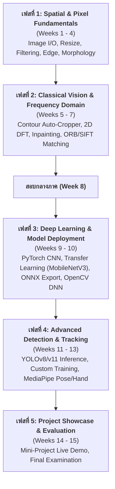

# 📊 สรุปรายงานรายวิชาฉบับสมบูรณ์ (Comprehensive Course Summary Report)
## รหัสวิชา 31909-2007: การประมวลผลภาพดิจิทัล (Digital Image Processing)
**ระดับการศึกษา:** ปริญญาตรี / ปวส. สาขาเทคโนโลยีสารสนเทศ  
**โครงสร้างเวลาเรียน:** 15 สัปดาห์ (75 ชั่วโมง: บรรยาย 30 ชั่วโมง, ปฏิบัติการ 45 ชั่วโมง)

---

## 1. บทนำและโครงสร้างรายวิชา (Course Overview)

วิชา **การประมวลผลภาพดิจิทัล (Digital Image Processing)** ออกแบบมาเพื่อปูพื้นฐานตั้งแต่มโนทัศน์การจัดการพิกเซลภาพ (Pixel Manipulation) ในโดเมนเชิงพื้นที่ (Spatial Domain) และโดเมนเชิงความถี่ (Frequency Domain) ไปจนถึงการบูรณาการแบบจำลองปัญญาประดิษฐ์และคอมพิวเตอร์วิทัศน์ระดับอุตสาหกรรม (Computer Vision Models: CNN, Transfer Learning, ONNX, YOLO, MediaPipe)

---

## 2. ตารางสรุปเนื้อหาและการสอดคล้องกับ CLO (15-Week Module Mapping)

| สัปดาห์ | หัวข้อหลัก | CLO ที่สอดคล้อง | ไฟล์เอกสารเนื้อหาหลัก | ไฟล์สไลด์ / คำแนะนำโค้ด | สคริปต์โค้ดตัวอย่าง |
|:---:|---|:---:|---|---|---|
| **1** | บทนำ + สภาพแวดล้อม Miniconda & VS Code | CLO 2 | [`week1_tutorial_basic_setup.md`](week1_tutorial_basic_setup.md) | — | `check_env.py` |
| **2** | การประมวลผลพิกเซลและการดำเนินการเรขาคณิต | CLO 2 | [`week2_tutorial_image_manipulation.md`](week2_tutorial_image_manipulation.md) | [`week2_slide_guide.md`](week2_slide_guide.md) | — |
| **3** | การจัดการแสง สี และการกรองภาพ (Filtering) | CLO 1 | [`week3_tutorial_contrast_filtering.md`](week3_tutorial_contrast_filtering.md) | [`week3_slide_outline.md`](week3_slide_outline.md) | — |
| **4** | การสกัดเส้นขอบและ Morphological Operations | CLO 1, 2 | [`week4_tutorial_edge_morphology.md`](week4_tutorial_edge_morphology.md) | [`week4_slide_outline.md`](week4_slide_outline.md) | — |
| **5** | การตรวจจับโครงร่างและ Auto-Cropper | CLO 2, 3 | [`week5_tutorial_contour_detection.md`](week5_tutorial_contour_detection.md) | [`week5_slide_outline.md`](week5_slide_outline.md) | [`codeweek5/week.py`](codeweek5/week.py) |
| **6** | โดเมนความถี่ (DFT/FFT) และ Image Inpainting | CLO 1, 3 | [`week6_detailed_guide.md`](week6_detailed_guide.md) | [`week6_slide_outline.md`](week6_slide_outline.md) | [`week6_code_guide.md`](week6_code_guide.md) |
| **7** | การจับคู่จุดเด่นภาพ (SIFT, ORB, Homography) | CLO 1, 3 | [`week7_detailed_guide.md`](week7_detailed_guide.md) | [`week7_slide_outline.md`](week7_slide_outline.md) | [`week7_code_guide.md`](week7_code_guide.md) |
| **8** | 🔬 **การทดสอบกลางภาคเรียน (Midterm Exam)** | CLO 1–4 | [`week8_midterm_review_guide.md`](week8_midterm_review_guide.md) | [`week8_slide_outline.md`](week8_slide_outline.md) | — |
| **9** | Deep Learning & CNN ด้วย PyTorch | CLO 1, 3 | [`week9_detailed_guide.md`](week9_detailed_guide.md) | [`week9_slide_outline.md`](week9_slide_outline.md) | [`train_mnist.py`](train_mnist.py) |
| **10** | Transfer Learning (MobileNetV3) & ONNX | CLO 2, 3 | [`week10_detailed_guide.md`](week10_detailed_guide.md) | [`week10_slide_outline.md`](week10_slide_outline.md) | [`train_transfer_onnx.py`](train_transfer_onnx.py), [`infer_onnx.py`](infer_onnx.py) |
| **11** | YOLO Object Detection Inference | CLO 1, 3 | [`week11_detailed_guide.md`](week11_detailed_guide.md) | [`week11_slide_outline.md`](week11_slide_outline.md) | [`yolo_inference_demo.py`](yolo_inference_demo.py) |
| **12** | Custom YOLO Training & Evaluation | CLO 2, 3 | [`week12_detailed_guide.md`](week12_detailed_guide.md) | [`week12_slide_outline.md`](week12_slide_outline.md) | [`train_custom_yolo.py`](train_custom_yolo.py) |
| **13** | MediaPipe Pose & Hand Landmark Tracking | CLO 3 | [`week13_detailed_guide.md`](week13_detailed_guide.md) | [`week13_slide_outline.md`](week13_slide_outline.md) | [`mediapipe_demo.py`](mediapipe_demo.py) |
| **14** | 🏆 **การนำเสนอโครงงาน Mini-Project** | CLO 2–4 | [`week14_detailed_guide.md`](week14_detailed_guide.md) | [`week14_slide_outline.md`](week14_slide_outline.md) | [`week14_mini_project_guide.md`](week14_mini_project_guide.md) |
| **15** | 🔬 **การทดสอบปลายภาคเรียน (Final Exam)** | CLO 1–4 | [`week15_detailed_guide.md`](week15_detailed_guide.md) | [`week15_slide_outline.md`](week15_slide_outline.md) | [`week15_final_exam_guide.md`](week15_final_exam_guide.md) |

---

## 3. สรุปฟังก์ชันสำคัญและสมการคณิตศาสตร์ที่ใช้ในวิชา

### 3.1 ฟังก์ชัน OpenCV & Deep Learning ที่สำคัญ
* **Image Resizing & Affine:** `cv2.resize()`, `cv2.getRotationMatrix2D()`, `cv2.warpAffine()`
* **Enhancement & Filtering:** `cv2.createCLAHE()`, `cv2.GaussianBlur()`, `cv2.medianBlur()`, `cv2.bilateralFilter()`
* **Edge & Morphology:** `cv2.Canny()`, `cv2.morphologyEx()`, `cv2.getStructuringElement()`
* **Contour Extraction:** `cv2.findContours()`, `cv2.boundingRect()`, `cv2.contourArea()`
* **Feature Matching:** `cv2.ORB_create()`, `cv2.BFMatcher()`, `cv2.findHomography()`
* **OpenCV DNN Module:** `cv2.dnn.readNetFromONNX()`, `cv2.dnn.blobFromImage()`
* **Ultralytics YOLO:** `YOLO('yolov8n.pt')`, `model.predict()`, `model.train()`
* **MediaPipe Landmarks:** `mp.solutions.hands`, `mp.solutions.pose`

### 3.2 สมการคณิตศาสตร์สำคัญ
* **Canny Gradient Magnitude:**
  $$G = \sqrt{G_x^2 + G_y^2}$$
* **Intersection over Union (IoU):**
  $$\text{IoU} = \frac{\text{Area of Overlap}}{\text{Area of Union}}$$
* **Vector Joint Angle ($\theta$):**
  $$\theta = \arccos\left( \frac{\vec{u} \cdot \vec{v}}{\|\vec{u}\| \|\vec{v}\|} \right) \times \frac{180}{\pi}$$

---

## 4. ผลสัมฤทธิ์ทางการเรียนรู้และความพร้อมด้าน Environment

หลักสูตรนี้ควบคุมสภาพแวดล้อมเสมือนผ่านไฟล์ `environment.yml` ร่วมกับ Miniconda ทำให้ผู้เรียนสามารถรันโค้ดได้ตรงกัน 100% บนทุกระบบปฏิบัติการ (Windows, macOS, Linux) พร้อมสำหรับการนำไปใช้งานจริงในภาคอุตสาหกรรมปัญญาประดิษฐ์และคอมพิวเตอร์วิทัศน์
