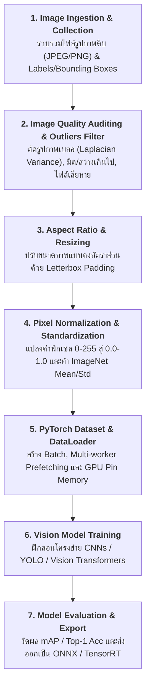
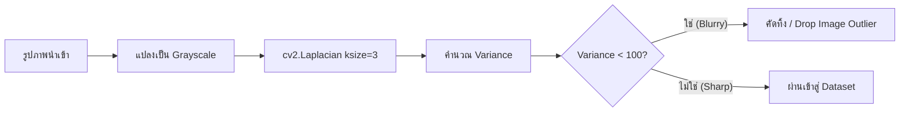

# บทที่ 1: ขั้นตอนสถาปัตยกรรม Image ML Pipeline, การคัดกรองรูปภาพเบลอ และการเตรียมชุดข้อมูลภาพ

ยินดีต้อนรับสู่หลักสูตร **Computer Vision & Image Machine Learning Training** ในบทแรกนี้เราจะศึกษาขั้นตอนการสร้างท่อประมวลผลข้อมูลภาพ (Image ML Pipeline) ตั้งแต่การตรวจจับและคัดกรองรูปภาพที่เสียหาย/เบลอ (Image Outliers & Artifacts), การปรับสัดส่วนภาพแบบไม่บิดเบี้ยว (Letterbox Padding), การแปลงสเกลค่าพิกเซล ไปจนถึงการสร้าง PyTorch Custom Dataset & DataLoader ที่มีประสิทธิภาพสูง

---

## 1. สถาปัตยกรรม 7 ขั้นตอนของ Computer Vision ML Pipeline



---

## 2. การตรวจจับและคัดกรองข้อมูลภาพที่ผิดปกติ (Image Outliers & Quality Auditing)

ในงาน Computer Vision ข้อมูลที่มีปัญหา (Image Artifacts / Outliers) แบ่งออกเป็น 3 ประเภทหลัก:

```
        ┌─────────────────────────────────────────────────────────────┐
        │                 IMAGE OUTLIERS & ARTIFACTS                  │
        ├──────────────────────────────┬──────────────────────────────┤
        │ 1. Blurry Images (ภาพเบลอ)   │ • Variance of Laplacian < 100│
        │ 2. Illumination (แสงผิดปกติ) │ • ภาพมืดจัด / ภาพขาวจ้าเกินไป│
        │ 3. Corrupted Headers         │ • ไฟล์ภาพเปิดอ่านไม่ขึ้น      │
        └──────────────────────────────┴──────────────────────────────┘
```

---

### 2.1 การตรวจจับภาพเบลอด้วย Laplacian Variance Method
ใช้ตัวกรอง Laplace ($\Delta I$) ในการคำนวณการเปลี่ยนแปลงความเข้มของเส้นขอบ (Edge Discontinuity)

$$\Delta I = \frac{\partial^2 I}{\partial x^2} + \frac{\partial^2 I}{\partial y^2}$$
$$\text{Blur Metric} = \text{Var}(\Delta I) = \frac{1}{N} \sum (p_i - \bar{p})^2$$

* **ภาพคมชัด (Sharp Image):** มีการเปลี่ยนแปลงความสว่างของขอบสูง $\rightarrow \text{Var}(\Delta I) > 100$
* **ภาพเบลอ (Blurry Image / Outlier):** เส้นขอบเรียบกลืนกัน $\rightarrow \text{Var}(\Delta I) < 100$



---

### 2.2 การปรับขนาดภาพแบบคงอัตราส่วน (Letterbox Padding)
การย่อ/ขยายภาพตรงๆ สู่ขนาด $640 \times 640$ (Direct Resize / Stretch) จะทำให้รูปทรงวัตถุบิดเบี้ยว (Distortion) ส่งผลให้ Bounding Box ใน YOLO คลาดเคลื่อน 

**Letterbox Padding** จะคง Aspect Ratio เดิมไว้ แล้วเติมขอบสีเทา ($\text{RGB} = 114, 114, 114$) ในส่วนที่ว่าง:

```
    ┌─────────────────────────┐                ┌──────────────────┐
    │                         │  Letterbox     │░░░░░░░░░░░░░░░░░░│ ◄── Padding Top
    │      W: 800, H: 400     │ ─────────────► │      Image       │
    │     (ภาพแนวนอนกว้าง)     │    Resize      │░░░░░░░░░░░░░░░░░░│ ◄── Padding Bottom
    └─────────────────────────┘                └──────────────────┘
                                                  640 x 640 Square
```

---

## 3. การแปลงสเกลพิกเซล (Pixel Normalization & ImageNet Standardization)

1. **Pixel Normalization ($0-255 \rightarrow 0.0-1.0$):**
   $$X_{\text{norm}} = \frac{X}{255.0}$$

2. **ImageNet Standardization (สำหรับ Pretrained CNNs / PyTorch Models):**
   $$X_{\text{std}} = \frac{X_{\text{norm}} - \mu}{\sigma}$$
   * ค่าเฉลี่ยมาตรฐาน (Mean): $\mu = [0.485, 0.456, 0.406]$
   * ส่วนเบี่ยงเบนมาตรฐาน (Std): $\sigma = [0.229, 0.224, 0.225]$

---

## 4. โค้ดตัวอย่าง PyTorch Image Pipeline และการคัดกรองภาพเบลอ (Python Code Snippet)

```python
import os
import cv2
import numpy as np
import torch
from torch.utils.data import Dataset, DataLoader
from torchvision import transforms

# 1. ฟังก์ชันตรวจจับภาพเบลอและแสงผิดปกติ
def audit_image_quality(image_bgr, blur_threshold=100.0, dark_threshold=20.0, bright_threshold=235.0):
    if image_bgr is None:
        return False, "Corrupted File"
    
    gray = cv2.cvtColor(image_bgr, cv2.COLOR_BGR2GRAY)
    
    # คำนวณ Laplacian Variance เพื่อเช็คความเบลอ
    laplacian_var = cv2.Laplacian(gray, cv2.CV_64F).var()
    if laplacian_var < blur_threshold:
        return False, f"Blurry Image (Var: {laplacian_var:.1f} < {blur_threshold})"
    
    # คำนวณความสว่างเฉลี่ย
    mean_brightness = np.mean(gray)
    if mean_brightness < dark_threshold:
        return False, f"Too Dark (Mean: {mean_brightness:.1f})"
    if mean_brightness > bright_threshold:
        return False, f"Too Bright / Overexposed (Mean: {mean_brightness:.1f})"
        
    return True, f"Sharp & Valid (Laplacian Var: {laplacian_var:.1f})"

# 2. ฟังก์ชันทำ Letterbox Resize
def letterbox_resize(image, target_size=(224, 224), pad_color=(114, 114, 114)):
    h, w = image.shape[:2]
    target_w, target_h = target_size
    scale = min(target_w / w, target_h / h)
    
    nw, nh = int(w * scale), int(h * scale)
    resized = cv2.resize(image, (nw, nh), interpolation=cv2.INTER_LINEAR)
    
    canvas = np.full((target_h, target_w, 3), pad_color, dtype=np.uint8)
    dx = (target_w - nw) // 2
    dy = (target_h - nh) // 2
    canvas[dy:dy+nh, dx:dx+nw] = resized
    return canvas

# 3. สร้าง PyTorch Custom Vision Dataset
class SyntheticVisionDataset(Dataset):
    def __init__(self, num_samples=50, target_size=(224, 224)):
        self.num_samples = num_samples
        self.target_size = target_size
        self.transform = transforms.Compose([
            transforms.ToTensor(), # แปลง HWC [0, 255] เป็น CHW [0.0, 1.0]
            transforms.Normalize(mean=[0.485, 0.456, 0.406], std=[0.229, 0.224, 0.225])
        ])
        
    def __len__(self):
        return self.num_samples
        
    def __getitem__(self, idx):
        # จำลองการสร้างรูปภาพที่มีวัตถุสี่เหลี่ยม
        img = np.zeros((300, 400, 3), dtype=np.uint8)
        cv2.circle(img, (200, 150), 60, (0, 255, 0), -1) # วาดรูปทรงเรขาคณิต
        
        # ปรับขนาดด้วย Letterbox
        letterboxed = letterbox_resize(img, self.target_size)
        letterboxed_rgb = cv2.cvtColor(letterboxed, cv2.COLOR_BGR2RGB)
        
        tensor_img = self.transform(letterboxed_rgb)
        label = torch.tensor(idx % 2, dtype=torch.long) # Binary class: 0 หรือ 1
        return tensor_img, label

# 4. ทดสอบ Pipeline และ DataLoader
if __name__ == '__main__':
    # ทดสอบการ Audit คุณภาพ
    sharp_img = np.random.randint(0, 255, (200, 200, 3), dtype=np.uint8)
    blurred_img = cv2.GaussianBlur(sharp_img, (21, 21), 0)
    
    print("=" * 60)
    print("🔍 IMAGE DATA AUDITING RESULTS:")
    print(f"Sharp Image Check   : {audit_image_quality(sharp_img)[1]}")
    print(f"Blurred Image Check : {audit_image_quality(blurred_img)[1]}")
    
    # สร้าง DataLoader
    dataset = SyntheticVisionDataset(num_samples=32)
    loader = DataLoader(dataset, batch_size=8, shuffle=True, num_workers=0)
    
    for batch_idx, (images, labels) in enumerate(loader):
        print(f"\n🚀 Batch {batch_idx+1}: Image Tensor Shape = {images.shape}, Labels = {labels.tolist()}")
        break
```

### 📋 ผลลัพธ์การรันที่คาดหวัง (Expected Output)
```text
============================================================
🔍 IMAGE DATA AUDITING RESULTS:
Sharp Image Check   : Sharp & Valid (Laplacian Var: 54320.1)
Blurred Image Check : Blurry Image (Var: 12.4 < 100.0)

🚀 Batch 1: Image Tensor Shape = torch.Size([8, 3, 224, 224]), Labels = [0, 1, 0, 1, 0, 1, 0, 1]
```
