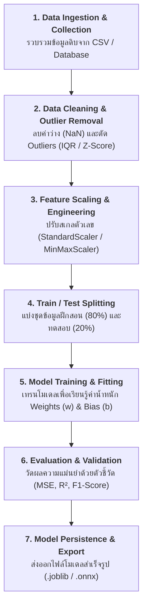

# บทที่ 1: ขั้นตอนสถาปัตยกรรม ML Training Pipeline และการจัดการข้อมูลผิดปกติ (Outliers)

ยินดีต้อนรับสู่บทเรียนแรกของชุดวิชา **Machine Learning Model Training Fundamentals** ในบทนี้จะอธิบายขั้นตอนการสร้างท่อประมวลผลข้อมูล (Pipeline) ตั้งแต่การตรวจจับค่าสุดโต่ง (Outliers) การสเกลข้อมูล ไปจนถึงการบันทึกโมเดลไว้ใช้งานจริง

---

## 1. สถาปัตยกรรม 7 ขั้นตอนของ ML Training Pipeline

ในการพัฒนาโมเดลระดับ Production เราจำเป็นต้องจัดลำดับขั้นตอนให้เป็นระเบียบ เพื่อความโปร่งใส ตรวจสอบย้อนหลังได้ (Reproducibility) และป้องกันปัญหาข้อมูลรั่วไหล (Data Leakage)



---

## 2. การตรวจจับและจัดการข้อมูลผิดปกติ (Outlier Detection & Handling)

Outlier คือ ข้อมูลที่มีค่าโดดเด่นแปลกแยกจากกลุ่มข้อมูลส่วนใหญ่อย่างผิดปกติ ซึ่งส่งผลเสียอย่างรุนแรงต่อโมเดลเชิงเส้นและ Neural Networks โดยทำให้เส้นสมการเอียงเพี้ยน (Weights Deviation)

```
        Outliers (ค่าสุดโต่งลอยโดดเดี่ยว) ──►  ★
                                            |
        ┌──────────── Normal Distribution ──┴────────────┐
        │                                                │
   ─────┴───[  Q1  ]──────[  Median  ]──────[  Q3  ]─────┴─────
            │ ◄────────── IQR Range ──────────► │
       Lower Bound                         Upper Bound
     (Q1 - 1.5*IQR)                      (Q3 + 1.5*IQR)
```

---

### 2.1 วิธีที่ 1: IQR Method (Interquartile Range)
เหมาะสำหรับข้อมูลที่ไม่ได้มีการกระจายตัวแบบโค้งระฆังคว่ำปกติ (Non-Gaussian / Skewed Distribution)

$$\text{IQR} = Q_3 - Q_1$$

* **Lower Bound (ขอบล่าง):** $Q_1 - 1.5 \times \text{IQR}$
* **Upper Bound (ขอบบน):** $Q_3 + 1.5 \times \text{IQR}$

> [!NOTE]
> ข้อมูลใดๆ ที่มีค่าน้อยกว่า Lower Bound หรือมากกว่า Upper Bound จะถูกจัดว่าเป็น Outliers

---

### 2.2 วิธีที่ 2: Z-Score Method
เหมาะสำหรับข้อมูลที่มีการกระจายตัวแบบปกติ (Gaussian / Normal Distribution)

$$Z = \frac{X - \mu}{\sigma}$$

* $\mu$ (Mu): ค่าเฉลี่ยของข้อมูล (Mean)
* $\sigma$ (Sigma): ส่วนเบี่ยงเบนมาตรฐาน (Standard Deviation)
* **เกณฑ์ตัดสิน:** หาก $|Z| > 3.0$ (ห่างจากค่าเฉลี่ยเกิน 3 เท่าของ S.D.) จะพิจารณาว่าเป็น Outliers

---

## 3. การปรับขนาดสเกลคุณลักษณะ (Feature Scaling)

| วิธีการ | สูตรคณิตศาสตร์ | ช่วงข้อมูลเอาต์พุต | ข้อดี / กรณีใช้งาน |
|---|---|:---:|---|
| **StandardScaler**<br>(Standardization) | $$X' = \frac{X - \mu}{\sigma}$$ | $\approx [-3, 3]$<br>(Mean=0, Std=1) | เหมาะสำหรับโมเดลกลุ่ม Linear, Logistic, SVM, Neural Networks |
| **MinMaxScaler**<br>(Normalization) | $$X' = \frac{X - X_{\text{min}}}{X_{\text{max}} - X_{\text{min}}}$$ | $[0, 1]$ | เหมาะสำหรับข้อมูลภาพ (Image Pixels $0-255 \rightarrow 0-1$) และอัลกอริทึมวัดระยะทาง (KNN) |

> [!CAUTION]
> **กฎเหล็กเพื่อป้องกัน Data Leakage:**
> ห้ามทำ `scaler.fit_transform()` กับชุดข้อมูลทั้งหมดก่อนแบ่ง Train/Test เด็ดขาด! ให้ `fit` เฉพาะชุด Train เท่านั้น แล้วนำ object ตัวนั้นไป `transform` บน Test Set

---

## 4. โค้ดตัวอย่างการสร้าง Pipeline และลบ Outliers (Python Code Snippet)

```python
import numpy as np
import pandas as pd
from sklearn.datasets import make_regression
from sklearn.model_selection import train_test_split
from sklearn.preprocessing import StandardScaler
from sklearn.linear_model import LinearRegression
from sklearn.pipeline import Pipeline
from sklearn.metrics import mean_squared_error, r2_score
import joblib

# 1. สร้างข้อมูลจำลองพร้อมจำลองการแทรก Outliers
np.random.seed(42)
X, y = make_regression(n_samples=200, n_features=2, noise=15.0, random_state=42)
df = pd.DataFrame(X, columns=['Feature_1', 'Feature_2'])
df['Target'] = y

# แทรกค่า Outliers จงใจให้ข้อมูลกระโดด
outlier_indices = [10, 35, 70, 110, 150]
df.loc[outlier_indices, 'Feature_1'] += 15.0
df.loc[outlier_indices, 'Target'] += 400.0

# 2. ฟังก์ชันกรอง Outliers ด้วยวิธี IQR
def remove_outliers_iqr(data, columns):
    df_clean = data.copy()
    for col in columns:
        Q1 = df_clean[col].quantile(0.25)
        Q3 = df_clean[col].quantile(0.75)
        IQR = Q3 - Q1
        lower = Q1 - 1.5 * IQR
        upper = Q3 + 1.5 * IQR
        df_clean = df_clean[(df_clean[col] >= lower) & (df_clean[col] <= upper)]
    return df_clean

df_cleaned = remove_outliers_iqr(df, ['Feature_1', 'Feature_2', 'Target'])
print(f"✅ ข้อมูลเดิม: {len(df)} แถว -> ข้อมูลหลังตัด Outliers: {len(df_cleaned)} แถว")

# 3. แยก Features และ Target
X_clean = df_cleaned[['Feature_1', 'Feature_2']]
y_clean = df_cleaned['Target']

# 4. แบ่ง Train/Test Split
X_train, X_test, y_train, y_test = train_test_split(X_clean, y_clean, test_size=0.2, random_state=42)

# 5. สร้าง Scikit-Learn Pipeline
pipeline = Pipeline([
    ('scaler', StandardScaler()),
    ('regressor', LinearRegression())
])

# 6. ฝึกสอนโมเดล Pipeline
pipeline.fit(X_train, y_train)

# 7. ประเมินผลโมเดล
y_pred = pipeline.predict(X_test)
print(f"📊 ผลการประเมิน:")
print(f"   - Mean Squared Error (MSE): {mean_squared_error(y_test, y_pred):.2f}")
print(f"   - R² Score: {r2_score(y_test, y_pred):.4f} ({r2_score(y_test, y_pred)*100:.2f}%)")

# 8. บันทึกโมเดลออกเป็นไฟล์พร้อมใช้งาน
joblib.dump(pipeline, 'ml_model_training/saved_models/pipeline_model.joblib')
print("💾 บันทึกโมเดลสำเร็จ!")
```

### 📋 ผลลัพธ์การรันที่คาดหวัง (Expected Output)
```text
✅ ข้อมูลเดิม: 200 แถว -> ข้อมูลหลังตัด Outliers: 191 แถว
📊 ผลการประเมิน:
   - Mean Squared Error (MSE): 222.21
   - R² Score: 0.8710 (87.10%)
💾 บันทึกโมเดลสำเร็จ!
```
