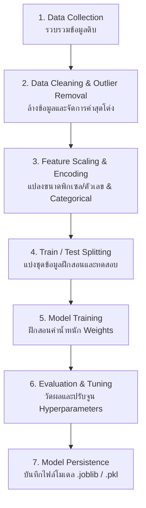
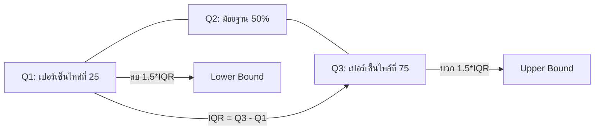

# บทที่ 1: ขั้นตอนสถาปัตยกรรม ML Training Pipeline และการจัดการข้อมูลผิดปกติ (Outliers)

---

## 1. ภาพรวมของ Machine Learning Training Pipeline

ในการพัฒนาโมเดล Machine Learning ระดับอุตสาหกรรม เราไม่ได้เพียงแค่ป้อนข้อมูลเข้าโมเดลแล้วสั่งรันทำนายทันที แต่จำเป็นต้องสร้าง **ท่อประมวลผลข้อมูล (Pipeline)** ที่มีความเป็นระบบ รันซ้ำได้ง่าย (Reproducible) และป้องกันปัญหาข้อมูลรั่วไหล (Data Leakage)



---

## 2. ขั้นตอนใน Pipeline โดยละเอียด

### 2.1 การรวบรวมและล้างข้อมูล (Data Cleaning)
* การจัดการค่าที่หายไป (Missing Values / NaNs): เติมด้วยค่าเฉลี่ย (Mean), มัธยฐาน (Median), หรือการลบแถวทิ้ง
* การจัดการข้อมูลซ้ำ (Duplicates Removal)

### 2.2 การตรวจจับและจัดการข้อมูลผิดปกติ (Outliers Detection & Handling)
Outlier คือ ข้อมูลที่มีค่าโด่งแปลกแยกจากกลุ่มข้อมูลส่วนใหญ่อย่างผิดปกติ ซึ่งอาจเกิดจากความผิดพลาดในการบันทึกค่า อุปกรณ์เซนเซอร์ชำรุด หรือธรรมชาติของข้อมูล การมี Outliers ในชุดข้อมูลจะทำให้โมเดลประเภทเชิงเส้น (เช่น Linear Regression, Logistic Regression, Neural Networks) เกิดการเอียงเพี้ยนของค่าน้ำหนัก (Weights Deviation)

#### วิธีที่ 1: IQR Method (Interquartile Range)
เหมาะสำหรับข้อมูลที่ไม่ได้มีการกระจายตัวแบบโค้งปกติ (Non-Normal Distribution)

$$\text{IQR} = Q_3 - Q_1$$

* **Lower Bound (ขอบล่าง):** $Q_1 - 1.5 \times \text{IQR}$
* **Upper Bound (ขอบบน):** $Q_3 + 1.5 \times \text{IQR}$

ข้อมูลที่น้อยกว่า Lower Bound หรือมากกว่า Upper Bound จะถูกจัดว่าเป็น Outliers



#### วิธีที่ 2: Z-Score Method
เหมาะสำหรับข้อมูลที่มีการกระจายตัวแบบปกติ (Gaussian / Normal Distribution)

$$Z = \frac{X - \mu}{\sigma}$$

โดยทั่วไป หากค่า $|Z| > 3.0$ (ห่างจากค่าเฉลี่ยเกิน 3 เท่าของส่วนเบี่ยงเบนมาตรฐาน) จะพิจารณาว่าจุดนั้นเป็น Outliers

---

### 2.3 การปรับขนาดสเกลคุณลักษณะ (Feature Scaling)
เพื่อป้องกันไม่ให้คุณลักษณะ (Features) ที่มีช่วงตัวเลขขนาดใหญ่ (เช่น รายได้ 50,000 บาท) เข้าครอบงำคุณลักษณะที่มีช่วงตัวเลขขนาดเล็ก (เช่น อายุ 25 ปี):

1. **StandardScaler (Standardization):**
   $$X' = \frac{X - \mu}{\sigma}$$
   ปรับค่าเฉลี่ยเป็น 0 และส่วนเบี่ยงเบนมาตรฐานเป็น 1

2. **MinMaxScaler (Normalization):**
   $$X' = \frac{X - X_{\text{min}}}{X_{\text{max}} - X_{\text{min}}}$$
   บีบช่วงข้อมูลให้อยู่ในช่วง $[0, 1]$

---

### 2.4 การแบ่งชุดข้อมูล (Data Splitting)
แบ่งข้อมูลออกเป็น 2 หรือ 3 ส่วนเพื่อความยุติธรรมในการวัดผล:
* **Train Set (70–80%):** ป้อนให้โมเดลฝึกเรียนรู้สมการค่าน้ำหนัก
* **Validation Set (10–15%):** ใช้ปรับจูน Hyperparameters ขณะกำลังเทรน
* **Test Set (15–20%):** ข้อมูลที่ไม่เคยเห็นเลย ใช้ทดสอบวัดผลครั้งสุดท้าย

> [!IMPORTANT]
> **ข้อควรระวังเรื่อง Data Leakage:** การทำ Feature Scaling (เช่น คำนวณ Mean และ Std) จะต้อง `fit` บนเฉพาะชุด Train Set เท่านั้น แล้วจึงนำ transformer ตัวนั้นไป `transform` บน Test Set ห้ามทำ Scaling รวมทั้ง Dataset ก่อนแบ่งข้อมูลเด็ดขาด!

---

### 2.5 การบันทึกโมเดลไว้ใช้งาน (Model Persistence)
เมื่อได้โมเดลที่มีประสิทธิภาพแล้ว เราสามารถบันทึกโมเดลออกเป็นไฟล์ด้วย `joblib` เพื่อนำไปโหลดใช้งานในแอปพลิเคชันอื่นได้โดยไม่ต้องเทรนใหม่:

```python
import joblib

# บันทึกโมเดล
joblib.dump(model, 'model.joblib')

# โหลดโมเดลกลับมาใช้งาน
loaded_model = joblib.load('model.joblib')
```
