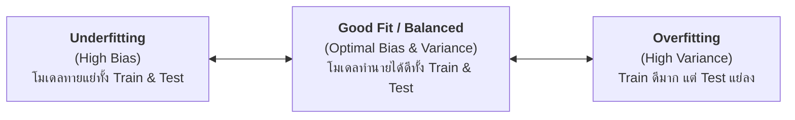
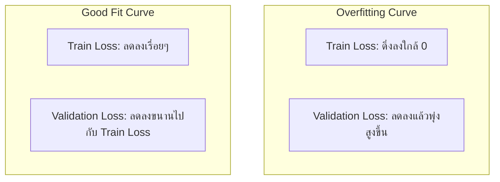
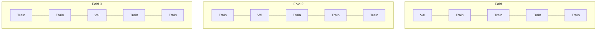

# บทที่ 2: ปัญหา Overfitting, Underfitting, และการทำ Cross-Validation

---

## 1. ปรากฏการณ์ Bias-Variance Tradeoff

ในการสร้างโมเดล Machine Learning เป้าหมายหลักคือการทำให้โมเดลสามารถทำนายข้อมูลชุดใหม่ในชีวิตจริงได้อย่างแม่นยำ (Generalization Ability) ปัญหาหลักที่มักพบเจอแบ่งออกเป็น 2 ขั้ว:

### 1.1 Underfitting (High Bias)
* **สาเหตุ:** โมเดลมีความซับซ้อนน้อยเกินไป (Simple Model) เช่น นำ Linear Regression มาแก้โจทย์ที่มีความสัมพันธ์ซับซ้อนแบบ Non-linear
* **ลักษณะอาการ:** ค่าความแม่นยำ (Accuracy) หรือค่า Loss ต่ำ/แย่ ทั้งบนชุด Train และ Test
* **วิธีแก้ไข:**
  1. เพิ่มความซับซ้อนของโมเดล (เช่น เพิ่ม Layer/Neurons ใน Neural Network หรือเพิ่ม Polynomial Features)
  2. ลดระดับการทำ Regularization
  3. เพิ่มคุณลักษณะ (Features) ใหม่ๆ เข้าสู่ระบบ

### 1.2 Overfitting (High Variance)
* **สาเหตุ:** โมเดลมีความซับซ้อนมากเกินไป (Complex Model) จนจดจำ Noise หรือความผิดปกติในชุดข้อมูล Train มากเกินไป
* **ลักษณะอาการ:** ค่าความแม่นยำบนชุด Train สูงมากเกือบ 100% แต่เมื่อนำไปทดสอบบนชุด Test ค่าความแม่นยำกลับตกลงอย่างรุนแรง
* **วิธีแก้ไข:**
  1. เพิ่มปริมาณข้อมูลฝึกสอน (Data Augmentation / Collect More Data)
  2. ทำ **Regularization (L1 Lasso / L2 Ridge)** เพื่อลดขนาดค่าน้ำหนัก
  3. ทำ **Feature Selection** ตัดคุณลักษณะที่ไม่จำเป็นออก
  4. ทำ **Cross-Validation** เพื่อตรวจสอบความเสถียร
  5. เทคนิค **Early Stopping** หยุดเทรนเมื่อ Validation Loss เริ่มพุ่งสูงขึ้น

---

## 2. การตรวจสอบการเรียนรู้ด้วย Learning Curves

Learning Curves คือ กราฟแสดงความสัมพันธ์ระหว่างประสิทธิภาพ (Loss หรือ Accuracy) กับจำนวน Epochs หรือขนาดของข้อมูล:

---

## 3. การตรวจสอบโมเดลด้วย Cross-Validation (CV)

การแบ่งข้อมูลแบบ Train/Test Split เพียงครั้งเดียว อาจทำให้เกิดความลำเอียง (Bias) จากสุ่มได้ชุดข้อมูลที่ไม่กระจายตัว ทางออกคือการทำ **K-Fold Cross-Validation**

### 3.1 K-Fold Cross-Validation
แบ่งข้อมูลออกเป็น $K$ ส่วนเท่าๆ กัน (เช่น $K=5$):
* ในแต่ละรอบ จะใช้ $K-1$ ส่วนในการฝึกสอน และอีก 1 ส่วนที่เหลือเป็น Validation Set
* ทำซ้ำทั้งหมด $K$ รอบ แล้วนำค่าความแม่นยำเฉลี่ยมารวมกัน

### 3.2 Stratification (Stratified K-Fold)
สำหรับโจทย์ **Imbalanced Dataset** (เช่น ข้อมูลผู้ป่วยโรคร้ายแรงมี 5% ข้อมูลคนปกติมี 95%) การแบ่ง Fold แบบธรรมดาอาจทำให้บาง Fold ไม่มีข้อมูลผู้ป่วยเลย 

**Stratified K-Fold** จะทำการสุ่มสัดส่วนของแต่ละคลาสในทุก Fold ให้คงสัดส่วนเดิมเสมอ (5% vs 95%) ป้องกันปัญหาโมเดลทายผลเพี้ยน

---

## 4. เทคนิค Regularization (L1 Lasso vs L2 Ridge)

Regularization คือการเพิ่ม Penalty Term ลงใน Loss Function เพื่อบังคับไม่ให้ค่าน้ำหนัก (Weights) มีขนาดใหญ่เกินไป:

$$\text{Loss}_{\text{total}} = \text{Loss}_{\text{original}} + \lambda \times \text{Penalty}$$

1. **L1 Regularization (Lasso):**
   $$\text{Penalty} = \sum |w_i|$$
   ทำให้ค่าน้ำหนักของฟีเจอร์ที่ไม่สำคัญกลายเป็น $0$ โดยตรง เหมาะสำหรับทำ **Feature Selection**

2. **L2 Regularization (Ridge):**
   $$\text{Penalty} = \sum w_i^2$$
   บีบให้ค่าน้ำหนักเข้าใกล้ $0$ แต่ไม่เท่ากับ $0$ ช่วยลดทอนความรุนแรงของฟีเจอร์ที่สูงเกินไป
