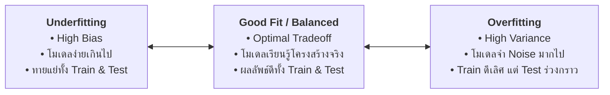
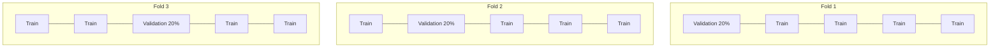

# บทที่ 2: ปัญหา Overfitting, Underfitting, การตรวจสอบด้วย Cross-Validation และ Regularization

---

## 1. ปรากฏการณ์ Bias-Variance Tradeoff

ในการสร้างโมเดล Machine Learning ความท้าทายสูงสุดคือการทำให้โมเดลมีความสามารถในการทำนายข้อมูลใหม่ในอนาคตได้อย่างแม่นยำ (Generalization) ปัญหาหลักที่เกิดขึ้นแบ่งออกเป็น 2 ขั้วตรงข้าม:



---

### 1.1 ตารางเปรียบเทียบ Underfitting vs Optimal Fit vs Overfitting

| หัวข้อ | Underfitting (High Bias) | Good Fit (Optimal) | Overfitting (High Variance) |
|---|---|---|---|
| **ความซับซ้อนโมเดล** | ต่ำเกินไป (Too Simple) | พอเหมาะ (Balanced) | สูงเกินไป (Too Complex) |
| **Train Accuracy** | ต่ำ ($\approx 60-70\%$) | สูง ($\approx 85-92\%$) | สูงมาก ($\approx 99-100\%$) |
| **Test Accuracy** | ต่ำ ($\approx 60-68\%$) | สูง ($\approx 84-90\%$) | ตกต่ำอย่างรุนแรง ($\approx 70-75\%$) |
| **ส่วนต่าง (Gap)** | แคบ แต่แย่ทั้งคู่ | แคบ และดีทั้งคู่ | **กว้างมาก ($> 15-20\%$)** |
| **แนวทางแก้ไข** | 1. เพิ่มความซับซ้อนโมเดล<br>2. เพิ่ม Features ใหม่<br>3. ลด Regularization | รักษาความสมดุล | 1. เพิ่ม Data Augmentation<br>2. ใช้ Regularization (L1/L2)<br>3. ตัด Features ที่ไม่จำเป็น<br>4. ทำ Early Stopping |

---

## 2. การวินิจฉัยด้วยกราฟการเรียนรู้ (Learning Curves)

```
   Loss │                                Loss │
        │  Train Loss ───                     │  Train Loss ────┐
        │  Val Loss   ───                     │  Val Loss   ────┼───────▲ (Gap กว้างมาก = Overfitting)
        │                                     │                 │
        │  (Loss ค้างสูงทั้งคู่ = Underfit)   │                 └───────▼
        └──────────────────────────► Epochs   └──────────────────────────► Epochs
```

---

## 3. การประเมินผลอย่างเสถียรด้วย K-Fold & Stratified K-Fold

การแบ่งชุดข้อมูลแบบ Train/Test Split เพียงครั้งเดียวอาจทำให้เกิด **Sampling Bias** (สุ่มได้ชุดข้อมูลที่ไม่เป็นตัวแทนที่ดี)

### 3.1 K-Fold Cross-Validation
แบ่งข้อมูลออกเป็น $K$ ส่วนเท่าๆ กัน (เช่น $K=5$):
* ในแต่ละรอบ จะใช้ $K-1$ ส่วนสำหรับฝึกสอน (Train) และใช้ 1 ส่วนที่เหลือเป็น Validation
* หมุนเวียนจนครบ $K$ รอบ แล้วหาค่าเฉลี่ยความแม่นยำ



### 3.2 Stratified K-Fold (สำหรับ Imbalanced Dataset)
สำหรับชุดข้อมูลที่จำนวนตัวอย่างแต่ละคลาสไม่เท่ากัน (เช่น ผู้ป่วยโรคร้ายแรง 5% คนปกติ 95%):
* **Stratified K-Fold** จะควบคุมให้ทุกๆ Fold ย่อยมีสัดส่วนของแต่ละคลาสเท่ากับสัดส่วนจริงใน Dataset เสมอ ป้องกันปัญหาบาง Fold ไม่มีตัวอย่างคลาสเป้าหมาย

---

## 4. เทคนิค Regularization (L1 Lasso vs L2 Ridge)

Regularization คือการเพิ่มบทลงโทษ (Penalty Term) เข้าไปในสมการ Loss เพื่อจำกัดไม่ให้ค่าน้ำหนัก (Weights) มีขนาดใหญ่เกินไป:

$$\text{Loss}_{\text{total}} = \text{Loss}_{\text{data}} + \lambda \cdot \text{Penalty}(w)$$

1. **L1 Regularization (Lasso):**
   $$\text{Penalty} = \sum_{j=1}^{p} |w_j|$$
   * มีคุณสมบัติผลักดันให้ค่าน้ำหนักของฟีเจอร์ที่ไม่จำเป็นกลายเป็น **0** พอดี ทำหน้าที่เป็น **Automatic Feature Selection**

2. **L2 Regularization (Ridge / Weight Decay):**
   $$\text{Penalty} = \sum_{j=1}^{p} w_j^2$$
   * มีคุณสมบัติบีบให้ค่าน้ำหนักทั้งหมดเล็กลงเข้าใกล้ 0 ช่วยลดความผันผวนของโมเดลเมื่อเจอ Noise

---

## 5. โค้ดตัวอย่างการทดลอง Overfitting และ Stratified CV (Python Code Snippet)

```python
import numpy as np
from sklearn.datasets import make_classification
from sklearn.model_selection import train_test_split, StratifiedKFold, cross_val_score
from sklearn.tree import DecisionTreeClassifier
from sklearn.linear_model import LogisticRegression, RidgeClassifier
from sklearn.metrics import accuracy_score

# 1. สร้างชุดข้อมูลจำลองที่มี Noise
X, y = make_classification(
    n_samples=600, n_features=20, n_informative=8,
    flip_y=0.15, random_state=42
)
X_train, X_test, y_train, y_test = train_test_split(X, y, test_size=0.3, random_state=42)

# 2. เปรียบเทียบความลึกของ Decision Tree เพื่อดู Overfitting
print("=" * 65)
print(f"{'Model Configuration':36s} | {'Train Acc':10s} | {'Test Acc':10s} | Status")
print("-" * 75)

tree_models = {
    "Underfitting (Max Depth = 1)": DecisionTreeClassifier(max_depth=1, random_state=42),
    "Optimal Fit   (Max Depth = 4)": DecisionTreeClassifier(max_depth=4, random_state=42),
    "Overfitting  (Max Depth = 25)": DecisionTreeClassifier(max_depth=25, random_state=42)
}

for name, model in tree_models.items():
    model.fit(X_train, y_train)
    tr_acc = accuracy_score(y_train, model.predict(X_train)) * 100
    te_acc = accuracy_score(y_test, model.predict(X_test)) * 100
    
    diff = tr_acc - te_acc
    status = "Good Fit ✅"
    if diff > 15.0:
        status = "Overfitting ⚠️"
    elif tr_acc < 70.0:
        status = "Underfitting ⚠️"
        
    print(f"{name:36s} | {tr_acc:8.2f}% | {te_acc:8.2f}% | {status}")

# 3. ทดสอบ Stratified 5-Fold Cross-Validation
print("\n" + "=" * 65)
skf = StratifiedKFold(n_splits=5, shuffle=True, random_state=42)
clf = LogisticRegression(random_state=42)
cv_scores = cross_val_score(clf, X, y, cv=skf, scoring='accuracy')

print(f"🔄 5-Fold Stratified CV Scores: {np.round(cv_scores * 100, 2)}")
print(f"📊 Mean CV Accuracy: {cv_scores.mean() * 100:.2f}% (± {cv_scores.std() * 100:.2f}%)")

# 4. ทดสอบ L2 Regularization (Ridge) ปรับค่า Alpha
print("\n" + "=" * 65)
for alpha in [0.01, 1.0, 100.0]:
    ridge = RidgeClassifier(alpha=alpha, random_state=42)
    ridge.fit(X_train, y_train)
    te_acc = accuracy_score(y_test, ridge.predict(X_test)) * 100
    print(f"🛡️ Ridge Alpha = {alpha:6.2f} -> Test Accuracy: {te_acc:.2f}%")
```

### 📋 ผลลัพธ์การรันที่คาดหวัง (Expected Output)
```text
=================================================================
Model Configuration                  | Train Acc  | Test Acc   | Status
---------------------------------------------------------------------------
Underfitting (Max Depth = 1)         |    67.14% |    69.33% | Underfitting ⚠️
Optimal Fit   (Max Depth = 4)        |    86.29% |    78.67% | Good Fit ✅
Overfitting  (Max Depth = 25)        |   100.00% |    74.67% | Overfitting ⚠️

=================================================================
🔄 5-Fold Stratified CV Scores: [82.5 85.  83.33 80.83 85.83]
📊 Mean CV Accuracy: 83.50% (± 1.83%)

=================================================================
🛡️ Ridge Alpha =   0.01 -> Test Accuracy: 80.56%
🛡️ Ridge Alpha =   1.00 -> Test Accuracy: 80.56%
🛡️ Ridge Alpha = 100.00 -> Test Accuracy: 82.78%
```
