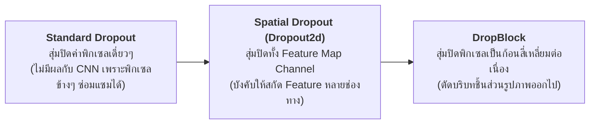
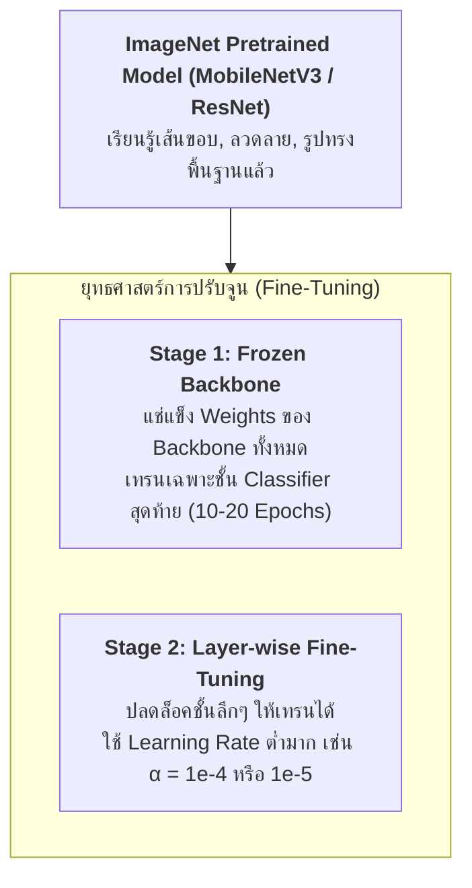

# บทที่ 2: ปัญหา Overfitting ในโมเดลรูปภาพ, การทำ Data Augmentation ขั้นสูง และ Transfer Learning

---

## 1. ปัญหาการ Overfitting ใน Computer Vision และ Shortcut Learning

ในการฝึกสอนโครงข่าย Convolutional Neural Networks (CNNs) หรือ Vision Transformers (ViTs) ปัญหา Overfitting ในงานภาพมักเกิดขึ้นในรูปแบบ **Shortcut Learning (การเรียนรู้ทางลัด)**:

```
        ภาพรถยนต์บนพื้นหญ้า               ภาพรถยนต์บนถนนคอนกรีต
    ┌──────────────────────────┐     ┌──────────────────────────┐
    │  🌿🌿🌿🌿🌿🌿🌿🌿🌿🌿🌿  │     │  ░░░░░░░░░░░░░░░░░░░░░░  │
    │  🌿  ╭────────────╮  🌿  │     │  ░  ╭────────────╮  ░  │
    │  🌿  │ 🚗 รถยนต์  │  🌿  │     │  ░  │ 🚗 รถยนต์  │  ░  │
    │  🌿  ╰────────────╯  🌿  │     │  ░  ╰────────────╯  ░  │
    └──────────────────────────┘     └──────────────────────────┘
      โมเดลจำผิดว่า "สีเขียว" = รถ      โมเดลทายผิดว่า "ไม่ใช่รถ" (Overfit พื้นหลัง)
```

* **สาเหตุ:** โมเดลจดจำพื้นผิวฉากหลัง (Background Texture), แสงเงาเฉพาะตัว, หรือลายน้ำ แทนที่จะเรียนรู้ลักษณะโครงสร้างรูปทรง (Shape & Geometric Features) ของวัตถุจริง

---

## 2. เทคนิค Regularization สำหรับโมเดลรูปภาพ (Vision Regularization)



1. **Spatial Dropout (2D Dropout):** สุ่มปิด Channel ทั้งแผ่น แทนที่จะสุ่มปิดพิกเซลเดี่ยวๆ ช่วยให้ CNN ไม่พึ่งพา Feature Map ใด Feature Map หนึ่งมากเกินไป
2. **Weight Decay (L2 Regularization):** ลดทอนขนาดของ Convolutional Kernels เพื่อป้องกันไม่ให้ Filter มีค่าน้ำหนักสุดโต่ง

---

## 3. ยุทธศาสตร์การทำ Data Augmentation ขั้นสูงในงาน Computer Vision

```
  1. Standard Augmentation         2. MixUp Augmentation          3. CutMix Augmentation
 ┌────────────────────────┐      ┌────────────────────────┐     ┌────────────────────────┐
 │   🐱 พลิกซ้าย/ขวา      │      │  🐱 + 🐶 จางซ้อนกัน    │     │  🐱 แมว  ┌────────┐   │
 │   🎨 ปรับแสง/สี        │      │ (50% Cat + 50% Dog)    │     │         │ 🐶 สุนัข │   │
 └────────────────────────┘      └────────────────────────┘     └─────────┴────────┴─────┘
                                                                4. Mosaic (YOLO 4-in-1)
                                                                ┌────────────┬───────────┐
                                                                │ 🚗 ภาพ 1   │ ✈️ ภาพ 2  │
                                                                ├────────────┼───────────┤
                                                                │ 🐕 ภาพ 3   │ 🚢 ภาพ 4  │
                                                                └────────────┴───────────┘
```

1. **Geometric & Color Transforms:** `RandomHorizontalFlip(p=0.5)`, `ColorJitter(brightness=0.2, contrast=0.2)`, `RandomAffine(degrees=15)`
2. **MixUp:** ผสมผสาน 2 รูปภาพและ Label เข้าด้วยกันแบบโปร่งแสง:
   $$\tilde{x} = \lambda x_1 + (1 - \lambda) x_2, \quad \tilde{y} = \lambda y_1 + (1 - \lambda) y_2$$
3. **CutMix:** ตัดส่วนสี่เหลี่ยมของภาพที่ 2 มาแปะทับลงบนภาพที่ 1 พร้อมปรับสัดส่วน Label ตามพื้นที่ (Bounding Box Area Ratio)
4. **Mosaic Augmentation (หัวใจของ YOLOv4/v8):** รวม 4 รูปภาพย่อยเข้าเป็น 1 ภาพใหญ่ ช่วยให้โมเดลตรวจจับวัตถุขนาดเล็ก (Small Objects) ได้ดีขึ้นอย่างมหาศาล

---

## 4. ยุทธศาสตร์ Transfer Learning (การถ่ายโอนการเรียนรู้)



---

## 5. โค้ดตัวอย่าง PyTorch CutMix Augmentation และ Transfer Learning (Python Snippet)

```python
import torch
import torch.nn as nn
import torchvision.models as models
import numpy as np

# 1. ฟังก์ชัน CutMix Augmentation สำหรับชุดข้อมูลภาพ
def apply_cutmix(images, labels, alpha=1.0):
    batch_size, channels, height, width = images.size()
    lam = np.random.beta(alpha, alpha)
    
    # สุ่มดัชนีภาพที่จะนำมาสลับ
    rand_index = torch.randperm(batch_size)
    target_a = labels
    target_b = labels[rand_index]
    
    # คำนวณพิกัดกรอบสี่เหลี่ยมที่จะตัดแปะ
    cut_ratio = np.sqrt(1.0 - lam)
    cut_w = int(width * cut_ratio)
    cut_h = int(height * cut_ratio)
    
    cx = np.random.randint(width)
    cy = np.random.randint(height)
    
    bbx1 = np.clip(cx - cut_w // 2, 0, width)
    bby1 = np.clip(cy - cut_h // 2, 0, height)
    bbx2 = np.clip(cx + cut_w // 2, 0, width)
    bby2 = np.clip(cy + cut_h // 2, 0, height)
    
    # ตัดแปะพิกัดภาพ
    images_cutmix = images.clone()
    images_cutmix[:, :, bby1:bby2, bbx1:bbx2] = images[rand_index, :, bby1:bby2, bbx1:bbx2]
    
    # ปรับสัดส่วน lambda ตามพื้นที่จริง
    lam_adjusted = 1.0 - ((bbx2 - bbx1) * (bby2 - bby1) / (width * height))
    return images_cutmix, target_a, target_b, lam_adjusted

# 2. การสร้าง Pretrained Model พร้อม Freezing Backbone
def build_transfer_learning_model(num_classes=5):
    # โหลด MobileNetV3 Small Pretrained
    model = models.mobilenet_v3_small(weights=models.MobileNet_V3_Small_Weights.DEFAULT)
    
    # Stage 1: Freeze Backbone Weights (ไม่ให้อัปเดตค่าน้ำหนัก)
    for param in model.features.parameters():
        param.requires_grad = False
        
    # ปรับเปลี่ยน Head Classifier ชั้นสุดท้ายตามจำนวนคลาสใหม่
    in_features = model.classifier[3].in_features
    model.classifier[3] = nn.Sequential(
        nn.Dropout(p=0.3), # ป้องกัน Overfitting
        nn.Linear(in_features, num_classes)
    )
    return model

# 3. ทดสอบการรัน CutMix และ Forward Pass
if __name__ == '__main__':
    images = torch.randn(4, 3, 224, 224) # 4 รูปภาพ
    labels = torch.tensor([0, 1, 2, 3])
    
    # รัน CutMix
    cutmix_imgs, target_a, target_b, lam = apply_cutmix(images, labels)
    print("=" * 60)
    print("🎨 CUTMIX AUGMENTATION DEMO:")
    print(f"Original Shape: {images.shape}")
    print(f"CutMix Output : {cutmix_imgs.shape}, Lambda Weight: {lam:.4f}")
    
    # รัน Model
    model = build_transfer_learning_model(num_classes=4)
    outputs = model(cutmix_imgs)
    
    # คำนวณ CutMix Loss
    criterion = nn.CrossEntropyLoss()
    loss = lam * criterion(outputs, target_a) + (1.0 - lam) * criterion(outputs, target_b)
    
    print("\n🚀 TRANSFER LEARNING MODEL FORWARD PASS:")
    print(f"Model Output Logits Shape: {outputs.shape}")
    print(f"Computed CutMix Loss     : {loss.item():.4f}")
```

### 📋 ผลลัพธ์การรันที่คาดหวัง (Expected Output)
```text
============================================================
🎨 CUTMIX AUGMENTATION DEMO:
Original Shape: torch.Size([4, 3, 224, 224])
CutMix Output : torch.Size([4, 3, 224, 224]), Lambda Weight: 0.7350

🚀 TRANSFER LEARNING MODEL FORWARD PASS:
Model Output Logits Shape: torch.Size([4, 4])
Computed CutMix Loss     : 1.4128
```
