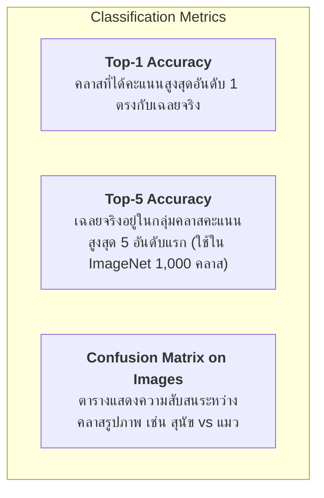

# บทที่ 3: ตัวชี้วัดประสิทธิภาพในงาน Computer Vision (Image Classification & YOLO Object Detection Metrics)

---

## 1. ตัวชี้วัดสำหรับงานจำแนกประเภทรูปภาพ (Image Classification Metrics)



* **Top-1 Accuracy:** สัดส่วนของรูปภาพที่โมเดลทายคลาสอันดับหนึ่งได้ถูกต้องแม่นยำ
* **Top-5 Accuracy:** รูปภาพที่เฉลยจริงติดอยู่ใน 5 อันดับแรกที่มีค่า Softmax สูงสุด (จำเป็นอย่างยิ่งสำหรับงานที่มีคลาสจำนวนมาก เช่น ImageNet 1,000 Classes)

---

## 2. ตัวชี้วัดสำหรับงานตรวจจับวัตถุ (Object Detection Metrics)

ในงาน Object Detection (เช่น YOLOv8, Faster R-CNN) โมเดลต้องทำนายทั้ง **ตำแหน่งพิกัดกรอบ (Bounding Box)** และ **คลาสวัตถุ (Category)** พร้อมกัน

---

### 2.1 ดรรชนีความทับซ้อนของกรอบ (Intersection over Union: IoU)

$$\text{IoU} = \frac{\text{Area of Overlap (พื้นที่ทับซ้อน)}}{\text{Area of Union (พื้นที่รวมทั้งหมด)}} = \frac{A \cap B}{A \cup B}$$

```
   Ground Truth Box (A)        Prediction Box (B)                Intersection (A ∩ B)
   ┌───────────────┐           ┌───────────────┐                    ┌─────────┐
   │               │           │               │                    │/////////│
   │       ┌───────┼───────┐   │       ┌───────┼───────┐            └─────────┘
   │       │///////│       │   │       │       │       │         ───────────────────
   └───────┼───────┘       │   └───────┼───────┘       │            Union (A ∪ B)
           │               │           │               │         ┌─────────────────┐
           └───────────────┘           └───────────────┘         └─────────────────┘
                                                                 IoU = 0.65 (ทับซ้อน 65%)
```

* **เกณฑ์การตัดสิน (IoU Threshold):**
  * หาก $\text{IoU} \ge 0.50$ และทายคลาสถูกต้อง $\rightarrow$ นับเป็น **True Positive (TP)**
  * หาก $\text{IoU} < 0.50$ หรือไม่มีวัตถุจริง $\rightarrow$ นับเป็น **False Positive (FP)**
  * หากมีวัตถุจริงแต่โมเดลตรวจไม่พบ $\rightarrow$ นับเป็น **False Negative (FN)**

---

### 2.2 Average Precision (AP) และ Mean Average Precision (mAP)

```
   Precision
    1.0 │  ╭─────────────╮
        │  │             ╰────────╮
    0.8 │  │                      ╰────────╮
        │  │       พื้นที่ใต้กราฟ P-R      ╰─────── (AP = Area under P-R curve)
    0.0 └──┴────────────────────────────────► Recall
       0.0                                 1.0
```

1. **Precision-Recall Curve:** วาดกราฟระหว่าง Precision บนแกน Y เทียบกับ Recall บนแกน X ณ ระดับ Confidence Threshold ต่างๆ ($0.0 - 1.0$)
2. **Average Precision (AP):** พื้นที่ใต้กราฟ Precision-Recall Curve ของ 1 คลาส
3. **Mean Average Precision (mAP):** ค่าเฉลี่ยของ AP รวมทุกคลาส ($K$ คลาส):
   $$\text{mAP} = \frac{1}{K} \sum_{c=1}^{K} \text{AP}_c$$
4. **เกณฑ์มาตรฐานระดับสากล (COCO Metrics):**
   * **$\text{mAP}@0.50$ (หรือ mAP50):** คำนวณ mAP ณ ค่าขอบเขต $\text{IoU} = 0.50$ (เกณฑ์ดั้งเดิมของ PASCAL VOC)
   * **$\text{mAP}@0.50:0.95$ (หรือ mAP50-95):** คำนวณค่าเฉลี่ย mAP ที่ระดับ IoU ตั้งแต่ $0.50$ ถึง $0.95$ (ขั้นละ $0.05$) **เป็นเกณฑ์ตัดสินความแม่นยำสูงสุดในงานวิจัยปัจจุบัน**

---

### 2.3 Non-Maximum Suppression (NMS)

อัลกอริทึมที่ใช้กรองลบ Bounding Box ที่ตรวจจับวัตถุตัวเดียวกันซ้ำซ้อน:
1. เรียงลำดับ Bounding Box ตามคะแนนความมั่นใจ (Confidence Score) จากมากไปน้อย
2. เลือกกล่องที่มีคะแนนสูงสุดไว้เสมอ
3. คำนวณ IoU เทียบกับกล่องอื่นๆ ที่เหลือ หากกล่องใดมี $\text{IoU} > \text{NMS Threshold}$ (เช่น $0.45$) ให้ **ลบทิ้งทันที**

---

## 3. โค้ดตัวอย่างการคำนวณ IoU, NMS และ mAP@0.5 (Python Snippet)

```python
import numpy as np

# 1. ฟังก์ชันคำนวณ IoU ระหว่าง 2 Bounding Box [x1, y1, x2, y2]
def compute_iou(boxA, boxB):
    xA = max(boxA[0], boxB[0])
    yA = max(boxA[1], boxB[1])
    xB = min(boxA[2], boxB[2])
    yB = min(boxA[3], boxB[3])
    
    inter_area = max(0, xB - xA) * max(0, yB - yA)
    boxA_area = (boxA[2] - boxA[0]) * (boxA[3] - boxA[1])
    boxB_area = (boxB[2] - boxB[0]) * (boxB[3] - boxB[1])
    
    union_area = float(boxA_area + boxB_area - inter_area)
    return inter_area / union_area if union_area > 0 else 0.0

# 2. ฟังก์ชัน Non-Maximum Suppression (NMS)
def non_max_suppression(boxes, scores, iou_threshold=0.45):
    if len(boxes) == 0:
        return []
    
    boxes = np.array(boxes)
    scores = np.array(scores)
    
    # ดัชนีเรียงตามคะแนน Confidence
    order = scores.argsort()[::-1]
    keep = []
    
    while len(order) > 0:
        idx = order[0]
        keep.append(idx)
        
        # คำนวณ IoU กับกล่องที่เหลือ
        ious = np.array([compute_iou(boxes[idx], boxes[other]) for other in order[1:]])
        
        # เก็บเฉพาะกล่องที่ IoU ต่ำกว่า Threshold (ไม่ทับซ้อนกับกล่องหลัก)
        remaining_indices = np.where(ious <= iou_threshold)[0]
        order = order[remaining_indices + 1]
        
    return keep

# 3. ทดสอบคำนวณ IoU และ NMS
if __name__ == '__main__':
    # กำหนด Bounding Box ตัวอย่าง [x1, y1, x2, y2]
    gt_box   = [50, 50, 200, 200]  # กล่องเฉลยจริง
    pred_box = [60, 60, 210, 210]  # กล่องที่โมเดลทำนาย
    
    iou = compute_iou(gt_box, pred_box)
    print("=" * 60)
    print(f"🎯 Bounding Box IoU: {iou:.4f} ({iou*100:.2f}%)")
    print(f"   Status: {'True Positive (TP) ✅' if iou >= 0.5 else 'False Positive (FP) ❌'}")
    
    # ทดสอบ NMS กรองกล่องซ้ำซ้อน
    candidate_boxes = [
        [50, 50, 200, 200],  # กล่อง A (หลัก)
        [52, 54, 198, 202],  # กล่อง B (ซ้ำซ้อน A)
        [300, 300, 450, 450] # กล่อง C (วัตถุอีกตัว)
    ]
    candidate_scores = [0.95, 0.82, 0.90]
    
    selected_indices = non_max_suppression(candidate_boxes, candidate_scores, iou_threshold=0.45)
    print("\n" + "=" * 60)
    print(f"🚀 NMS ผลลัพธ์การคัดเลือกกล่องที่ดีที่สุด:")
    print(f"   กล่องเดิมทั้งหมด: {len(candidate_boxes)} กล่อง -> หลังทำ NMS เหลือ: {len(selected_indices)} กล่อง (ดัชนี {selected_indices})")
```

### 📋 ผลลัพธ์การรันที่คาดหวัง (Expected Output)
```text
============================================================
🎯 Bounding Box IoU: 0.7358 (73.58%)
   Status: True Positive (TP) ✅

============================================================
🚀 NMS ผลลัพธ์การคัดเลือกกล่องที่ดีที่สุด:
   กล่องเดิมทั้งหมด: 3 กล่อง -> หลังทำ NMS เหลือ: 2 กล่อง (ดัชนี [0, 2])
```
