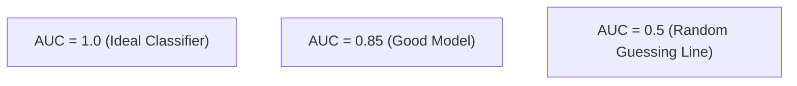

# บทที่ 3: ตัวชี้วัดการประเมินผลโมเดล (Evaluation Metrics)

---

## 1. ตาราง Confusion Matrix สำหรับการจำแนกประเภท (Classification)

Confusion Matrix เป็นตารางเปรียบเทียบผลทำนายของโมเดล (Predicted Class) กับเฉลยจริง (Actual Class)

| | **Actual Positive (1)** | **Actual Negative (0)** |
|---|---|---|
| **Predicted Positive (1)** | **True Positive (TP)** ทายว่าใช่ และใช่จริง | **False Positive (FP)** ทายว่าใช่ แต่ไม่ใช่จริง (Type I Error) |
| **Predicted Negative (0)** | **False Negative (FN)** ทายว่าไม่ใช่ แต่ใช่จริง (Type II Error) | **True Negative (TN)** ทายว่าไม่ใช่ และไม่ใช่จริง |

---

## 2. ตัวชี้วัดประสิทธิภาพ Classification Metrics

### 2.1 Accuracy (ความถูกต้องรวม)
สัดส่วนของตัวอย่างที่ทำนายถูกต้องทั้งหมดเทียบกับตัวอย่างทั้งหมด:

$$\text{Accuracy} = \frac{TP + TN}{TP + TN + FP + FN}$$

> [!WARNING]
> **ข้อจำกัดของ Accuracy:** ไม่สามารถใช้เป็นตัวชี้วัดหลักในโจทย์ **Imbalanced Dataset** ได้ เช่น ถ้ามีผู้ป่วยโรคร้ายแรง 1 คน และคนปกติ 99 คน หากโมเดลเดาว่า "ปกติ" ทั้งหมด จะได้ Accuracy สูงถึง 99% แต่ล้มเหลวในการตรวจหาผู้ป่วย 100%

---

### 2.2 Precision (ความแม่นยำของการทายผล)
เมื่อโมเดลทายว่า **"ใช่ (Positive)"** ผลปรากฏว่าเป็นจริงกี่เปอร์เซ็นต์:

$$\text{Precision} = \frac{TP}{TP + FP}$$

* **เมื่อไหร่ต้องเน้น Precision สูง?** งานที่การเกิด **False Positive (FP)** ส่งผลเสียรุนแรง เช่น **Spam Mail Filter** (หากอีเมลสำคัญถูกทายว่าเป็น Spam ผู้ใช้จะเสียโอกาสทันที)

---

### 2.3 Recall / Sensitivity (ความสามารถในการสแกนหา)
จากตัวอย่างจริงที่เป็น **"ใช่ (Positive)"** ทั้งหมด โมเดลสามารถตรวจจับเจอได้กี่เปอร์เซ็นต์:

$$\text{Recall} = \frac{TP}{TP + FN}$$

* **เมื่อไหร่ต้องเน้น Recall สูง?** งานที่การเกิด **False Negative (FN)** ส่งผลเสียถึงแก่ชีวิตหรือความเสียหายมหาศาล เช่น **การตรวจโรคคัดกรองมะเร็ง** หรือ **การตรวจจับวัตถุรุกล้ำพื้นที่ความปลอดภัย** (หลุดสแกนไม่ได้เด็ดขาด)

---

### 2.4 F1-Score (ค่าเฉลี่ยฮาร์มอนิก)
ค่าเฉลี่ยสมดุล (Harmonic Mean) ระหว่าง Precision และ Recall:

$$\text{F1-Score} = 2 \times \frac{\text{Precision} \times \text{Recall}}{\text{Precision} + \text{Recall}}$$

สำหรับ multi-class classification จะมีรูปแบบคำนวณ 3 แบบ:
1. **Macro F1:** คำนวณ F1-Score แยกทีละคลาสแล้วหาค่าเฉลี่ย (ให้ความสำคัญทุกคลาสเท่ากัน)
2. **Micro F1:** รวม TP, FP, FN ทั้งหมดมารวมกันแล้วคำนวณ F1 ครั้งเดียว
3. **Weighted F1:** ถ่วงน้ำหนัก F1-Score แต่ละคลาสตามจำนวนตัวอย่าง (Support)

---

### 2.5 ROC Curve และ AUC Score
* **Receiver Operating Characteristic (ROC) Curve:** กราฟพล็อตระหว่าง **True Positive Rate (Recall)** บนแกน Y เทียบกับ **False Positive Rate ($\frac{FP}{FP+TN}$)** บนแกน X ณ ระดับ Threshold ต่างๆ ($0.0 - 1.0$)
* **Area Under the Curve (AUC):** พื้นที่ใต้กราฟ ROC
  * $\text{AUC} = 1.0$: โมเดลทำนายแยกแยะสมบูรณ์แบบ
  * $\text{AUC} = 0.5$: โมเดลเดาสุ่ม
  * $\text{AUC} < 0.5$: โมเดลทำนายตรงข้ามความจริง

---

## 3. ตัวชี้วัดสำหรับการประมาณค่าเชิงตัวเลข (Regression Metrics)

เมื่อทำนายค่าตัวเลขต่อเนื่อง (Continuous Output เช่น ราคายูสเซอร์ หรืออุณหภูมิ):

1. **Mean Squared Error (MSE):**
   $$\text{MSE} = \frac{1}{n} \sum_{i=1}^{n} (y_i - \hat{y}_i)^2$$
   ทำโทษข้อผิดพลาดขนาดใหญ่รุนแรงเนื่องจากมีการยกกำลังสอง

2. **Root Mean Squared Error (RMSE):**
   $$\text{RMSE} = \sqrt{\text{MSE}}$$
   ถอดสแควร์รูทเพื่อให้หน่วยของ Error กลับมาตรงกับหน่วยข้อมูลเดิม

3. **Mean Absolute Error (MAE):**
   $$\text{MAE} = \frac{1}{n} \sum_{i=1}^{n} |y_i - \hat{y}_i|$$
   คิดค่าเบี่ยงเบนเฉลี่ยตรงๆ ทนทานต่อ Outliers มากกว่า MSE

4. **Coefficient of Determination ($R^2$ Score):**
   $$R^2 = 1 - \frac{\sum (y_i - \hat{y}_i)^2}{\sum (y_i - \bar{y})^2}$$
   บอกว่าโมเดลอธิบายความผันผวนของข้อมูลได้กี่เปอร์เซ็นต์ ($R^2 = 1.0$ คืออธิบายได้สมบูรณ์แบบ)
