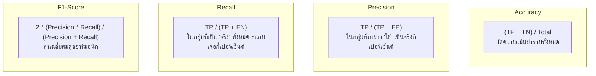

# บทที่ 3: ตัวชี้วัดประสิทธิภาพโมเดล (Evaluation Metrics: Classification & Regression)

---

## 1. ตาราง Confusion Matrix สำหรับการจำแนกประเภท (Classification)

Confusion Matrix เป็นตารางมาตรฐานสากลที่ใช้เปรียบเทียบผลลัพธ์การทำนายของโมเดล (Prediction) กับความเป็นจริง (Ground Truth):

```
                        ╔═════════════════════════════════════════════════════╗
                        ║                    ACTUAL CLASS                     ║
                        ╠══════════════════════════╦══════════════════════════╣
                        ║   Positive (1) (ของจริง) ║   Negative (0) (ของจริง) ║
 ╔═════════╦════════════╬══════════════════════════╬══════════════════════════╣
 ║         ║ Positive   ║   True Positive (TP)     ║   False Positive (FP)    ║
 ║ PREDICT ║ (ทายว่า 1) ║   ทายถูกว่าเป็น 1        ║   ทายผิดว่าเป็น 1        ║
 ║  CLASS  ╠════════════╬══════════════════════════╬══════════════════════════╣
 ║         ║ Negative   ║   False Negative (FN)    ║   True Negative (TN)     ║
 ║         ║ (ทายว่า 0) ║   ทายผิดว่าเป็น 0        ║   ทายถูกว่าเป็น 0        ║
 ╚═════════╩════════════╩══════════════════════════╩══════════════════════════╝
```

---

## 2. เจาะลึกตัวชี้วัด Classification Metrics



### 2.1 Accuracy (ความถูกต้องรวม)
$$\text{Accuracy} = \frac{TP + TN}{TP + TN + FP + FN}$$
> [!WARNING]
> ห้ามใช้ Accuracy เป็นตัวตัดสินเดี่ยวในชุดข้อมูลที่ไม่สมดุล (Imbalanced Data) เช่น ถ้ามีคนร้าย 1 คน และคนบริสุทธิ์ 99 คน การทายว่า "คนบริสุทธิ์" ทั้งหมด จะได้ Accuracy 99% แต่จับคนร้ายไม่ได้เลย (0%)

---

### 2.2 Precision vs Recall: บริบทการเลือกใช้งานในชีวิตจริง

| ตัวชี้วัด | สูตรคณิตศาสตร์ | เน้นใช้ในกรณีใด? | ตัวอย่างการใช้งานจริง |
|---|:---:|---|---|
| **Precision** | $$\frac{TP}{TP + FP}$$ | เมื่อการเกิด **False Positive (FP)** ส่งผลเสียร้ายแรง | **ระบบคัดกรองอีเมลขยะ (Spam Filter):**<br>ถ้าอีเมลสมัครงานสำคัญถูกทายผิดว่าเป็น Spam ผู้ใช้จะเสียโอกาสทันที |
| **Recall**<br>(Sensitivity) | $$\frac{TP}{TP + FN}$$ | เมื่อการเกิด **False Negative (FN)** ส่งผลเสียหายต่อชีวิต/ทรัพย์สิน | **ระบบวินิจฉัยโรคมะเร็ง / ตรวจจับวัตถุอันตราย:**<br>ห้ามปล่อยให้ผู้ป่วยมะเร็งหลุดรอดการตรวจพบเด็ดขาด |

---

### 2.3 F1-Score และรูปแบบ Multi-Class (Macro, Micro, Weighted)
$$\text{F1-Score} = 2 \times \frac{\text{Precision} \times \text{Recall}}{\text{Precision} + \text{Recall}}$$

1. **Macro F1:** คำนวณ F1 ของแต่ละคลาสแยกกันแล้วหาค่าเฉลี่ย (ให้ความสำคัญทุกคลาสเท่าเทียมกัน เหมาะกับคลาสที่หายาก)
2. **Micro F1:** รวมผลรวม TP, FP, FN ทั้งหมดของทุกคลาสมารวมกันแล้วคำนวณครั้งเดียว
3. **Weighted F1:** ถ่วงน้ำหนัก F1 แต่ละคลาสตามสัดส่วนจำนวนตัวอย่าง (Support)

---

### 2.4 ROC Curve และ AUC Score (Receiver Operating Characteristic)

* **True Positive Rate (TPR / Recall):** $\frac{TP}{TP + FN}$ บนแกน Y
* **False Positive Rate (FPR):** $\frac{FP}{FP + TN}$ บนแกน X

```
    TPR (Recall)
    1.0 │          ╭─────────────── (AUC = 1.0 : โมเดลสมบูรณ์แบบ)
        │       ╭──╯
    0.8 │     ╭─╯                 (AUC = 0.85 : โมเดลคุณภาพดีเยี่ยม)
        │   ╭─╯
    0.5 │ ╭─╯ ─ ─ ─ ─ ─ ─ ─ ─ ─ ─ (AUC = 0.50 : เส้นสุ่มเดา Random Guess)
        │ ╱
    0.0 └──┴────────┴────────┴─────► FPR
       0.0         0.5       1.0
```

---

## 3. ตัวชี้วัดสำหรับงาน Regression (ประมาณค่าตัวเลข)

1. **Mean Squared Error (MSE):**
   $$\text{MSE} = \frac{1}{N} \sum_{i=1}^{N} (y_i - \hat{y}_i)^2$$
   * ทำโทษค่าความผิดพลาดขนาดใหญ่รุนแรงเนื่องจากมีการยกกำลังสอง
2. **Root Mean Squared Error (RMSE):**
   $$\text{RMSE} = \sqrt{\text{MSE}}$$
   * มีหน่วยตรงกับหน่วยของข้อมูลจริง (เช่น บาท, กิโลกรัม)
3. **Mean Absolute Error (MAE):**
   $$\text{MAE} = \frac{1}{N} \sum_{i=1}^{N} |y_i - \hat{y}_i|$$
   * ทนทานต่อ Outliers มากกว่า MSE
4. **$R^2$ Score (Coefficient of Determination):**
   $$R^2 = 1 - \frac{\sum (y_i - \hat{y}_i)^2}{\sum (y_i - \bar{y})^2}$$
   * บ่งบอกว่าโมเดลสามารถอธิบายความผันผวนของข้อมูลได้กี่เปอร์เซ็นต์ ($R^2 = 1.0$ คืออธิบายได้สมบูรณ์แบบ)

---

## 4. โค้ดตัวอย่างการประเมินผลและการวาดกราฟ (Python Code Snippet)

```python
import numpy as np
from sklearn.datasets import make_classification, make_regression
from sklearn.model_selection import train_test_split
from sklearn.ensemble import RandomForestClassifier, RandomForestRegressor
from sklearn.metrics import (
    confusion_matrix, accuracy_score, precision_score, recall_score,
    f1_score, roc_auc_score, classification_report,
    mean_squared_error, mean_absolute_error, r2_score
)

# 1. Classification Evaluation
X_c, y_c = make_classification(n_samples=1000, n_features=15, weights=[0.7, 0.3], random_state=42)
Xc_train, Xc_test, yc_train, yc_test = train_test_split(X_c, y_c, test_size=0.25, random_state=42)

clf = RandomForestClassifier(n_estimators=100, random_state=42)
clf.fit(Xc_train, yc_train)

yc_pred = clf.predict(Xc_test)
yc_prob = clf.predict_proba(Xc_test)[:, 1]

cm = confusion_matrix(yc_test, yc_pred)
tn, fp, fn, tp = cm.ravel()

print("=" * 60)
print("📊 CLASSIFICATION METRICS SUMMARY")
print("=" * 60)
print(f"Confusion Matrix -> TP: {tp}, TN: {tn}, FP: {fp}, FN: {fn}")
print(f"Accuracy  : {accuracy_score(yc_test, yc_pred)*100:.2f}%")
print(f"Precision : {precision_score(yc_test, yc_pred)*100:.2f}%")
print(f"Recall    : {recall_score(yc_test, yc_pred)*100:.2f}%")
print(f"F1-Score  : {f1_score(yc_test, yc_pred)*100:.2f}%")
print(f"ROC-AUC   : {roc_auc_score(yc_test, yc_prob):.4f}")

# 2. Regression Evaluation
X_r, y_r = make_regression(n_samples=500, n_features=10, noise=12.0, random_state=42)
Xr_train, Xr_test, yr_train, yr_test = train_test_split(X_r, y_r, test_size=0.25, random_state=42)

reg = RandomForestRegressor(n_estimators=100, random_state=42)
reg.fit(Xr_train, yr_train)
yr_pred = reg.predict(Xr_test)

print("\n" + "=" * 60)
print("📉 REGRESSION METRICS SUMMARY")
print("=" * 60)
mse = mean_squared_error(yr_test, yr_pred)
print(f"MSE  : {mse:.2f}")
print(f"RMSE : {np.sqrt(mse):.2f}")
print(f"MAE  : {mean_absolute_error(yr_test, yr_pred):.2f}")
print(f"R²   : {r2_score(yr_test, yr_pred):.4f} ({r2_score(yr_test, yr_pred)*100:.2f}%)")
```

### 📋 ผลลัพธ์การรันที่คาดหวัง (Expected Output)
```text
============================================================
📊 CLASSIFICATION METRICS SUMMARY
============================================================
Confusion Matrix -> TP: 64, TN: 168, FP: 2, FN: 16
Accuracy  : 92.80%
Precision : 96.97%
Recall    : 80.00%
F1-Score  : 87.67%
ROC-AUC   : 0.9367

============================================================
📉 REGRESSION METRICS SUMMARY
============================================================
MSE  : 4453.71
RMSE : 66.74
MAE  : 51.26
R²   : 0.7869 (78.69%)
```
