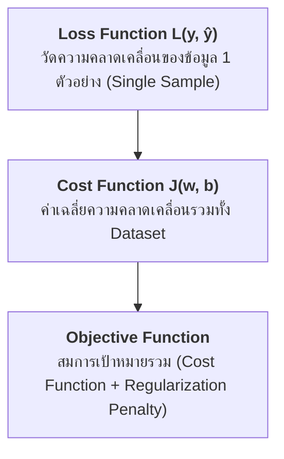
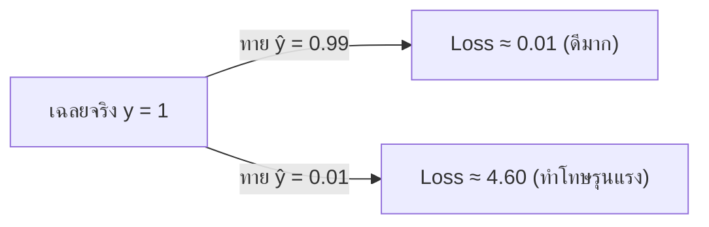

# บทที่ 4: เจาะลึกฟังก์ชันความสูญเสีย (Loss Functions) และฟังก์ชันต้นทุน (Cost Functions)

---

## 1. นิยามและความแตกต่าง: Loss Function vs Cost Function vs Objective Function

ในการฝึกสอนโมเดลปัญญาประดิษฐ์และ Machine Learning คำว่า Loss Function, Cost Function และ Objective Function มักถูกใช้สลับกัน แต่มักมีความแตกต่างทางคณิตศาสตร์ดังนี้:

1. **Loss Function $L(y_i, \hat{y}_i)$:** คำนวณค่าความผิดพลาดของการทำนาย ($\hat{y}_i$) เทียบกับเฉลยจริง ($y_i$) สำหรับ **ข้อมูลตัวอย่างเดี่ยว 1 จุด**
2. **Cost Function $J(w, b)$:** ค่าเฉลี่ยของ Loss Function รวม **ทั่วทั้งชุดข้อมูล (Entire Dataset)**:
   $$J(w, b) = \frac{1}{N} \sum_{i=1}^{N} L(y_i, \hat{y}_i)$$
3. **Objective Function:** สมการเป้าหมายทั่วไปที่อัลกอริทึมพยายามจะย่อค่า (Minimize) หรือขยายค่า (Maximize) ซึ่งใน Machine Learning มักเป็น:
   $$\text{Objective} = J(w, b) + \lambda \text{Penalty}(w)$$

---

## 2. ฟังก์ชันความสูญเสียสำหรับงานจำแนกประเภท (Classification Loss Functions)

### 2.1 Binary Cross-Entropy Loss (Log Loss)
ใช้สำหรับโจทย์การจำแนกประเภทแบบ 2 คลาส ($y \in \{0, 1\}$) โดยให้เอาต์พุต $\hat{y} \in [0.0, 1.0]$ เป็นค่าความน่าจะเป็น (Probability)

$$L_{\text{BCE}}(y, \hat{y}) = -\left[ y \log(\hat{y}) + (1 - y) \log(1 - \hat{y}) \right]$$

* **กลไกการทำงาน:**
  * หากเฉลยจริง $y = 1$: สมการเหลือ $-\log(\hat{y})$ $\rightarrow$ หากโมเดลทาย $\hat{y} \rightarrow 1$ Loss จะเข้าใกล้ 0 แต่หากทาย $\hat{y} \rightarrow 0$ Loss จะพุ่งขึ้นเป็นอนันต์ ($\infty$) ทำโทษโมเดลอย่างรุนแรง
  * หากเฉลยจริง $y = 0$: สมการเหลือ $-\log(1 - \hat{y})$

---

### 2.2 Categorical Cross-Entropy Loss & Sparse Categorical Cross-Entropy
ใช้สำหรับโจทย์จำแนกประเภทหลายคลาส (Multi-class Classification, $K > 2$ คลาส) โดยส่งผ่านเอาต์พุตด้วยฟังก์ชัน **Softmax**

$$L_{\text{CCE}}(y, \hat{y}) = -\sum_{c=1}^{K} y_c \log(\hat{y}_c)$$

* **Categorical Cross-Entropy:** เฉลย $y$ อยู่ในฟอร์แมต One-Hot Vector เช่น `[0, 1, 0]`
* **Sparse Categorical Cross-Entropy:** เฉลย $y$ อยู่ในฟอร์แมต Integer Index เช่น `1` (ประหยัดหน่วยความจำเมื่อมีคลาสจำนวนมาก)

---

### 2.3 Focal Loss (สำหรับโจทย์ Imbalanced Dataset รุนแรง)
แก้ไขปัญหาโจทย์ที่มีคลาสซ้ำๆ สแกนเจอง่าย (Easy Examples) เป็นจำนวนมาก จนกลบสัญญาณของคลาสสำคัญที่หายาก (Hard Examples)

$$L_{\text{Focal}} = -\alpha_t (1 - \hat{p}_t)^\gamma \log(\hat{p}_t)$$

* $\gamma$ (Focusing Parameter): ลดทอนน้ำหนักของ Easy Examples (ตัวอย่างที่ทายถูกมั่นใจสูง) ลง เพื่อบังคับให้โมเดลหันไปสนใจตัวอย่างที่ยาก
* นิยมใช้ในโมเดล Object Detection เช่น RetinaNet

---

### 2.4 Hinge Loss (สำหรับ Support Vector Machines)
ใช้ในโมเดล Support Vector Machines (SVM) กำหนดขอบเขตความมั่นใจ (Margin)

$$L_{\text{Hinge}}(y, \hat{y}) = \max(0, 1 - y \cdot \hat{y}), \quad y \in \{-1, 1\}$$

---

## 3. ฟังก์ชันความสูญเสียสำหรับงานประมาณค่าตัวเลข (Regression Loss Functions)

### 3.1 Mean Squared Error (MSE / L2 Loss)
คำนวณกำลังสองของผลต่างระหว่างค่าจริงและค่าทำนาย:

$$J_{\text{MSE}} = \frac{1}{N} \sum_{i=1}^{N} (y_i - \hat{y}_i)^2$$

* **ข้อดี:** เป็นฟังก์ชันเส้นโค้งเรียบ (Convex & Differentiable) คำนวณ Gradient ง่าย
* **ข้อจำกัด:** **ไวต่อ Outliers มาก** เพราะค่าความผิดพลาดขนาดใหญ่จะถูกยกกำลังสอง ทำโทษจนค่าน้ำหนักเพี้ยน

---

### 3.2 Mean Absolute Error (MAE / L1 Loss)
คำนวณค่าสัมบูรณ์ของผลต่าง:

$$J_{\text{MAE}} = \frac{1}{N} \sum_{i=1}^{N} |y_i - \hat{y}_i|$$

* **ข้อดี:** **ทนทานต่อ Outliers (Robust to Outliers)**
* **ข้อจำกัด:** อนุพันธ์ (Gradient) มีค่าคงที่ตลอดเส้น และไม่สามารถหาอนุพันธ์ได้ที่จุด $y - \hat{y} = 0$ (จุดยอดแหลม) ทำให้ลู่เข้าจุดสมดุลได้ยาก

---

### 3.3 Huber Loss / Smooth L1 Loss (ทางออกสายกลาง)
รวมข้อดีของ MSE และ MAE เข้าด้วยกัน:
* หากความคลาดเคลื่อนน้อยกว่าค่า $\delta$: ใช้ **MSE** (เพื่อให้ลู่เข้าจุดสมดุลได้ราบรื่น)
* หากความคลาดเคลื่อนมากกว่าค่า $\delta$: ใช้ **MAE** (เพื่อไม่ให้ Outliers ทำโทษโมเดลเกินไป)

$$L_{\delta}(y, \hat{y}) = \begin{cases} \frac{1}{2}(y - \hat{y})^2 & \text{ถ้า } |y - \hat{y}| \le \delta \\ \delta \cdot |y - \hat{y}| - \frac{1}{2}\delta^2 & \text{ถ้า } |y - \hat{y}| > \delta \end{cases}$$

---

## 4. ฟังก์ชันความสูญเสียเฉพาะทางใน Computer Vision

### 4.1 Bounding Box Losses (IoU, GIoU, DIoU, CIoU)
ในงาน Object Detection การใช้อัลกอริทึม Smooth L1 วัดพิกัด Bounding Box แยกจุด $(x, y, w, h)$ มักไม่สอดคล้องกับดรรชนี IoU จึงมีการพัฒนา Loss เฉพาะ:

1. **IoU Loss:** $L_{\text{IoU}} = 1 - \text{IoU}$
2. **GIoU Loss (Generalized IoU):** แก้ปัญหากรณี Bounding Box ไม่ทับซ้อนกันเลย (IoU = 0)
3. **DIoU Loss (Distance IoU):** พิจารณาระยะห่างระหว่างจุดศูนย์กลางของกรอบ
4. **CIoU Loss (Complete IoU):** พิจารณาทั้ง IoU, ระยะห่างจุดศูนย์กลาง, และอัตราส่วน Aspect Ratio (ใช้ใน YOLOv5/v8/v11)

---

## 5. ตารางเปรียบเทียบการเลือกใช้งาน Loss Function

| งานที่ใช้ | Loss Function ที่แนะนำ | เมื่อไหร่ควรเลือกใช้ |
|---|---|---|
| **Binary Classification** | Binary Cross-Entropy (Log Loss) | โจทย์ทายผล 2 ทาง (ใช่/ไม่ใช่, สแปม/ไม่สแปม) |
| **Multi-class Classification** | Categorical Cross-Entropy | โจทย์ทายผลหลายคลาส (คลาสไม่ทับซ้อนกัน) |
| **Imbalanced Classification** | Focal Loss | ข้อมูลคลาสเป้าหมายมีจำนวนน้อยมาก (< 5%) |
| **Standard Regression** | Mean Squared Error (MSE) | ข้อมูลสะอาด ไม่มี Outliers รุนแรง |
| **Outlier-Heavy Regression** | Huber Loss / MAE | ข้อมูลมี Noise หรือมี Outliers ปะปนมาก |
| **Object Detection** | CIoU / GIoU Loss | วัดความแม่นยำของการตีกรอบ Bounding Box |
