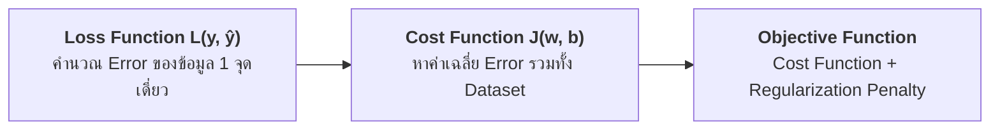

# บทที่ 4: เจาะลึกฟังก์ชันความสูญเสีย (Loss Functions) และฟังก์ชันต้นทุน (Cost Functions)

---

## 1. นิยามความแตกต่าง: Loss vs Cost vs Objective Function



* **Loss Function $L(y_i, \hat{y}_i)$:** วัดความผิดพลาดของ **1 ตัวอย่างเดี่ยว**
* **Cost Function $J(w, b)$:** ค่าเฉลี่ยความผิดพลาดของ **ทั้งชุดข้อมูล ($N$ ตัวอย่าง)**:
  $$J(w, b) = \frac{1}{N} \sum_{i=1}^{N} L(y_i, \hat{y}_i)$$
* **Objective Function:** สมการเป้าหมายรวมที่ให้อัลกอริทึม Optimization ค้นหาค่าต่ำสุด เช่น $J(w, b) + \lambda \sum w^2$

---

## 2. กลุ่มฟังก์ชันความสูญเสียสำหรับงาน Classification

```
   Binary Cross-Entropy Loss (เมื่อเฉลยจริง y = 1)
   Loss
    ▲
5.0 ┼  ╲
4.0 ┼   ╲
3.0 ┼    ╲
2.0 ┼     ╲
1.0 ┼      ╲
0.0 ┼───────┴────────┴────────┴────────► Prediction (ŷ)
   0.0      0.25     0.50     1.0 (ทาย ŷ -> 1 Loss -> 0)
```

### 2.1 Binary Cross-Entropy Loss (Log Loss)
$$L_{\text{BCE}}(y, \hat{y}) = -\left[ y \log(\hat{y}) + (1 - y) \log(1 - \hat{y}) \right]$$

### 2.2 Categorical Cross-Entropy Loss (Multi-Class)
$$L_{\text{CCE}}(y, \hat{y}) = -\sum_{c=1}^{K} y_c \log(\hat{y}_c)$$
* ใช้คู่กับ Activation **Softmax** ในชั้นสุดท้าย

### 2.3 Focal Loss (แก้ปัญหาคลาสไม่สมดุลรุนแรงใน Object Detection)
$$L_{\text{Focal}} = -\alpha_t (1 - \hat{p}_t)^\gamma \log(\hat{p}_t)$$
* ค่า $\gamma$ (Focusing Parameter) จะช่วยกดน้ำหนักของตัวอย่างที่โมเดลทายถูกอย่างมั่นใจแล้ว (Easy Examples) ลง เพื่อให้โมเดลโฟกัสเฉพาะตัวอย่างที่ยาก (Hard Examples)

---

## 3. กลุ่มฟังก์ชันความสูญเสียสำหรับงาน Regression

```
   Loss Curve Comparison
   Loss
    ▲           ╱ MSE (L2 Loss: โค้งพาราโบลา ยกกำลังสอง ไวต่อ Outliers)
    │         ╱
    │       ╱   Huber Loss (Smooth L1: ปรับเป็นเส้นตรงเมื่อ Error ใหญ่)
    │     ╱
    │   ╱       MAE (L1 Loss: เส้นตรง V-Shape ทนต่อ Outliers)
    │ ╱
    └─────────────────────────────► Error (y - ŷ)
```

### 3.1 Mean Squared Error (MSE / L2 Loss)
$$L_{\text{MSE}} = (y - \hat{y})^2$$
* **ข้อดี:** หาอนุพันธ์ได้ราบรื่นทุกจุด (Differentiable) ลู่เข้าจุดศูนย์กลางได้เร็ว
* **ข้อเสีย:** **ไวต่อ Outliers มาก** เพราะค่าความผิดพลาดขนาดใหญ่จะถูกยกกำลังสอง

### 3.2 Mean Absolute Error (MAE / L1 Loss)
$$L_{\text{MAE}} = |y - \hat{y}|$$
* **ข้อดี:** ทนทานต่อ Outliers (Robust)
* **ข้อเสีย:** ไม่สามารถหาอนุพันธ์ที่จุด $0$ ได้ตรงๆ และความชันคงที่ทำให้ลู่เข้าสมดุลช้า

### 3.3 Huber Loss / Smooth L1 (การประนีประนอมที่ลงตัว)
$$L_{\delta}(e) = \begin{cases} \frac{1}{2} e^2 & \text{ถ้า } |e| \le \delta \\ \delta |e| - \frac{1}{2}\delta^2 & \text{ถ้า } |e| > \delta \end{cases}$$
* เมื่อ Error น้อย ($|e| \le \delta$) จะใช้ **MSE** เพื่อความนุ่มนวล
* เมื่อ Error มาก ($|e| > \delta$) จะสลับเป็น **MAE** เพื่อป้องกันไม่ให้ Outliers ทำลายค่าน้ำหนัก

---

## 4. ฟังก์ชันความสูญเสียเฉพาะทางใน Computer Vision

### 4.1 Bounding Box Losses (IoU, GIoU, DIoU, CIoU)
ในงานตรวจจับวัตถุ (Object Detection เช่น YOLOv8/v11):
1. **IoU Loss:** $1 - \text{IoU}$
2. **GIoU Loss:** แก้ปัญหากรณีกรอบไม่ซ้อนทับกันเลย
3. **CIoU Loss (Complete IoU):** คิดทั้งความทับซ้อน (IoU), ระยะห่างระหว่างจุดกึ่งกลางกรอบ, และสัดส่วน Aspect Ratio ($w/h$)

---

## 5. โค้ดตัวอย่างการคำนวณและเปรียบเทียบ Loss Functions (Python Snippet)

```python
import numpy as np

# 1. การคำนวณ Binary Cross-Entropy
def binary_cross_entropy(y_true, y_pred, eps=1e-15):
    y_pred = np.clip(y_pred, eps, 1 - eps)
    return -np.mean(y_true * np.log(y_pred) + (1 - y_true) * np.log(1 - y_pred))

# 2. การคำนวณ Focal Loss
def focal_loss(y_true, y_pred, gamma=2.0, alpha=0.25, eps=1e-15):
    y_pred = np.clip(y_pred, eps, 1 - eps)
    p_t = np.where(y_true == 1, y_pred, 1 - y_pred)
    alpha_t = np.where(y_true == 1, alpha, 1 - alpha)
    loss = -alpha_t * ((1 - p_t) ** gamma) * np.log(p_t)
    return np.mean(loss)

# 3. การคำนวณ Huber Loss
def huber_loss(y_true, y_pred, delta=1.0):
    error = y_true - y_pred
    is_small_error = np.abs(error) <= delta
    squared_loss = 0.5 * (error ** 2)
    linear_loss = delta * np.abs(error) - 0.5 * (delta ** 2)
    return np.mean(np.where(is_small_error, squared_loss, linear_loss))

# ทดสอบเปรียบเทียบ Loss
y_true_cls = np.array([1, 1, 0, 0])
y_pred_good = np.array([0.95, 0.90, 0.05, 0.10])
y_pred_bad  = np.array([0.10, 0.20, 0.85, 0.90])

print("=" * 60)
print(f"BCE Loss (ทายแม่น)  : {binary_cross_entropy(y_true_cls, y_pred_good):.4f}")
print(f"BCE Loss (ทายแย่)   : {binary_cross_entropy(y_true_cls, y_pred_bad):.4f}")
print(f"Focal Loss (ทายแม่น): {focal_loss(y_true_cls, y_pred_good):.4f}")
print(f"Focal Loss (ทายแย่) : {focal_loss(y_true_cls, y_pred_bad):.4f}")

# ทดสอบ Huber Loss กับ Outliers
y_reg_true = np.array([10.0, 12.0, 15.0, 100.0]) # 100.0 คือ Outlier
y_reg_pred = np.array([10.5, 11.8, 14.9,  15.0]) # ทำนายพลาดเยอะที่จุด Outlier

mse = np.mean((y_reg_true - y_reg_pred) ** 2)
mae = np.mean(np.abs(y_reg_true - y_reg_pred))
huber = huber_loss(y_reg_true, y_reg_pred, delta=1.0)

print("\n" + "=" * 60)
print(f"MSE Loss (โดน Outlier ยกกำลังสอง) : {mse:.2f}")
print(f"MAE Loss (ทนต่อ Outlier)          : {mae:.2f}")
print(f"Huber Loss (ประนีประนอม)          : {huber:.2f}")
```

### 📋 ผลลัพธ์การรันที่คาดหวัง (Expected Output)
```text
============================================================
BCE Loss (ทายแม่น)  : 0.0784
BCE Loss (ทายแย่)   : 2.3026
Focal Loss (ทายแม่น): 0.0001
Focal Loss (ทายแย่) : 0.4077

============================================================
MSE Loss (โดน Outlier ยกกำลังสอง) : 1806.32
MAE Loss (ทนต่อ Outlier)          : 21.43
Huber Loss (ประนีประนอม)          : 21.04
```
