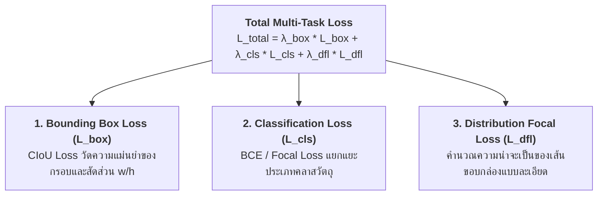

# บทที่ 4: เจาะลึกฟังก์ชันความสูญเสียในงาน Computer Vision (Classification, YOLO CIoU Bounding Box Loss & Focal Loss)

---

## 1. สถาปัตยกรรม Multi-Task Loss ในงาน Computer Vision

ในโมเดลตรวจจับวัตถุยุคใหม่ (เช่น YOLOv8, YOLOv11) การฝึกสอน 1 รอบต้องคำนวณ Loss พร้อมกัน 3 องค์ประกอบ (**Multi-Task Loss**):



---

## 2. ฟังก์ชันความสูญเสียสำหรับจำแนกคลาสวัตถุ (Vision Classification Losses)

### 2.1 Cross-Entropy พร้อม Label Smoothing
การฝึกสอนด้วย One-Hot Vector `[1, 0, 0]` มักทำให้โมเดลเกิดความมั่นใจเกินเหตุ (Overconfidence) และ Overfitting ได้ง่าย 

**Label Smoothing** จะกระจายความน่าจะเป็นเล็กน้อย ($\epsilon = 0.1$) ให้คลาสอื่นๆ เช่น `[0.90, 0.05, 0.05]` ช่วยให้โมเดลมี Generalization บนรูปภาพใหม่ได้ดีขึ้น

---

### 2.2 Focal Loss (หัวใจของการแก้ปัญหา Background Class ท่วมท้น)
ในภาพขนาด $640 \times 640$ พื้นที่ส่วนใหญ่กว่า 98% มักเป็น **"ฉากหลังว่างเปล่า (Background)"** ทำให้เกิด Easy Negative ตัวอย่างง่ายๆ ท่วมท้นระบบ

$$L_{\text{Focal}} = -\alpha_t (1 - p_t)^\gamma \log(p_t)$$

```
   Loss
    ▲
5.0 ┼  ╲  Standard Cross-Entropy (ตัวอย่างง่ายๆ ยังคงสะสม Loss มหาศาล)
4.0 ┼   ╲
3.0 ┼    ╲
2.0 ┼     ╲  Focal Loss (γ = 2.0: ลดทอน Loss ของตัวอย่างที่มั่นใจแล้วลงเกือบ 0)
1.0 ┼      ───────╮
0.0 ┼─────────────┴──────────────────────► Probability of Ground Truth (p_t)
   0.0                                  1.0 (มั่นใจว่าใช่)
```

---

## 3. วิวัฒนาการของ Bounding Box Regression Loss

```
   [ Smooth L1 ] ──► [ IoU Loss ] ──► [ GIoU Loss ] ──► [ DIoU Loss ] ──► [ CIoU Loss ]
    (คิดพิกัดแยก)      (คิดพื้นที่รวม)    (แก้กรอบไม่ทับ)    (คิดระยะจุดศูนย์กลาง)   (คิดสัดส่วน w/h)
```

| Loss Function | สูตรคำนวณ | ข้อดี | ข้อจำกัด |
|---|---|---|---|
| **Smooth L1** | คิดพิกัดแยก $(x, y, w, h)$ | คำนวณง่าย | ไม่สอดคล้องกับดรรชนีความทับซ้อน IoU |
| **IoU Loss** | $1 - \text{IoU}$ | ตรงกับเกณฑ์วัดผล | หากกรอบไม่ทับซ้อนกันเลย ($\text{IoU}=0$) Gradient จะกลายเป็น 0 |
| **GIoU Loss** | $1 - \text{IoU} + \frac{|C \setminus (A \cup B)|}{|C|}$ | แก้ปัญหากรณี $\text{IoU} = 0$ ได้ | ลู่เข้าช้ามากในแนวแกนราบ/ดิ่ง |
| **DIoU Loss** | $1 - \text{IoU} + \frac{\rho^2(b, b^{gt})}{c^2}$ | ดึงจุดศูนย์กลางกล่องเข้าหากันโดยตรง | ยังไม่ได้คำนวณความสอดคล้องของสัดส่วน Aspect Ratio |
| **CIoU Loss**<br>*(มาตรฐาน YOLO)* | **$1 - \text{IoU} + \frac{\rho^2(b, b^{gt})}{c^2} + \alpha v$** | **สมบูรณ์แบบที่สุด** คิดทั้งความทับซ้อน, ระยะห่าง, และสัดส่วน $w/h$ | สูตรคณิตศาสตร์มีความซับซ้อน |

---

### 3.1 เจาะลึกสมการ CIoU Loss (Complete IoU)

$$\mathcal{L}_{\text{CIoU}} = 1 - \text{IoU} + \frac{\rho^2(b, b^{gt})}{c^2} + \alpha v$$

* $\rho(b, b^{gt})$: ระยะทางแบบ Euclidean ระหว่างจุดกึ่งกลางของกล่องทำนายและกล่องเฉลย
* $c$: ความยาวเส้นทแยงมุมของกล่องครอบที่เล็กที่สุด (Smallest Enclosing Box)
* $v$: ดรรชนีวัดความสอดคล้องของอัตราส่วนภาพ (Aspect Ratio Consistency):
  $$v = \frac{4}{\pi^2} \left( \arctan \frac{w^{gt}}{h^{gt}} - \arctan \frac{w}{h} \right)^2$$
* $\alpha$: พารามิเตอร์ถ่วงน้ำหนัก: $\alpha = \frac{v}{(1 - \text{IoU}) + v}$

---

## 4. โค้ดตัวอย่าง PyTorch การคำนวณ CIoU Loss และ Focal Loss (Python Snippet)

```python
import torch
import torch.nn as nn
import math

# 1. ฟังก์ชัน PyTorch คำนวณ Complete IoU (CIoU) Loss
def bbox_ciou_loss(pred_boxes, target_boxes, eps=1e-7):
    # กล่องในฟอร์แมต [x1, y1, x2, y2]
    b1_x1, b1_y1, b1_x2, b1_y2 = pred_boxes.unbind(-1)
    b2_x1, b2_y1, b2_x2, b2_y2 = target_boxes.unbind(-1)
    
    # 1. คำนวณ Intersection
    inter_x1 = torch.max(b1_x1, b2_x1)
    inter_y1 = torch.max(b1_y1, b2_y1)
    inter_x2 = torch.min(b1_x2, b2_x2)
    inter_y2 = torch.min(b1_y2, b2_y2)
    inter_area = (inter_x2 - inter_x1).clamp(0) * (inter_y2 - inter_y1).clamp(0)
    
    # 2. คำนวณ Union
    w1, h1 = b1_x2 - b1_x1, b1_y2 - b1_y1
    w2, h2 = b2_x2 - b2_x1, b2_y2 - b2_y1
    union_area = w1 * h1 + w2 * h2 - inter_area + eps
    iou = inter_area / union_area
    
    # 3. คำนวณระยะจุดศูนย์กลาง (Center Distance Squared)
    c1_x, c1_y = (b1_x1 + b1_x2) / 2, (b1_y1 + b1_y2) / 2
    c2_x, c2_y = (b2_x1 + b2_x2) / 2, (b2_y1 + b2_y2) / 2
    rho2 = (c1_x - c2_x)**2 + (c1_y - c2_y)**2
    
    # 4. คำนวณเส้นทแยงมุมกล่องครอบนอกสุด (Enclosing Diagonal Squared)
    enc_x1 = torch.min(b1_x1, b2_x1)
    enc_y1 = torch.min(b1_y1, b2_y1)
    enc_x2 = torch.max(b1_x2, b2_x2)
    enc_y2 = torch.max(b1_y2, b2_y2)
    c2 = (enc_x2 - enc_x1)**2 + (enc_y2 - enc_y1)**2 + eps
    
    # 5. คำนวณ Aspect Ratio Factor (v และ alpha)
    v = (4 / (math.pi ** 2)) * torch.pow(torch.atan(w2 / (h2 + eps)) - torch.atan(w1 / (h1 + eps)), 2)
    with torch.no_grad():
        alpha = v / ((1 - iou) + v + eps)
        
    ciou = iou - (rho2 / c2 + alpha * v)
    return (1.0 - ciou).mean()

# 2. ฟังก์ชัน Focal Loss
def focal_loss_binary(pred_logits, targets, alpha=0.25, gamma=2.0):
    p = torch.sigmoid(pred_logits)
    ce_loss = nn.functional.binary_cross_entropy_with_logits(pred_logits, targets, reduction='none')
    p_t = p * targets + (1 - p) * (1 - targets)
    loss = ce_loss * ((1 - p_t) ** gamma)
    if alpha >= 0:
        alpha_t = alpha * targets + (1 - alpha) * (1 - targets)
        loss = alpha_t * loss
    return loss.mean()

# 3. ทดสอบการคำนวณ Loss
if __name__ == '__main__':
    # กล่องทำนาย vs กล่องจริง
    pred_boxes = torch.tensor([[50.0, 50.0, 150.0, 150.0], [10.0, 10.0, 80.0, 80.0]])
    target_boxes = torch.tensor([[45.0, 48.0, 155.0, 152.0], [12.0, 15.0, 85.0, 85.0]])
    
    ciou_loss = bbox_ciou_loss(pred_boxes, target_boxes)
    print("=" * 60)
    print(f"🎯 YOLO CIoU Bounding Box Loss: {ciou_loss.item():.4f}")
    
    # ทดสอบ Focal Loss
    logits = torch.tensor([4.5, -3.2, 0.1])
    targets = torch.tensor([1.0, 0.0, 1.0])
    focal = focal_loss_binary(logits, targets)
    print(f"🔥 Object Detection Focal Loss: {focal.item():.4f}")
```

### 📋 ผลลัพธ์การรันที่คาดหวัง (Expected Output)
```text
============================================================
🎯 YOLO CIoU Bounding Box Loss: 0.1468
🔥 Object Detection Focal Loss: 0.0452
```
