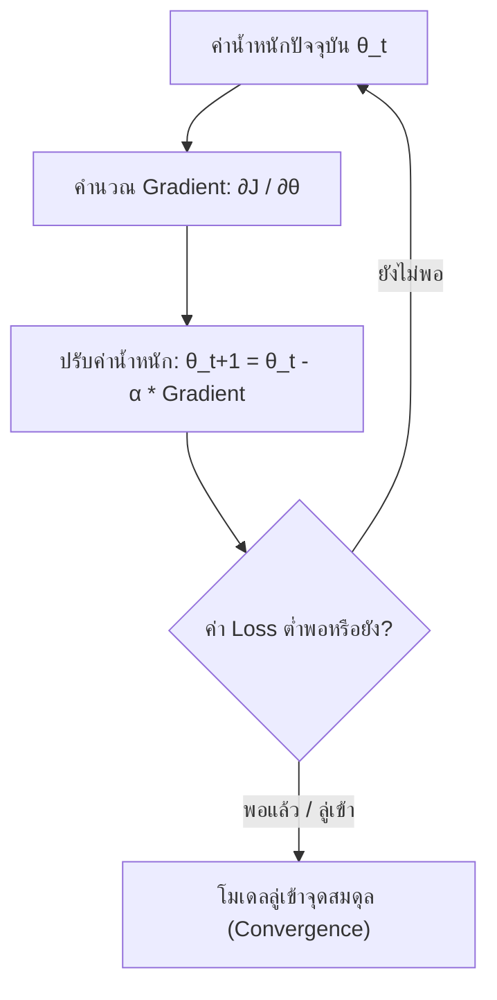
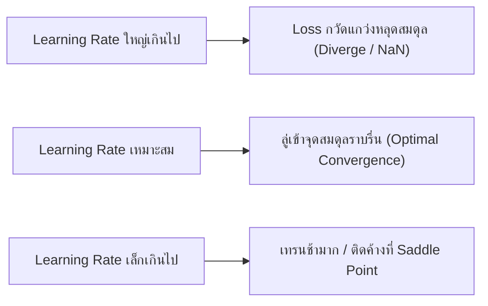
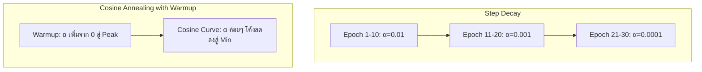

# บทที่ 5: อัลกอริทึมการปรับปรุงค่าน้ำหนัก (Optimizers, Gradient Descent และ Learning Rates)

---

## 1. คณิตศาสตร์พื้นฐานของ Gradient Descent

กระบวนการเรียนรู้ของ Machine Learning คือการหาค่าน้ำหนักตัวแปร $\theta = (w, b)$ ที่ทำให้ค่า Cost Function $J(\theta)$ มีค่าน้อยที่สุด อัลกอริทึมหลักที่ใช้ขับเคลื่อนเรียกว่า **Gradient Descent (การลดลงตามความชัน)**

$$\theta_{t+1} = \theta_t - \alpha \nabla_{\theta} J(\theta_t)$$

* $\theta_t$: ค่าน้ำหนัก ณ ปัจจุบัน
* $\alpha$ (Alpha / Learning Rate): อัตราการเรียนรู้ (ขนาดก้าวเดิน)
* $\nabla_{\theta} J(\theta_t) = \frac{\partial J}{\partial \theta}$: ความชัน (Gradient/Derivative) ของ Cost Function สัมพัทธ์กับ $\theta$

---

## 2. รูปแบบของ Gradient Descent ตามขนาดข้อมูล (Batch Variants)

| รูปแบบ | จำนวนข้อมูลต่อ 1 การอัปเดต | ข้อดี | ข้อเสีย |
|---|---|---|---|
| **Batch Gradient Descent** | ข้อมูลทั้งหมดใน Dataset | ความชันนิ่ง ลู่เข้าจุดสมดุลชัวร์ | ช้ามากและกิน RAM มหาศาลเมื่อข้อมูลใหญ่ |
| **Stochastic Gradient Descent (SGD)** | ข้อมูลทีละ 1 ตัวอย่าง ($N=1$) | อัปเดตเร็ว หลุดจาก Local Minima ได้ | ค่า Loss แกว่งสั่นสะเทือนรุนแรง (Noisy) |
| **Mini-batch Gradient Descent** | ข้อมูลกลุ่มย่อย (เช่น Batch Size = 32, 64, 128) | **เสถียร ประมวลผลบน GPU ได้เต็มประสิทธิภาพ** | ต้องปรับจูนขนาด Batch Size |

---

## 3. วิวัฒนาการของ Optimizers (จาก SGD สู่ AdamW)

### 3.1 SGD with Momentum
เพิ่มแรงเฉื่อย (Momentum) เพื่อช่วยดันให้การอัปเดตพุ่งผ่านจุดแอ่งกระทะแคบๆ (Saddle Points) หรือ Local Minima:

$$v_t = \beta v_{t-1} + (1 - \beta) \nabla_{\theta} J(\theta)$$
$$\theta_{t+1} = \theta_t - \alpha v_t$$

* $\beta$ (Momentum Factor): โดยทั่วไปนิยมตั้งค่า $0.9$

---

### 3.2 RMSprop (Root Mean Square Propagation)
ปรับขนาด Learning Rate แบบปรับตัว (Adaptive LR) แยกตามฟีเจอร์ โดยหารด้วยค่าเฉลี่ยกำลังสองของความชันย้อนหลัง:

$$S_t = \beta S_{t-1} + (1 - \beta) (\nabla_{\theta} J(\theta))^2$$
$$\theta_{t+1} = \theta_t - \frac{\alpha}{\sqrt{S_t + \epsilon}} \nabla_{\theta} J(\theta)$$

---

### 3.3 Adam (Adaptive Moment Estimation)
รวมข้อดีของ **Momentum** (ดึงแรงเฉื่อยอันดับหนึ่ง $m_t$) และ **RMSprop** (ดึงแรงเฉื่อยอันดับสอง $v_t$) เข้าด้วยกัน:

$$m_t = \beta_1 m_{t-1} + (1 - \beta_1) g_t \quad (\text{First Moment - Mean})$$
$$v_t = \beta_2 v_{t-1} + (1 - \beta_2) g_t^2 \quad (\text{Second Moment - Uncentered Variance})$$

ปรับแต่ง Bias Correction เพื่อไม่ให้ช่วงเริ่มเทรนเกิดค่าเอียง:

$$\hat{m}_t = \frac{m_t}{1 - \beta_1^t}, \quad \hat{v}_t = \frac{v_t}{1 - \beta_2^t}$$
$$\theta_{t+1} = \theta_t - \frac{\alpha}{\sqrt{\hat{v}_t} + \epsilon} \hat{m}_t$$

* ค่ามาตรฐานอุตสาหกรรม: $\alpha = 0.001$, $\beta_1 = 0.9$, $\beta_2 = 0.999$, $\epsilon = 10^{-8}$

---

### 3.4 AdamW (Adam with Decoupled Weight Decay)
แก้ไขข้อผิดพลาดทางคณิตศาสตร์ของ Adam ดั้งเดิมเมื่อใช้ร่วมกับ L2 Weight Decay โดยทำการแยกส่วนลดทอนน้ำหนัก (Weight Decay) ออกมาคำนวณต่างหากก่อนการปรับสเกล Adaptive LR ช่วยให้โมเดลประมวลผล Generalization บนชุดข้อมูลทดสอบได้ดีกว่า Adam ปกติอย่างมาก (นิยมใช้ใน Transformer / LLMs / YOLOv8)

---

## 4. อัตราการเรียนรู้ (Learning Rate) และยุทธศาสตร์การปรับตั้ง (LR Schedulers)

### 4.1 อิทธิพลของ Learning Rate ($\alpha$)
* **Learning Rate สูงเกินไป ($\alpha > 0.1$):** การอัปเดตก้าวกระโดดข้ามจุดสมดุล ทำให้ Loss กวัดแกว่งพุ่งระเบิดสู่อิสรภาพ (Divergence / Loss = NaN)
* **Learning Rate ต่ำเกินไป ($\alpha < 10^{-6}$):** การเรียนรู้ช้าเหมือนเต่า อาจติดอยู่ใน Local Minima หรือ Saddle Point ไม่ไปไหน

---

### 4.2 ตารางเปรียบเทียบยุทธศาสตร์การปรับตั้งอัตราเรียนรู้ (Learning Rate Schedulers)

1. **StepLR:** ลดค่า Learning Rate ลงเป็นสัดส่วน (เช่น คูณ 0.1) ทุกๆ N Epochs
2. **ReduceLROnPlateau:** เฝ้าสังเกตค่า Validation Loss หากหยุดลดลงเป็นเวลา N Epochs (Patience) ระบบจะลด Learning Rate ลงอัตโนมัติ
3. **CosineAnnealingLR:** ลดค่า Learning Rate ลงเป็นเส้นโค้งคอสซายน์ (Cosine Curve) ช่วยให้ลู่เข้าจุดสมดุลได้อย่างนุ่มนวล
4. **Warmup Scheduler:** เริ่มต้นเทรนด้วย Learning Rate ต่ำๆ ในช่วง 3–5 Epochs แรก เพื่อป้องกันไม่ให้ค่าน้ำหนักสุ่มเพี้ยนรุนแรง จากนั้นค่อยไต่ขึ้นสู่ระดับปกติ
