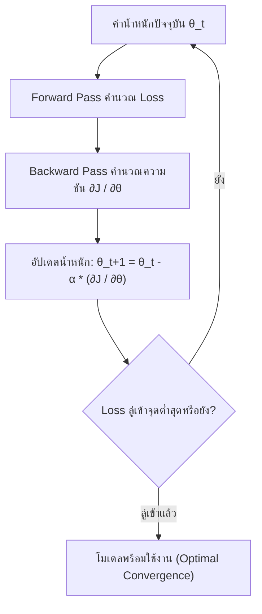

# บทที่ 5: อัลกอริทึม Optimizers, Gradient Descent, การปรับจูน Learning Rates และคู่มือแก้ปัญหาการเทรน (Troubleshooting Matrix)

---

## 1. คณิตศาสตร์พื้นฐานของ Gradient Descent

Gradient Descent คือกลไกการปรับค่าน้ำหนัก $\theta = (w, b)$ เพื่อลดทอนค่า Cost Function $J(\theta)$ ให้เหลือน้อยที่สุด:

$$\theta_{t+1} = \theta_t - \alpha \nabla_{\theta} J(\theta_t)$$

* $\theta_t$: ค่าน้ำหนักตัวแปรในรอบปัจจุบัน
* $\alpha$ (Alpha / Learning Rate): อัตราการก้าวเดิน (Step Size)
* $\nabla_{\theta} J(\theta_t)$: ความชัน (Partial Derivative) ของฟังก์ชันความสูญเสีย



---

## 2. ลำดับวิวัฒนาการของ Optimizers (จาก SGD สู่ AdamW)

```
   [ SGD ] ──► [ SGD + Momentum ] ──► [ RMSprop ] ──► [ Adam ] ──► [ AdamW ]
   (พื้นฐาน)      (ดันพ้นแอ่งกระทะ)    (Adaptive LR)    (ผสาน 2 ขั้ว)   (Decoupled Decay)
```

| Optimizer | สมการอัปเดตหลัก | จุดเด่น | กรณีที่นิยมใช้ |
|---|---|---|---|
| **SGD** | $\theta \leftarrow \theta - \alpha g_t$ | เรียบง่าย ไม่กินหน่วยความจำ | งานทฤษฎีพื้นฐาน |
| **SGD + Momentum** | $v_t = \beta v_{t-1} + (1-\beta)g_t$<br>$\theta \leftarrow \theta - \alpha v_t$ | มีแรงเฉื่อยช่วยดันให้พ้น **Saddle Points** และ Local Minima | งาน Computer Vision (CNNs, ResNet) ที่ต้องการความแม่นยำสูง |
| **RMSprop** | $S_t = \beta S_{t-1} + (1-\beta)g_t^2$<br>$\theta \leftarrow \theta - \frac{\alpha}{\sqrt{S_t + \epsilon}} g_t$ | ปรับขนาด Learning Rate แยกรายตัวแปรอัตโนมัติ (Adaptive) | งาน Recurrent Neural Networks (RNNs) |
| **Adam** | ผสาน **Momentum** ($m_t$) + **RMSprop** ($v_t$) เข้าด้วยกัน | เทรนลู่เข้าไวมาก ทนทานต่อการตั้ง Learning Rate เริ่มต้น | งาน Deep Learning และ AI ทั่วไป |
| **AdamW** | แยกการคิด **Weight Decay** ออกจาก Adaptive Learning Rate | ป้องกันปัญหา Overfitting ได้ดีกว่า Adam ปกติอย่างเห็นได้ชัด | **มาตรฐานงานปัจจุบัน (YOLOv8, Transformers, LLMs)** |

---

## 3. ยุทธศาสตร์การปรับตั้งอัตราเรียนรู้ (Learning Rate Schedulers)


1. **StepLR:** ลด Learning Rate ลงทีละขั้น (เช่น คูณ 0.1 ทุก 10 Epochs)
2. **ReduceLROnPlateau:** เฝ้าดู Validation Loss หากไม่ปรับตัวดีขึ้นติดต่อกัน $N$ รอบ (Patience) ระบบจะลด Learning Rate ลงอัตโนมัติ
3. **CosineAnnealingLR with Warmup:** เริ่มต้นด้วย Learning Rate ต่ำๆ ในช่วง 3-5 Epochs แรก แล้วค่อยปรับลดลงเป็นเส้นโค้งคอสซายน์

---

## 4. ปัญหาความชันเลือนหายและระเบิด (Vanishing vs Exploding Gradients)

```
   Vanishing Gradients (ความชันเลือนหาย) ──►  ∂J/∂W → 0 (Layer ลึกๆ ไม่เรียนรู้)
   Exploding Gradients (ความชันระเบิด)   ──►  ∂J/∂W → ∞ (ค่าน้ำหนักกลายเป็น NaN/Inf)
```

* **วิธีแก้ Vanishing Gradients:**
  * เปลี่ยน Activation Function เป็น **ReLU, Leaky ReLU, หรือ GELU**
  * ใช้โครงสร้างทางลัด **Residual Connections (Skip Connections)**
  * ใส่ **Batch Normalization (BatchNorm)** หรือ **Layer Normalization (LayerNorm)**
* **วิธีแก้ Exploding Gradients:**
  * ทำ **Gradient Clipping:** จำกัดขนาดพฤติกรรมความชันไม่ให้เกินเพดานที่กำหนด เช่น `max_norm = 1.0`

---

## 5. ตารางคู่มือแก้ปัญหาการฝึกสอนโมเดล (Troubleshooting Matrix Table)

| อาการที่เกิดขึ้น (Symptom) | สาเหตุที่เป็นไปได้ (Possible Causes) | วิธีแก้ปัญหาที่ตรงจุด (Actionable Solution) |
|---|---|---|
| **Loss กลายเป็น `NaN` หรือ `Inf`** | 1. Learning Rate สูงเกินไป<br>2. เกิดการหารด้วยศูนย์ในฟังก์ชัน Loss<br>3. Gradient พุ่งระเบิด (Exploding) | • ลด Learning Rate ลง 10 เท่า (เช่น $0.01 \rightarrow 0.001$)<br>• ใส่ `clip_grad_norm_`<br>• เพิ่ม $\epsilon = 10^{-8}$ ป้องกันหาร 0 |
| **Loss ค้างคงที่ ไม่ยอมลดลง (Plateau)** | 1. Learning Rate ต่ำเกินไป<br>2. ค่าน้ำหนักเริ่มจาก 0 (Zero Init)<br>3. ติดค้างอยู่ใน Saddle Point | • ปรับใช้ `ReduceLROnPlateau`<br>• ใช้ **He Normal / Xavier Initialization**<br>• เปลี่ยนมาใช้ Optimizer กลุ่ม **AdamW** |
| **Train Loss ต่ำ แต่ Val Loss พุ่งสูง** | เกิดภาวะ **Overfitting** โมเดลจดจำข้อมูลมากเกินไป | • เพิ่ม **Data Augmentation**<br>• ใส่ **Dropout** ($0.2-0.5$)<br>• เพิ่ม **L2 Weight Decay**<br>• ทำ **Early Stopping** |
| **Train และ Val Loss สูงทั้งคู่** | เกิดภาวะ **Underfitting** โมเดลเรียบง่ายเกินไป | • เพิ่มจำนวน Layers หรือ Channels<br>• ลดระดับ Regularization<br>• เพิ่มจำนวน Epochs ในการเทรน |
| **Loss สั่นสะเทือนรุนแรง (Oscillation)** | 1. Batch Size เล็กเกินไป ($N=2, 4$)<br>2. Learning Rate ใหญ่เกินไป | • ขยาย Batch Size เป็น 32 หรือ 64<br>• ลดขนาด Learning Rate ลง |

---

## 6. โค้ดตัวอย่างการจำลอง Gradient Descent และ Schedulers (Python Snippet)

```python
import numpy as np

# 1. จำลองกลไก Gradient Descent พร้อม Momentum
def optimize_momentum_demo():
    print("=" * 60)
    print("🚀 GRADIENT DESCENT WITH MOMENTUM SIMULATION")
    print("=" * 60)
    
    # ฟังก์ชันเป้าหมาย: f(w) = w^2 (จุดต่ำสุดคือ w=0)
    w = 10.0  # จุดเริ่มต้นห่างไกล
    lr = 0.1
    beta = 0.9
    v = 0.0
    
    print(f"{'Step':5s} | {'Weight (w)':12s} | {'Gradient (df/dw)':16s} | Velocity (v)")
    print("-" * 60)
    for step in range(1, 6):
        grad = 2 * w  # อนุพันธ์ของ w^2
        v = beta * v + (1 - beta) * grad
        w = w - lr * v
        print(f"{step:5d} | {w:12.4f} | {grad:16.4f} | {v:.4f}")

# 2. จำลอง Cosine Annealing Learning Rate Schedule
def cosine_annealing_schedule(initial_lr=0.01, min_lr=0.0001, total_epochs=50):
    print("\n" + "=" * 60)
    print("📉 COSINE ANNEALING LR SCHEDULE DEMO")
    print("=" * 60)
    epochs = [1, 10, 25, 40, 50]
    for ep in epochs:
        lr = min_lr + 0.5 * (initial_lr - min_lr) * (1 + np.cos(np.pi * ep / total_epochs))
        print(f"Epoch {ep:2d}/{total_epochs} -> Current Learning Rate (α) = {lr:.6f}")

# 3. จำลอง Gradient Clipping
def gradient_clipping_demo():
    print("\n" + "=" * 60)
    print("🛡️ GRADIENT CLIPPING (MAX NORM = 5.0) DEMO")
    print("=" * 60)
    # สมมติเกิด Exploding Gradient ขนาดใหญ่มาก
    gradients = np.array([12.0, -18.0, 25.0])
    max_norm = 5.0
    
    total_norm = np.linalg.norm(gradients)
    clip_coef = max_norm / (total_norm + 1e-6)
    
    if clip_coef < 1.0:
        clipped_gradients = gradients * clip_coef
    else:
        clipped_gradients = gradients
        
    print(f"Original Gradient Vector : {gradients} (Norm = {total_norm:.2f})")
    print(f"Clipped Gradient Vector  : {np.round(clipped_gradients, 2)} (Norm = {np.linalg.norm(clipped_gradients):.2f})")

if __name__ == '__main__':
    optimize_momentum_demo()
    cosine_annealing_schedule()
    gradient_clipping_demo()
```

### 📋 ผลลัพธ์การรันที่คาดหวัง (Expected Output)
```text
============================================================
🚀 GRADIENT DESCENT WITH MOMENTUM SIMULATION
============================================================
Step  | Weight (w)   | Gradient (df/dw) | Velocity (v)
------------------------------------------------------------
    1 |       9.8000 |          20.0000 | 2.0000
    2 |       9.4240 |          19.6000 | 3.7600
    3 |       8.8912 |          18.8480 | 5.2688
    4 |       8.2215 |          17.7824 | 6.5202
    5 |       7.4343 |          16.4431 | 7.5125

============================================================
📉 COSINE ANNEALING LR SCHEDULE DEMO
============================================================
Epoch  1/50 -> Current Learning Rate (α) = 0.009981
Epoch 10/50 -> Current Learning Rate (α) = 0.008109
Epoch 25/50 -> Current Learning Rate (α) = 0.005050
Epoch 40/50 -> Current Learning Rate (α) = 0.001991
Epoch 50/50 -> Current Learning Rate (α) = 0.000100

============================================================
🛡️ GRADIENT CLIPPING (MAX NORM = 5.0) DEMO
============================================================
Original Gradient Vector : [ 12. -18.  25.] (Norm = 33.06)
Clipped Gradient Vector  : [ 1.81 -2.72  3.78] (Norm = 5.00)
```
