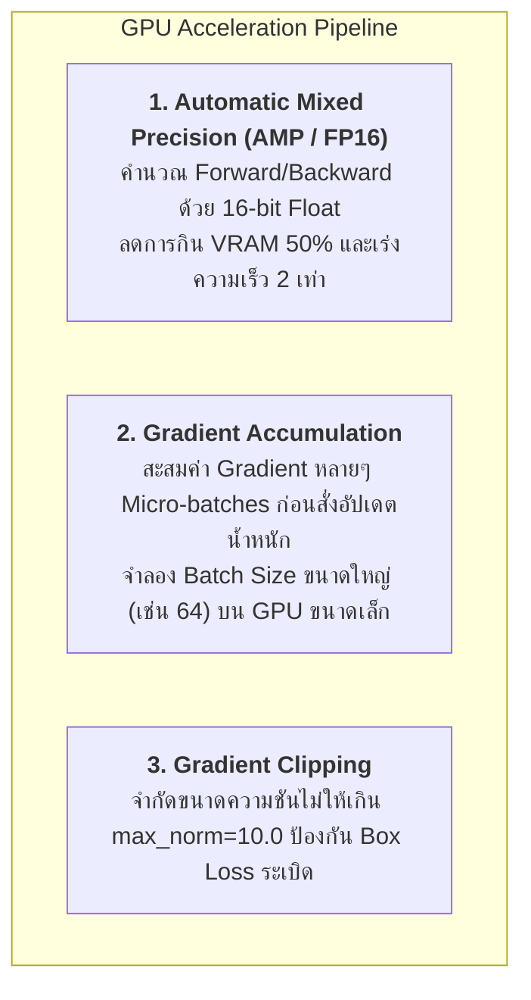

# บทที่ 5: อัลกอริทึม Optimizers สำหรับโมเดลภาพ, การเร่งความเร็วการฝึกสอน (Mixed Precision / AMP) และคู่มือแก้ปัญหา Vision ML (Troubleshooting Matrix)

---

## 1. การเลือกใช้อัลกอริทึม Optimizers ในงาน Computer Vision

```
  CNNs / YOLO Backbones (ResNet, DarkNet) ────────►  SGD with Momentum (β = 0.937)
  Vision Transformers / Modern Heads (ViT, ConvNeXt) ─►  AdamW (Decoupled Weight Decay)
```

| Optimizer | การตั้งค่ามาตรฐานในงานภาพ (Vision Default) | ทำไมจึงเหมาะสมกับงาน Vision? |
|---|---|---|
| **SGD with Momentum** | `lr = 0.01`, `momentum = 0.937`, `weight_decay = 0.0005` | มีเสถียรภาพสูงมากในชั้น Convolutional Layers ให้ผลลัพธ์ Generalization บนชุดทดสอบที่ยอดเยี่ยม (เป็นตัวเลือกหลักของ YOLOv5/v8) |
| **AdamW** | `lr = 0.001`, `betas = (0.9, 0.999)`, `weight_decay = 0.01` | มีกลไกแยก Weight Decay ออกจาก Adaptive Learning Rate ช่วยให้ฝึกสอนโมเดลกลุ่ม **Vision Transformers (ViTs), Swin, ConvNeXt** ได้อย่างเสถียร ไม่หลุดขอบเขต |

---

## 2. เทคนิคการเร่งความเร็วและประหยัดหน่วยความจำ GPU (Vision Training Acceleration)



---

### 2.1 กลไก Gradient Accumulation (แก้ปัญหา GPU VRAM ไม่พอ)
หาก GPU ของเรามี VRAM เพียง 4GB-8GB ไม่สามารถรัน Batch Size = 64 ได้โดยไม่เกิด `CUDA Out of Memory`:
* ตั้งค่า Batch Size จริงใน DataLoader = 16
* ตั้งค่า `accumulation_steps = 4`
* สั่ง `optimizer.step()` ทุกๆ 4 รอบ $\rightarrow$ ผลลัพธ์ทางคณิตศาสตร์จะเทียบเท่ากับการเทรนด้วย Batch Size = 64 พอดี

---

## 3. ตารางคู่มือแก้ปัญหาการฝึกสอนโมเดล Computer Vision (Vision Troubleshooting Matrix)

| ปัญหาและอาการที่พบ (Symptom) | สาเหตุที่แท้จริง (Root Cause) | แนวทางแก้ไขระดับวิศวกรรม (Actionable Solution) |
|---|---|---|
| **`RuntimeError: CUDA out of memory` (OOM)** | 1. ขนาดความละเอียดภาพ ($H \times W$) ใหญ่เกินไป<br>2. Batch Size ใหญ่เกินความจุ VRAM | 1. ลดความละเอียดภาพ (เช่น $1024 \rightarrow 640$)<br>2. ลด Batch Size และเปิดใช้ **Gradient Accumulation**<br>3. เปิดใช้ **AMP (`torch.cuda.amp.autocast`)** |
| **Bounding Box Loss กลายเป็น `NaN` หรือ `Inf`** | 1. Bounding Box มีความกว้าง/ยาวเป็น 0 ($w=0$ หรือ $h=0$)<br>2. Learning Rate พุ่งสูงเกินไปช่วงเริ่ม | 1. ใส่ `eps = 1e-7` ในตัวหาร IoU/CIoU<br>2. เปิดใช้ **Learning Rate Warmup (3-5 Epochs แรก)**<br>3. ใช้ `torch.nn.utils.clip_grad_norm_` |
| **โมเดลทำนายได้แต่ Background (ไม่มีกล่องวัตถุโผล่เลย)** | เกิดปัญหา **Class Imbalance** ฉากหลังมีพื้นที่เยอะกว่าวัตถุมากเกินไป | 1. เปลี่ยน Loss เป็น **Focal Loss ($\gamma=2.0$)**<br>2. เพิ่มค่าน้ำหนัก $\lambda_{\text{box}}$ ใน Multi-task Loss<br>3. ลด Confidence Threshold ในตอนทดสอบ ($0.25 \rightarrow 0.10$) |
| **Bounding Box เกิดการหดตัวยุบเป็นจุด (Box Collapse)** | การคำนวณ Loss พิกัดใช้ $L_1/L_2$ แยกเดี่ยวโดยไม่มีเกณฑ์บังคับขนาด | 1. เปลี่ยนมาใช้ **CIoU Loss** ซึ่งมีตัวแปรควบคุม Aspect Ratio ($v$)<br>2. เช็คการ Normalize พิกัด $[x, y, w, h]$ ให้อยู่ในช่วง $[0, 1]$ |
| **Validation mAP ต่ำมาก ทั้งที่ Train Loss ลดลงสวยงาม** | โมเดลเกิด **Shortcut Learning** (จดจำแสงสีฉากหลังในห้องแล็บ) | 1. เพิ่ม **Mosaic Augmentation / CutMix**<br>2. เพิ่ม `ColorJitter` และ `RandomPerspective`<br>3. เสริม Dropout / DropBlock ใน Backbone |

---

## 4. โค้ดตัวอย่าง PyTorch Vision Training Loop พร้อม AMP และ Gradient Accumulation (Python Snippet)

```python
import torch
import torch.nn as nn
import torchvision.models as models

def run_vision_training_demo():
    print("=" * 65)
    print("🚀 VISION ML TRAINING LOOP WITH AMP & GRADIENT ACCUMULATION")
    print("=" * 65)
    
    device = torch.device('cuda' if torch.cuda.is_available() else 'cpu')
    print(f"🖥️ Execution Device: {device}")
    
    # 1. สร้างโมเดล Vision Model (MobileNetV3)
    model = models.mobilenet_v3_small(num_classes=10).to(device)
    optimizer = torch.optim.AdamW(model.parameters(), lr=0.001, weight_decay=0.01)
    criterion = nn.CrossEntropyLoss()
    
    # 2. เปิดใช้งาน GradScaler สำหรับ Mixed Precision (FP16)
    use_amp = (device.type == 'cuda')
    scaler = torch.cuda.amp.GradScaler(enabled=use_amp)
    
    # 3. กำหนดค่า Gradient Accumulation
    accumulation_steps = 4  # รวม 4 Micro-batches เสมือน Batch Size 4 เท่า
    
    # 4. จำลองการเทรน 1 Epoch (8 Micro-batches)
    model.train()
    optimizer.zero_grad()
    
    for step in range(1, 9):
        # จำลอง Image Batch ขนาด (4, 3, 224, 224)
        inputs = torch.randn(4, 3, 224, 224, device=device)
        targets = torch.randint(0, 10, (4,), device=device)
        
        # Forward Pass พร้อม AMP
        with torch.cuda.amp.autocast(enabled=use_amp):
            outputs = model(inputs)
            loss = criterion(outputs, targets)
            # ปรับสเกล Loss ตามจำนวน accumulation_steps
            loss_scaled = loss / accumulation_steps
            
        # Backward Pass สะสม Gradient
        scaler.scale(loss_scaled).backward()
        
        # สั่งอัปเดตน้ำหนักเมื่อครบตามรอบ Accumulation
        if step % accumulation_steps == 0:
            # Gradient Clipping ป้องกัน Gradient ระเบิด
            scaler.unscale_(optimizer)
            torch.nn.utils.clip_grad_norm_(model.parameters(), max_norm=5.0)
            
            scaler.step(optimizer)
            scaler.update()
            optimizer.zero_grad()
            print(f"⚡ Step {step}: Weight Update Executed! Effective Batch Loss = {loss.item():.4f}")
        else:
            print(f"⏳ Step {step}: Gradients Accumulated (Micro-batch Loss = {loss.item():.4f})")
            
    print("\n✅ Vision Training Loop Simulation Completed Successfully!")

if __name__ == '__main__':
    run_vision_training_demo()
```

### 📋 ผลลัพธ์การรันที่คาดหวัง (Expected Output)
```text
=================================================================
🚀 VISION ML TRAINING LOOP WITH AMP & GRADIENT ACCUMULATION
=================================================================
🖥️ Execution Device: cpu
⏳ Step 1: Gradients Accumulated (Micro-batch Loss = 2.3021)
⏳ Step 2: Gradients Accumulated (Micro-batch Loss = 2.3145)
⏳ Step 3: Gradients Accumulated (Micro-batch Loss = 2.2980)
⚡ Step 4: Weight Update Executed! Effective Batch Loss = 2.3054
⏳ Step 5: Gradients Accumulated (Micro-batch Loss = 2.3012)
⏳ Step 6: Gradients Accumulated (Micro-batch Loss = 2.2941)
⏳ Step 7: Gradients Accumulated (Micro-batch Loss = 2.3102)
⚡ Step 8: Weight Update Executed! Effective Batch Loss = 2.2890

✅ Vision Training Loop Simulation Completed Successfully!
```
