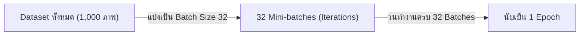
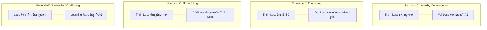

# บทที่ 6: การเฝ้าสังเกตการณ์การฝึกสอน และการแก้ปัญหาโค้ดคลาดเคลื่อน (Monitoring & Troubleshooting Guide)

---

## 1. นิยามศัพท์สำคัญระหว่างการฝึกสอนโมเดล (Training Dynamics Terms)

ก่อนเฝ้าสังเกตการณ์กราฟการเรียนรู้ จำเป็นต้องเข้าใจความหมายของหน่วยเวลาในกระบวนการเทรน:



* **Epoch:** จำนวนรอบที่โมเดลได้อ่านและประมวลผลข้อมูล **ครบทุกตัวอย่างในชุด Dataset** จำนวน 1 รอบเต็ม
* **Batch Size:** จำนวนตัวอย่างข้อมูลที่ป้อนเข้าประมวลผลต่อ 1 การคำนวณ Forward / Backward Pass (เช่น 16, 32, 64, 128)
* **Iteration / Step:** จำนวนครั้งของการอัปเดตค่าน้ำหนัก (Weight Update)
  $$\text{Iterations per Epoch} = \left\lceil \frac{\text{Total Dataset Size}}{\text{Batch Size}} \right\rceil$$
  * *ตัวอย่าง:* ข้อมูลมี 1,000 ภาพ ตั้ง Batch Size = 32 $\rightarrow$ ใน 1 Epoch จะมีเท่ากับ 32 Iterations/Steps

---

## 2. การวิเคราะห์รูปแบบกราฟการเรียนรู้ (Loss & Accuracy Curve Diagnosis)

การเปรียบเทียบระหว่าง **Train Loss** และ **Validation Loss** คือหัวใจสำคัญในการวินิจฉัยสุขภาพของโมเดล:



---

## 3. ปัญหาการเลือนหายและระเบิดของความชัน (Vanishing & Exploding Gradients)

ในการเทรนโครงข่ายประสาทเทียมหลายชั้น (Deep Neural Networks / CNNs / Transformers):

### 3.1 Vanishing Gradients (ความชันเลือนหาย)
* **อาการ:** ค่า Gradient ที่ย้อนกลับผ่าน Chain Rule ยิ่งลึกยิ่งมีขนาดเล็กเข้าใกล้ 0 ทำให้ค่าน้ำหนักใน Layer แรกๆ หยุดการเรียนรู้ (Loss ค้างไม่ลดลง)
* **สาเหตุ:** การใช้ Activation Function แบบ **Sigmoid** หรือ **Tanh** ซึ่งมีค่าอนุพันธ์สูงสุดไม่เกิน $0.25$
* **วิธีแก้ไข:**
  1. เปลี่ยนไปใช้ Activation Function กลุ่ม **ReLU, Leaky ReLU, หรือ GELU**
  2. ใช้การเชื่อมต่อแบบทางลัด **Residual Connections (ResNet)**
  3. ใส่โครงสร้าง **Batch Normalization (BatchNorm)** หรือ **Layer Normalization (LayerNorm)**

### 3.2 Exploding Gradients (ความชันระเบิด)
* **อาการ:** ค่า Gradient ทวีคูณขนาดใหญ่เกินไป จนค่าน้ำหนักกลายเป็น `NaN` (Not a Number) หรือ `Inf` (Infinity)
* **วิธีแก้ไข:**
  1. ทำ **Gradient Clipping:** จำกัดขนาดพฤติกรรมความชันไม่ให้เกินขอบเขตที่กำหนด (เช่น `max_norm=1.0`)
  2. ลดขนาด Learning Rate ลง

---

## 4. คู่มือการแก้ปัญหาข้อผิดพลาดระหว่างการเทรน (Troubleshooting Matrix Table)

| อาการบัคที่พบ (Symptom) | สาเหตุที่เป็นไปได้ (Possible Causes) | แนวทางแก้ไข (Actionable Fixes) |
|---|---|---|
| **Loss กลายเป็น `NaN` หรือ `Inf`** | 1. Learning Rate สูงเกินไป<br>2. เกิดการหารด้วยศูนย์ (Division by Zero)<br>3. Gradient ระเบิด (Exploding) | 1. ลด Learning Rate ลง 10 เท่า (เช่น $10^{-2} \rightarrow 10^{-3}$)<br>2. เพิ่มค่า $\epsilon = 10^{-8}$ ในตัวหาร<br>3. ใส่ `torch.nn.utils.clip_grad_norm_(model.parameters(), 1.0)` |
| **Loss ค้างคงที่ ไม่ยอมลดลง (Plateau)** | 1. Learning Rate ต่ำเกินไป<br>2. ค่าน้ำหนักตั้งต้นเป็น 0 ทั้งหมด (Zero Init)<br>3. ติดอยู่ใน Saddle Point | 1. ใช้ `ReduceLROnPlateau` หรือ Cosine Scheduler<br>2. เปลี่ยนการสุ่มค่าน้ำหนักตั้งต้นเป็น **He Normal / Xavier Initialization** |
| **Train Loss ต่ำ แต่ Val Loss พุ่งสูง** | เกิดภาวะ **Overfitting** โมเดลจดจำ Noise ในชุด Train | 1. เพิ่ม **Data Augmentation**<br>2. เพิ่ม **Dropout** ($p=0.2-0.5$)<br>3. ใส่ **L2 Weight Decay** ($10^{-4}$)<br>4. ทำ **Early Stopping** |
| **Train Loss และ Val Loss สูงทั้งคู่** | เกิดภาวะ **Underfitting** โมเดลความซับซ้อนต่ำไป | 1. เพิ่มจำนวน Layers หรือ Channels/Neurons<br>2. ลดระดับ Regularization<br>3. เพิ่มเวลาการเทรน (Epochs) |
| **Loss แกว่งขึ้นลงรุนแรง (Oscillation)** | 1. Batch Size เล็กเกินไป ($N=2, 4$)<br>2. Learning Rate ใหญ่เกินไป | 1. เพิ่มขนาด Batch Size เป็น 32 หรือ 64<br>2. ปรับใช้ Optimizer กลุ่ม Adaptive เช่น **AdamW** |

---

## 5. เทคนิคและแนวปฏิบัติที่ดีในการควบคุมระบบ (Best Practices)

### 5.1 Early Stopping
เฝ้าสังเกตการณ์ค่า Validation Loss หากไม่ปรับตัวดีขึ้นติดต่อกันตามจำนวนรอบที่กำหนด (Patience เช่น 10 Epochs) ให้หยุดการเทรนทันที เพื่อป้องกัน Overfitting และประหยัดพลังงานประมวลผล

```python
# ตัวอย่างตรรกะ Early Stopping ใน PyTorch
if val_loss < best_val_loss:
    best_val_loss = val_loss
    patience_counter = 0
    torch.save(model.state_dict(), 'best_model.pth')
else:
    patience_counter += 1
    if patience_counter >= 10:
        print("Early stopping triggered!")
        break
```

### 5.2 Model Checkpointing
ทำการบันทึกน้ำหนักโมเดลเฉพาะรอบที่ให้ค่า Validation Loss ต่ำที่สุด (`best_model.pth`) เก็บไว้เสมอ ไม่ใช้โมเดลใน Epochสุดท้ายเนื่องจากอาจเกิดการ Overfitting ไปแล้ว
