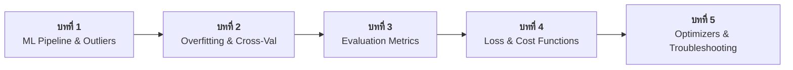

# 🤖 คู่มือหลักสูตรการฝึกฝนโมเดล Machine Learning (Master ML Training & Evaluation Course)

ยินดีต้อนรับสู่หลักสูตร **Machine Learning Model Training, Loss Functions & Evaluation Metrics** เอกสารชุดนี้ถูกจัดเรียงเป็น 5 บทเรียนลำดับต่อเนื่อง ครอบคลุมตั้งแต่กระบวนการเตรียมข้อมูล (Pipeline & Outliers), ปัญหาการเรียนรู้ (Overfitting & Underfitting), การวัดผลประสิทธิภาพ (Evaluation Metrics), ฟังก์ชันความสูญเสีย (Loss & Cost Functions) ไปจนถึงอัลกอริทึม Optimizers และตารางแก้ปัญหาการเทรน (Troubleshooting Matrix) 

---

## 📚 สารบัญบทเรียนและการนำทาง (Curriculum Roadmap)



| บทที่ | หัวข้อบทเรียน | ไฟล์คู่มือการเรียนรู้ฉบับสมบูรณ์ (พร้อมโค้ด & ไดอะแกรม) | สาระสำคัญ |
|:---:|---|---|---|
| **1** | **ML Pipeline & Outliers** | [`01_ml_pipeline_and_outliers.md`](01_ml_pipeline_and_outliers.md) | สถาปัตยกรรม 7 ขั้นตอน, การตัด Outliers (IQR / Z-Score), Scaling & Data Leakage |
| **2** | **Overfitting & Cross-Validation** | [`02_overfitting_underfitting_cross_validation.md`](02_overfitting_underfitting_cross_validation.md) | Bias-Variance Tradeoff, Learning Curves, Stratified K-Fold CV, L1/L2 Regularization |
| **3** | **Evaluation Metrics** | [`03_evaluation_metrics_classification_regression.md`](03_evaluation_metrics_classification_regression.md) | Confusion Matrix, Precision/Recall, F1-Score (Macro/Micro), ROC-AUC, MSE/R² |
| **4** | **Loss & Cost Functions** | [`04_loss_and_cost_functions_mastery.md`](04_loss_and_cost_functions_mastery.md) | Loss vs Cost, BCE, CCE, Focal Loss, MSE, MAE, Huber Loss, CIoU Box Loss |
| **5** | **Optimizers & Troubleshooting** | [`05_optimizers_gradient_descent_and_troubleshooting.md`](05_optimizers_gradient_descent_and_troubleshooting.md) | Gradient Descent, SGD, Adam, AdamW, LR Schedulers, Vanishing Gradients & Troubleshooting Matrix |

---

## 🎯 จุดเด่นของเอกสารชุดนี้

1. **ครบจบในไฟล์เดียว (Self-Contained):** แต่ละบทมีทั้งคำอธิบายทฤษฎีระดับตำราวิชาการ, สูตรคณิตศาสตร์ ($\LaTeX$), ผังงาน Mermaid, ภาพไดอะแกรม ASCII, และโค้ดตัวอย่าง Python ที่ก๊อปปี้ไปรันได้ทันที
2. **มีตัวอย่างผลลัพธ์การรัน (Expected Outputs):** แสดงค่าตัวเลขจากการคำนวณจริง เพื่อให้ผู้เรียนเปรียบเทียบผลลัพธ์ได้ทันที
3. **คู่มือแก้บัคภาคปฏิบัติ (Troubleshooting Matrix):** รวมตารางแก้ปัญหาที่พบบ่อย เช่น Loss = `NaN`/`Inf`, Loss ไม่ยอมลด (Plateau), และ Loss สั่นสะเทือน

---

## 🛠️ การรันสคริปต์ตัวอย่างในเครื่อง

คุณสามารถเปิด Terminal และสั่งรันสคริปต์ตัวอย่างทั้งหมดได้ดังนี้:

```bash
# Activate conda environment
conda activate dip_env

# รันบทเรียนที่ 1: Pipeline & Outliers
python ml_model_training/01_pipeline_and_outliers.py

# รันบทเรียนที่ 2: Overfitting & Cross-Validation
python ml_model_training/02_overfitting_cross_val.py

# รันบทเรียนที่ 3: Evaluation Metrics & Plotting
python ml_model_training/03_evaluation_metrics_demo.py
```
