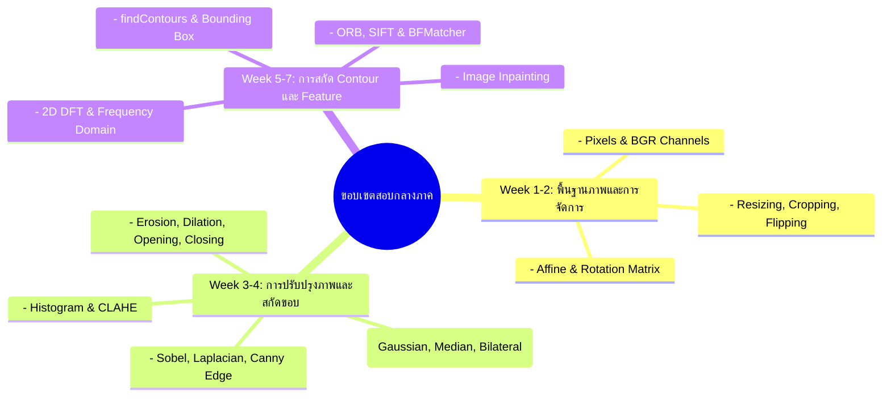

# โครงสร้างเนื้อหารายสัปดาห์ - สัปดาห์ที่ 8
## การทดสอบกลางภาคเรียนและการทบทวนความรู้ (Midterm Examination & Review)

> **วิชา:** การประมวลผลภาพดิจิทัล (Digital Image Processing)  
> **รหัสวิชา:** 31909-2007  
> **เวลาเรียน:** 5 ชั่วโมง (บรรยาย 2 ชั่วโมง, ปฏิบัติ 3 ชั่วโมง)

---

## 1. วัตถุประสงค์การเรียนรู้ประจำสัปดาห์ (Learning Objectives)
1. **ทบทวนมโนทัศน์สำคัญ (CLO 1):** ประเมินความเข้าใจพื้นฐานเรื่องภาพดิจิทัล พิกเซล ช่องสี สเกลความสว่าง และการแปลงพื้นที่ภาพ
2. **ประเมินทักษะการประมวลผลภาพ (CLO 2):** สอบปฏิบัติการประมวลผลภาพ การกรองสัญญาณรบกวน การปรับฮิสโตแกรม และการสกัดขอบภาพด้วย OpenCV ใน VS Code
3. **การประยุกต์ใช้อัลกอริทึมดั้งเดิม (CLO 3):** ทดสอบการหาตำแหน่งวัตถุ การสกัด Contour และการจับคู่ฟีเจอร์ด้วย ORB/SIFT
4. **ความรอบคอบและกระบวนการดีบัก (CLO 4):** ประเมินทักษะการค้นหาข้อผิดพลาดของโค้ด (Debugging) การเลือกใช้ Parameter ที่เหมาะสม และการจัดการ Environment

---

## 2. หัวข้อเนื้อหาการทบทวน (Review Topics Scope)

---

## 3. รูปแบบข้อสอบกลางภาค (Midterm Exam Structure)

| ส่วนที่ | ประเภทข้อสอบ | เวลา | คะแนนเต็ม | รายละเอียด |
|:---:|---|:---:|:---:|---|
| **ส่วนที่ 1** | ทฤษฎีเชิงมโนทัศน์ (Theory) | 2 ชั่วโมง | 40 คะแนน | ปรนัยและอัตนัย คำนวณค่าพิกเซล Matrix, ฮิสโตแกรม, และการทำงานของ Filter |
| **ส่วนที่ 2** | ปฏิบัติการเขียนโปรแกรม (Practical Lab) | 3 ชั่วโมง | 60 คะแนน | โจทย์สถานการณ์จำลอง รับไฟล์ภาพที่สกปรก ต้องเขียนสคริปต์ทำความสะอาด สกัด ROI และบันทึกผล |

---

## 4. สิ่งที่ต้องเตรียมความพร้อมก่อนเข้าสอบ
* ติดตั้ง Environment `dip_env` บน VS Code และตรวจสอบด้วย `python check_env.py` ให้ผ่าน 100%
* ทบทวนฟังก์ชัน OpenCV หลัก: `cv2.imread()`, `cv2.cvtColor()`, `cv2.GaussianBlur()`, `cv2.Canny()`, `cv2.findContours()`, `cv2.inpaint()`, `cv2.ORB_create()`
