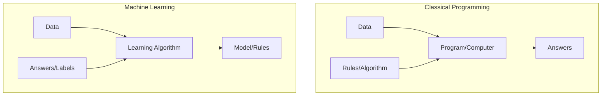
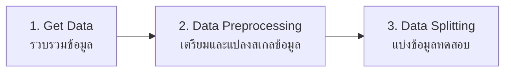
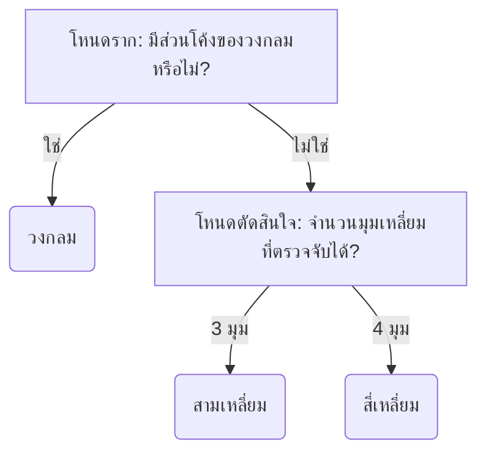
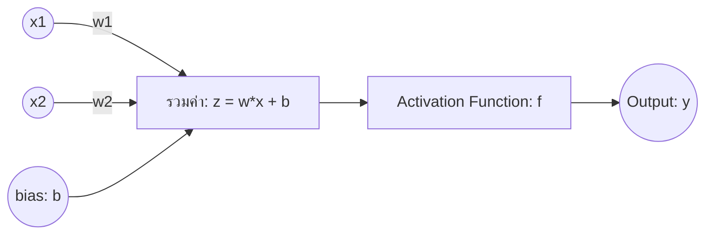
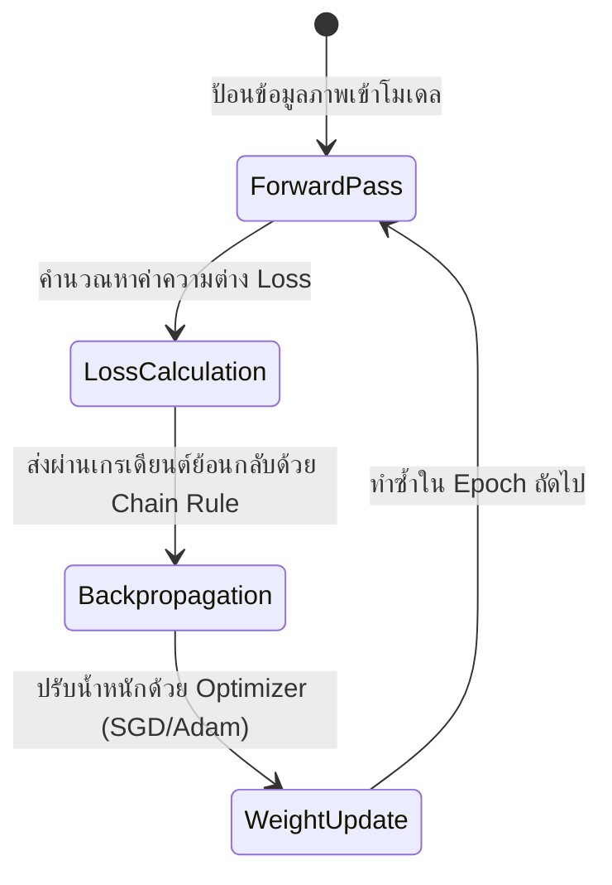

# บทที่ 9: พื้นฐาน Machine Learning, การจัดการข้อมูล, และแบบจำลองประสาทเทียม (CNN)
> **หลักสูตร:** การประมวลผลภาพดิจิทัล (Digital Image Processing)
> **เครื่องมือ:** Python 3.10, PyTorch 2.0+, Scikit-learn, NumPy, Matplotlib, OpenCV, VS Code

---

## ภาพรวมของบทนี้

ในช่วง 7 สัปดาห์แรกของหลักสูตร เราได้ศึกษาวิธีการจัดการภาพเบื้องต้น การสกัดขอบภาพ และการระบุฟีเจอร์ด้วยเงื่อนไขทางคณิตศาสตร์แบบกำหนดด้วยมือ (Hand-Crafted Features เช่น Sobel, Canny และ ORB) 

ในบทนี้ เราจะเริ่มต้นบทเรียนด้วยการทำความเข้าใจเกี่ยวกับ **การเรียนรู้ของเครื่อง (Machine Learning - ML)** และขั้นตอนการจัดการข้อมูล **(Data Pipeline)** ซึ่งเป็นหัวใจสำคัญก่อนเริ่มสร้างโมเดลใดๆ จากนั้นจะเรียนรู้โมเดลพื้นฐานอย่าง **Decision Tree** และการคำนวณคณิตศาสตร์เบื้องต้นใน **Neural Networks (Perceptron)** ก่อนจะก้าวเข้าสู่โมเดลชั้นสูงอย่าง **Convolutional Neural Networks (CNN)** ในการจำแนกภาพจริง

---

## บทที่ 1: พื้นฐาน Machine Learning และการจัดการข้อมูล (Data Pipeline)

### 1.1 ปฏิวัติโปรแกรมมิ่ง (Classical Programming VS Machine Learning)
* **การเขียนโปรแกรมแบบดั้งเดิม (Classical Programming):** เราต้องป้อนข้อมูล (Data) และกฎเกณฑ์ (Rules/Algorithm) ที่เขียนขึ้นด้วยมือ เพื่อให้ได้ผลลัพธ์ (Answers) ออกมา
* **การเรียนรู้ของเครื่อง (Machine Learning):** เราป้อนข้อมูล (Data) ร่วมกับผลเฉลยต้นแบบ (Answers) เพื่อให้ระบบเรียนรู้และสร้างกฎเกณฑ์/สมการ (Rules/Model) ออกมาเองโดยอัตโนมัติ



### 1.2 ประเภทของ Machine Learning
1. **Supervised Learning (การเรียนรู้แบบมีผู้สอน):** ข้อมูลทุกตัวจะมีเฉลย (Labels) กำกับไว้ เช่น นำรูปภาพแมวและสุนัขที่มีการแปะป้ายชัดเจนว่าตัวไหนเป็นแมวหรือสุนัข ป้อนให้โมเดลฝึกเรียนรู้
2. **Unsupervised Learning (การเรียนรู้แบบไม่มีผู้สอน):** ข้อมูลไม่มีการแปะป้ายเฉลย โมเดลจะหาความสัมพันธ์หรือจับกลุ่มข้อมูลตามคุณลักษณะของมันเอง (Clustering) เช่น การแบ่งประชากรลูกค้าตามพฤติกรรมการซื้อ

### 1.3 วงจรการจัดการข้อมูล (Data Pipeline)
ก่อนส่งข้อมูลเข้าประมวลผลในแบบจำลอง ข้อมูลจะต้องเดินทางผ่านท่อประมวลผล (Pipeline) 3 ขั้นตอนสำคัญ:



1. **Get Data (การรวบรวมข้อมูล):** การดึงข้อมูลมาจากกล้องถ่ายรูป, คลังภาพของระบบปฏิบัติการ หรือไฟล์ตาราง (.csv) ที่สกัดคุณลักษณะ (Features) ของภาพไว้
2. **Data Preprocessing (การเตรียมข้อมูล):** การทำความสะอาดภาพและปรับแต่งพิกเซล เช่น:
   * **การปรับมิติขนาดภาพ (Resizing):** ปรับให้ภาพทุกภาพมีขนาดเท่ากัน (เช่น 28x28 พิกเซล)
   * **การทำ Normalization:** การปรับช่วงค่าสีของพิกเซลเดิมที่อยู่ในช่วง $0-255$ ให้อยู่ในช่วงที่โมเดลประมวลผลได้ดีที่สุด เช่น $[0.0, 1.0]$ หรือ $[-1.0, 1.0]$ ช่วยให้โมเดลเทรนง่ายและไม่เกิดปัญหาค่าน้ำหนักเพี้ยน
3. **Data Splitting (การแบ่งชุดข้อมูล):** ในโลกการทำโมเดล เราต้องนำเอาข้อมูลดิบทั้งหมดมาหั่นออกเป็นกลุ่มย่อยเพื่อประโยชน์ในการตรวจสอบประสิทธิภาพ:
   * **Train Set (ข้อมูลฝึกสอน ~70%):** เป็นข้อมูลที่ส่งป้อนให้โมเดลดูเพื่อปรับปรุงสมการค่าน้ำหนัก
   * **Validation Set (ข้อมูลปรับแต่ง ~15%):** เป็นข้อมูลทดสอบขณะที่โมเดลกำลังเรียนรู้ เพื่อช่วยให้ผู้พัฒนาปรับจูน Hyperparameter (เช่น ความกว้าง ความลึก ลูปเทรน)
   * **Test Set (ข้อมูลทดสอบ ~15%):** เป็นข้อมูลที่โมเดล **ไม่เคยเห็นเลย** ตลอดการเทรน เพื่อทดสอบความสามารถที่แท้จริงว่า หากเจอกับข้อมูลสภาพภายนอกในชีวิตจริงจะทำนายได้ถูกต้องหรือไม่
   * **ทำไมถึงห้ามทดสอบโมเดลด้วยข้อมูลชุดเทรน?** เพราะโมเดลอาจจะใช้วิธี **"จดจำคำตอบล่วงหน้า" (Overfitting)** เช่น นร.ที่ท่องจำคำตอบจากชีตเฉลยข้อสอบเดิมได้ 100% แต่พอเจอแนวข้อสอบใหม่กลับทำไม่ได้เลย ดังนั้นการใช้ Test Set จึงเป็นการจำลองการทดสอบที่ยุติธรรมที่สุด

---

## บทที่ 2: ต้นไม้ตัดสินใจ (Decision Tree)

โมเดล **Decision Tree** เป็นทางผ่านแรกที่ดีที่สุดในการเรียนรู้ทฤษฎี ML เนื่องจากเข้าใจง่าย สามารถวาดโครงสร้างออกมาเป็นเงื่อนไขแบบถ้า-แล้ว (If-Else) ที่คนเราเข้าใจได้ทันที

### 2.1 โครงสร้างของ Decision Tree
* **Root Node (โหนดราก):** เงื่อนไขแรกสุดที่ใช้เริ่มต้นตรวจสอบข้อมูล
* **Decision Node (โหนดตัดสินใจ):** เงื่อนไขแยกย่อยในแต่ละกิ่งก้าน
* **Leaf Node (โหนดใบไม้):** ผลลัพธ์สุดท้ายที่เป็นคำทำนาย (Class)



### 2.2 ตัวอย่างการประยุกต์ใช้ในงานสกัดฟีเจอร์ของภาพ
ในการสกัดคุณลักษณะ (Feature Extraction) จากสัปดาห์ก่อนหน้า เราได้ค่าตัวเลข เช่น:
1. **Circularity (ความกลม):** อัตราส่วนระหว่างพื้นที่และเส้นรอบวง (หากใกล้เคียง $1.0$ แปลว่ากลมมาก)
2. **Vertices (จำนวนยอดมุม):** นับจำนวนขอบหักมุม
หากเราเขียนเงื่อนไขด้วย Decision Tree จะช่วยจำแนก **วงกลม, สามเหลี่ยม, และสี่เหลี่ยม** ได้โดยอ้างอิงคุณลักษณะเหล่านี้แทนที่จะเขียนเงื่อนไขเองทั้งหมด

---

## บทที่ 3: โครงข่ายประสาทเทียมเดี่ยว (Perceptron) และการคำนวณด้วยมือ

โครงข่ายประสาทเทียม (Neural Networks) ถูกออกแบบขึ้นมาโดยจำเลียนสมองมนุษย์ โครงสร้างที่เล็กที่สุดเรียกว่า **Perceptron**

### 3.1 องค์ประกอบของ Perceptron
1. **Inputs ($x_1, x_2, \dots, x_n$):** ค่าคุณลักษณะต่างๆ เช่น พิกเซลสี หรือคุณลักษณะภาพ
2. **Weights ($w_1, w_2, \dots, w_n$):** ค่าน้ำหนักตัวแปรควบคุมอิทธิพลอินพุตแต่ละโหนด (ค่านี้ที่โมเดลใช้เรียนรู้)
3. **Bias ($b$):** ค่าเอนเอียงช่วยยืดหยุ่นตำแหน่งเลื่อนสมการขึ้นหรือลง
4. **Linear Combination ($z$):** ผลรวมค่าน้ำหนักเชิงเส้น
   $$z = w_1 x_1 + w_2 x_2 + \dots + w_n x_n + b = \sum_{i=1}^n w_i x_i + b$$
5. **Activation Function ($f(z)$):** ฟังก์ชันกระตุ้นแปลงจากเชิงเส้นให้เป็นสัญญาณ "ไม่เชิงเส้น" (Non-linear) เพื่อสกัดข้อมูลจำลองパターンที่ยากๆ



### 3.2 ตัวอย่างการคำนวณทีละขั้นด้วยมือ (Hand Calculation Walkthrough)

**กำหนดโจทย์:**
* ข้อมูลนำเข้า (Inputs): $x_1 = 0.5$, $x_2 = 0.8$
* ค่าน้ำหนัก (Weights): $w_1 = 0.4$, $w_2 = -0.6$
* ค่าเอนเอียง (Bias): $b = 0.1$

**ขั้นตอนที่ 1: คำนวณผลรวมเชิงเส้น ($z$)**
$$z = (w_1 \times x_1) + (w_2 \times x_2) + b$$
$$z = (0.4 \times 0.5) + (-0.6 \times 0.8) + 0.1$$
$$z = 0.2 + (-0.48) + 0.1$$
$$z = -0.18$$

**ขั้นตอนที่ 2: แปลงผลลัพธ์ผ่าน Activation Function แบบต่างๆ**

* **แบบที่ A: Step Function (ฟังก์ชันขั้นบันได)**
  $$f(z) = \begin{cases} 1 & \text{ถ้า } z \geq 0 \\ 0 & \text{ถ้า } z < 0 \end{cases}$$
  เนื่องจาก $z = -0.18$ ซึ่งมีค่าน้อยกว่า $0$
  $$\text{ผลลัพธ์ } y = 0$$

* **แบบที่ B: ReLU (Rectified Linear Unit)**
  $$f(z) = \max(0, z)$$
  เนื่องจาก $z = -0.18$ ซึ่งเป็นค่าติดลบ
  $$f(-0.18) = \max(0, -0.18) = 0$$
  $$\text{ผลลัพธ์ } y = 0$$

* **แบบที่ C: Sigmoid Function (ฟังก์ชันซิกมอยด์)**
  บีบช่วงข้อมูลให้อยู่ในช่วง $[0, 1]$ แสดงทศนิยมชัดเจน
  $$f(z) = \frac{1}{1 + e^{-z}}$$
  แทนค่า $z = -0.18$:
  $$f(-0.18) = \frac{1}{1 + e^{-(-0.18)}} = \frac{1}{1 + e^{0.18}}$$
  เนื่องจาก $e^{0.18} \approx 1.1972$
  $$f(-0.18) = \frac{1}{1 + 1.1972} = \frac{1}{2.1972} \approx 0.4551$$
  $$\text{ผลลัพธ์ } y \approx 0.455$$

---

## บทที่ 4: จาก Perceptron สู่ Multi-Layer Perceptron (MLP)

เมื่อนำ Perceptron หลายตัวมาเชื่อมต่อกันซ้อนกันหลายชั้น จะสามารถเรียนรู้ระบบสมการที่ซับซ้อนอย่างยิ่งยวดได้ เรียกว่า **MLP (Multi-Layer Perceptron)** ประกอบด้วย:
1. **Input Layer (ชั้นข้อมูลอินพุต)**
2. **Hidden Layer (ชั้นซ่อนตัวกรองข้อมูล)**
3. **Output Layer (ชั้นทำนายและสรุปผลลัพธ์)**

**ข้อจำกัดของ MLP ในงานวิเคราะห์รูปภาพ:**
หากภาพขนาดใหญ่พิกเซลสูง เช่น 1920x1080 การแผ่พิกเซลภาพมาเป็นแถว 1 มิติจะทำให้สูญเสียมิติความสัมพันธ์ของจุดพิกเซลข้างเคียง (Spatial Information) และทำให้ค่าน้ำหนัก Weights มีจำนวนหลักร้อยล้านตัว ทำให้ใช้เวลานานและโมเดลจำจำเจ (Overfitting)

---

## บทที่ 5: โครงข่ายประสาทเทียมแบบคอนโวลูชัน (CNN)

สถาปัตยกรรม **CNN** ออกแบบขึ้นมาเพื่อแก้ปัญหาของ MLP ในการประมวลผลรูปภาพโดยเฉพาะ โดยการนำเทคนิคการทำฟิลเตอร์ (Filtering) ที่เราเรียนในวิชา DIP สัปดาห์ก่อนหน้ามาผสมผสาน

### 5.1 เลเยอร์คอนโวลูชัน (Convolutional Layer)
CNN จะใช้ **ตัวกรอง (Kernel / Filter)** ขนาดเล็ก (เช่น $3 \times 3$ หรือ $5 \times 5$ พิกเซล) ค่อยๆ เลื่อนตรวจสอบตรวจจับฟีเจอร์เด่นขอบภาพ ไปทั่วทุกพื้นที่รูปภาพ (Convolution Operation) 

* **พารามิเตอร์สำคัญ:**
  * **Kernel Size:** ขนาดตัวกรอง เช่น $3 \times 3$ พิกเซล
  * **Stride (ก้าวเดิน):** ขยับกรองเลื่อนทีละกี่พิกเซลในแต่ละสเต็ป
  * **Padding (การเติมขอบ):** เติมสีดำ (ค่า 0) รอบภาพ เพื่อป้องกันมุมขอบสูญหายและคงขนาดรูปดั้งเดิม

```
ตัวอย่างการทำ Convolution ขนาด 3x3 บนภาพ 5x5:
[ภาพต้นฉบับ 5x5]             [ตัวกรอง 3x3]             [Feature Map ผลลัพธ์]
1  1  1  0  0               1  0  1
0  1  1  1  0  *Convolution* 0  1  0  ===>        4  3  4
0  0  1  1  1               1  0  1               2  4  3
0  0  1  1  0                                     2  3  4
0  1  1  0  0
```

### 5.2 เลเยอร์พูลลิ่ง (Pooling Layer)
ทำหน้าที่ **ย่อยขนาดภาพ (Downsampling)** ลดมิติเชิงพื้นที่ลงเพื่อลดการคำนวณและประหยัดแรม
* **Max Pooling:** สไลด์ตรวจดึงเฉพาะค่าพิกเซลสูงสุดจากหน้าต่างพื้นที่ขนาด $2 \times 2$

```
[Matrix ขนาด 4x4]             [หลังทำ Max Pooling 2x2, Stride 2]
12  20 | 30   0
 8  12 |  2  30    ========>     20  30
-------+-------                  11  37
 2   3 | 15  37
 9  11 |  7  12
```

---

## บทที่ 6: กระบวนการฝึกสอนตัวแบบ (Training Dynamics)

เพื่อให้โมเดลสามารถเรียนรู้น้ำหนักตัวแปรในตัวกรอง (Kernels) และค่าน้ำหนักการจำแนกได้ จะต้องผ่านกลไก 3 ส่วนวนซ้ำตามลำดับ:



1. **ฟังก์ชันสูญเสีย (Loss Function):** วัดความแตกต่างของคำทำนายของโมเดลเทียบกับเฉลยจริง เช่น **Cross-Entropy Loss** ในโจทย์ 10 คลาสของ MNIST
2. **การคำนวณย้อนกลับ (Backpropagation):** อาศัยกฎลูกโซ่หาทิศทางความชัน (Gradients) เพื่อปรับน้ำหนัก
3. **ตัวปรับค่าน้ำหนัก (Optimizer):** นำทิศทางความชันไปคำนวณปรับปรุงค่าน้ำหนักในโมเดล เช่น **SGD** หรือ **Adam**

---

## บทที่ 7: ตัวประเมินผลลัพธ์ประสิทธิภาพ (Evaluation Metrics)

หลังการเรียนรู้เสร็จสิ้น โมเดลจะนำผลลัพธ์มาคำนวณค่าเพื่อประเมินความแม่นยำบน **Test Set** เพื่อป้องกันการจำคำตอบของโมเดลล่วงหน้า (Overfitting)

### 7.1 ความถูกต้องรวม (Accuracy)
วัดเปอร์เซ็นต์คำตอบที่โมเดลตอบถูกทั้งหมดเทียบกับจำนวนข้อมูลทดสอบทั้งหมด:
$$\text{Accuracy} = \frac{\text{Correct Predictions}}{\text{Total Predictions}}$$

### 7.2 ตารางเปรียบเทียบคำพยากรณ์ (Confusion Matrix)
แยกดูความผิดพลาดของโมเดลในแต่ละประเภทของคลาสอย่างละเอียด เพื่อแยกแยะคำศัพท์ในระดับประสิทธิภาพ ได้แก่ **Precision (ความแม่นยำจำเพาะ), Recall (ความระลึก/ความครอบคลุม), และ F1-Score (ดัชนีชี้วัดความสมดุลประสาน)**
