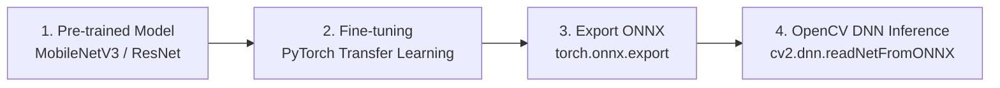

# โครงสร้างเนื้อหารายสัปดาห์ - สัปดาห์ที่ 10
## การปรับใช้โมเดลสำเร็จรูปและการสั่งทำงานโมเดลบน OpenCV (Transfer Learning & ONNX Export)

> **วิชา:** การประมวลผลภาพดิจิทัล (Digital Image Processing)  
> **รหัสวิชา:** 31909-2007  
> **เวลาเรียน:** 5 ชั่วโมง (บรรยาย 2 ชั่วโมง, ปฏิบัติ 3 ชั่วโมง)

---

## 1. วัตถุประสงค์การเรียนรู้ประจำสัปดาห์ (Learning Objectives)
1. **อธิบายแนวคิด Transfer Learning (CLO 1):** เข้าใจหลักการแช่แข็งค่าน้ำหนัก (Feature Extractor Freezing) และการปรับแต่งเลเยอร์ปลายทาง (Fine-tuning Classifiers) ด้วย MobileNetV3 / ResNet
2. **การส่งออกโมเดลมาตรฐาน ONNX (CLO 2):** สามารถนำโมเดล PyTorch ส่งออกเป็น Open Neural Network Exchange (`.onnx`) เพื่อข้ามเฟรมเวิร์ก
3. **การรัน Inference บน OpenCV DNN (CLO 3):** พัฒนาสคริปต์ Python โหลดโมเดล `.onnx` เข้าสู่ OpenCV ผ่าน `cv2.dnn.readNetFromONNX()` เพื่อทำนายภาพเรียลไทม์
4. **การประเมินความเร็วและความแม่นยำ (CLO 4):** เปรียบเทียบ Latency และ Memory Footprint ระหว่าง PyTorch Native กับ OpenCV DNN

---

## 2. แผนการเรียนรู้ประจำสัปดาห์

* **บรรยาย (2 ชั่วโมง):**
  * ทำไมต้อง Transfer Learning? (ลดระยะเวลาเทรนจากหลายวันเหลือหลักนาที)
  * โครงสร้าง MobileNetV3: Depthwise Separable Convolution
  * มาตรฐาน ONNX (Open Neural Network Exchange) และสถาปัตยกรรม OpenCV DNN Module
* **ปฏิบัติการ (3 ชั่วโมง) - LAB 10:**
  * เขียนสคริปต์ `train_transfer_onnx.py` ใน PyTorch เพื่อทำ Fine-Tuning คัดแยกประเภทวัตถุ
  * ส่งออกโมเดล `.onnx`
  * เขียนสคริปต์ `infer_onnx.py` โหลดโมเดลด้วย OpenCV DNN ประมวลผลจากวิดีโอ/กล้องสด

---

## 3. ฟังก์ชันและคำสั่งสำคัญประจำสัปดาห์

| ไลบรารี / โมดูล | ฟังก์ชัน / คำสั่ง | วัตถุประสงค์ |
|---|---|---|
| **`torchvision.models`** | `mobilenet_v3_small(weights=...)` | โหลดโมเดล Pre-trained |
| **`torch.onnx`** | `torch.onnx.export()` | ส่งออกกราฟโมเดลเป็นไฟล์ `.onnx` |
| **`cv2.dnn`** | `readNetFromONNX('model.onnx')` | โหลดไฟล์ ONNX เข้า OpenCV |
| **`cv2.dnn`** | `blobFromImage(image, scalefactor, size, mean, swapRB)` | แปลงภาพเข้า Tensor สเปก OpenCV |
