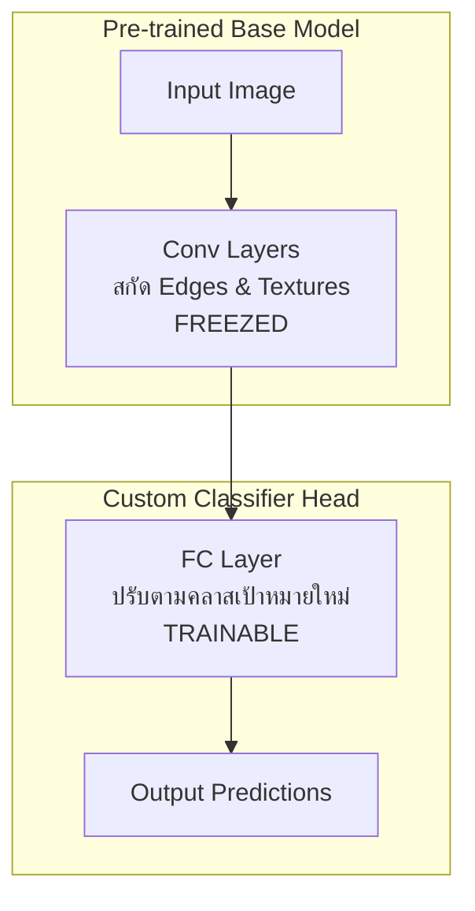
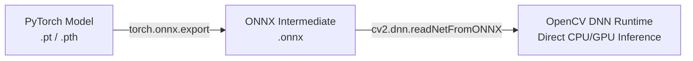

# บทที่ 10: การปรับใช้โมเดลสำเร็จรูปและการสั่งทำงานโมเดลบน OpenCV (Transfer Learning & ONNX Export)
> **หลักสูตร:** การประมวลผลภาพดิจิทัล (Digital Image Processing)  
> **เครื่องมือ:** Python 3.10, PyTorch 2.0+, OpenCV 4.6+, ONNX, VS Code

---

## ภาพรวมของบทเรียน

ในสัปดาห์ที่ 9 เราได้เรียนรู้การสร้างโครงข่ายประสาทเทียมแบบคอนโวลูชัน (CNN) ขึ้นมาจากศูนย์เพื่อจำแนกภาพตัวเลขลายมือ (MNIST) อย่างไรก็ตาม ในโลกอุตสาหกรรมจริง การฝึกฝนโมเดลจากศูนย์จำเป็นต้องใช้ชุดข้อมูลขนาดใหญ่และเวลาคำนวณมหาศาล

ในบทนี้ เราจะศึกษากลยุทธ์ **การเรียนรู้ถ่ายโอน (Transfer Learning)** โดยนำโมเดลระดับอุตสาหกรรมอย่าง **MobileNetV3** ที่ผ่านการฝึกสอนบนชุดข้อมูล ImageNet มาทำการแช่แข็งค่าน้ำหนัก (Weight Freezing) และดัดแปลงส่วนปลายทาง (Fine-tuning) จากนั้นเรียนรู้วิธีแปลงโมเดล PyTorch เป็นฟอร์แมตมาตรฐาน **ONNX (Open Neural Network Exchange)** เพื่อให้นำไปสั่งงานผ่านเอนจิน **OpenCV DNN** ได้อย่างรวดเร็วโดยไม่ต้องพึ่งพา PyTorch ในสภาพแวดล้อมจริง

---

## บทที่ 1: ทฤษฎีการเรียนรู้ถ่ายโอน (Transfer Learning)

### 1.1 แนวคิดเบื้องต้น
มนุษย์เราสามารถเรียนรู้ทักษะใหม่ได้เร็วขึ้นหากมีทักษะเดิมที่ใกล้เคียงกัน ในทาง Computer Vision โมเดล CNN ที่ผ่านการฝึกบน ImageNet ได้เรียนรู้การสกัดฟีเจอร์พื้นฐาน เช่น เส้นขอบ (Edges), พื้นผิว (Textures), และลวดลาย (Patterns) ไว้อย่างสมบูรณ์แล้ว



### 1.2 โครงสร้าง MobileNetV3
MobileNetV3 ใช้สถาปัตยกรรม **Depthwise Separable Convolution** ซึ่งแบ่งขั้นตอนการทำ Convolve ออกเป็น 2 ขั้นตอนย่อย:
1. **Depthwise Convolution:** กรองข้อมูลแยกทีละช่องสัญญาณสี (Channel)
2. **Pointwise Convolution (1x1 Conv):** ผสมสัญญาณข้ามช่องสี

ความซับซ้อนของการคำนวณลดลงจาก $\mathcal{O}(D_K^2 \cdot M \cdot N \cdot D_F^2)$ เหลือเพียง:
$$\mathcal{O}(D_K^2 \cdot M \cdot D_F^2 + M \cdot N \cdot D_F^2)$$

---

## บทที่ 2: การส่งออกโมเดลฟอร์แมต ONNX (Open Neural Network Exchange)

### 2.1 ทำไมต้อง ONNX?
เมื่อนำโมเดลไปใช้งานจริง (Production Deployment) บนอุปกรณ์ขนาดเล็ก (Edge Device) การติดตั้ง PyTorch (ขนาด ~2GB) เป็นเรื่องสิ้นเปลืองทรัพยากร ONNX ช่วยแปลงโครงสร้างกราฟและค่าน้ำหนักออกเป็นไฟล์ไบนารีขนาดเล็ก (`.onnx`) ที่ประมวลผลผ่าน C++ หรือ OpenCV ได้อย่างมีประสิทธิภาพ



### 2.2 โค้ดส่งออก ONNX ใน PyTorch
```python
import torch
import torchvision.models as models

# 1. โหลดโมเดล
model = models.mobilenet_v3_small(weights=None)
model.classifier[3] = torch.nn.Linear(model.classifier[3].in_features, 2) # 2 คลาส
model.eval()

# 2. สร้าง Dummy Input
dummy_input = torch.randn(1, 3, 224, 224)

# 3. Export เป็น ONNX
torch.onnx.export(
    model,
    dummy_input,
    "mobilenet_v3_custom.onnx",
    export_params=True,
    opset_version=11,
    do_constant_folding=True,
    input_names=['input'],
    output_names=['output']
)
print("ONNX model exported successfully!")
```

---

## บทที่ 3: การรัน Inference ด้วย OpenCV DNN Module

OpenCV มีโมดูล `cv2.dnn` ที่รองรับการประมวลผล Deep Learning ด้วยประสิทธิภาพสูง โดยใช้ฟังก์ชัน `blobFromImage` ในการเตรียมภาพ:

$$\text{Blob} = \left( \text{Pixel} - \text{Mean} \right) \times \text{ScaleFactor}$$

```python
import cv2
import numpy as np

# 1. โหลดโมเดล ONNX
net = cv2.dnn.readNetFromONNX("mobilenet_v3_custom.onnx")

# 2. เตรียมภาพอินพุต
img = cv2.imread("test_image.jpg")
blob = cv2.dnn.blobFromImage(
    img, 
    scalefactor=1.0/255.0, 
    size=(224, 224), 
    mean=(0.485*255, 0.456*255, 0.406*255), 
    swapRB=True, 
    crop=False
)

# 3. Forward Pass
net.setInput(blob)
outputs = net.forward()

# 4. คำนวณ Softmax
probs = np.exp(outputs) / np.sum(np.exp(outputs), axis=1)
class_id = np.argmax(probs)
confidence = probs[0][class_id]

print(f"Predicted Class: {class_id}, Confidence: {confidence:.2f}")
```
