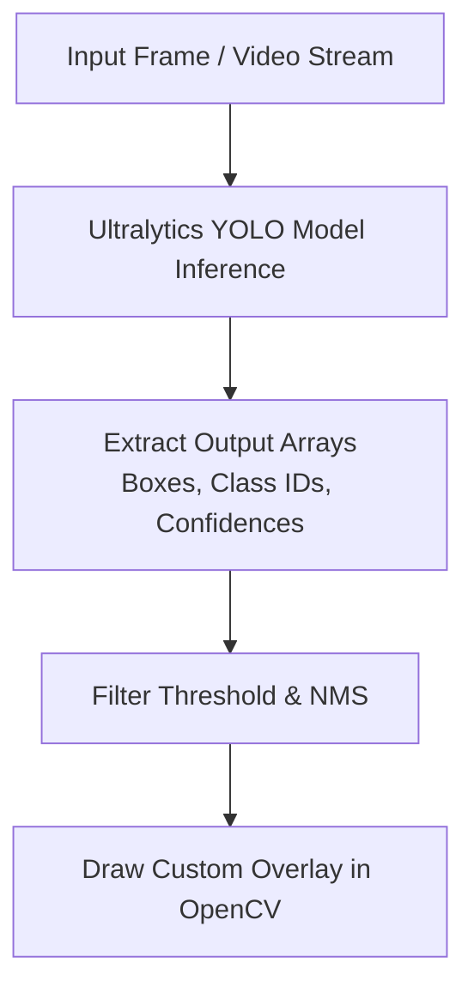

# โครงสร้างเนื้อหารายสัปดาห์ - สัปดาห์ที่ 11
## การตรวจจับวัตถุเป้าหมายด้วยแบบจำลอง YOLO (Object Detection Inference in VS Code)

> **วิชา:** การประมวลผลภาพดิจิทัล (Digital Image Processing)  
> **รหัสวิชา:** 31909-2007  
> **เวลาเรียน:** 5 ชั่วโมง (บรรยาย 2 ชั่วโมง, ปฏิบัติ 3 ชั่วโมง)

---

## 1. วัตถุประสงค์การเรียนรู้ประจำสัปดาห์ (Learning Objectives)
1. **แยกแยะประเภทงาน Computer Vision (CLO 1):** เข้าใจความแตกต่างระหว่าง Image Classification, Object Localization, และ Object Detection
2. **อธิบายสถาปัตยกรรม YOLO (CLO 1):** เข้าใจหลักการของ You Only Look Once (YOLOv8/v11), Bounding Boxes, Confidence Score, และ Non-Maximum Suppression (NMS)
3. **การประมวลผล Inference ด้วย Ultralytics (CLO 2):** สามารถเขียนสคริปต์ Python ใช้ไลบรารี `ultralytics` สั่งงานโมเดลตรวจจับวัตถุบนภาพถ่ายและวิดีโอ
4. **การเชื่อมต่อและดึงพิกเซลวัตถุด้วย OpenCV (CLO 3):** สกัดพิกัด Bounding Box ($x_1, y_1, x_2, y_2$) คลาส และ Confidence จากโมเดลเพื่อนำไปตีกรอบระบุโซนปลอดภัยใน OpenCV

---

## 2. แผนการเรียนรู้ประจำสัปดาห์

* **บรรยาย (2 ชั่วโมง):**
  * วิวัฒนาการของ Object Detection: Two-Stage (R-CNN, Faster R-CNN) VS One-Stage (YOLO, SSD)
  * โครงสร้าง YOLO: Grid System, Anchor Boxes / Anchor-Free, NMS Algorithm
  * เมทริกซ์การวัด Intersection over Union (IoU)
* **ปฏิบัติการ (3 ชั่วโมง) - LAB 11:**
  * ติดตั้ง `ultralytics` package
  * เขียนสคริปต์ `yolo_inference_demo.py` โหลด `yolov8n.pt` สแกนวัตถุเรียลไทม์
  * เขียนตรรกะระบบแจ้งเตือนวัตถุรุกล้ำพื้นที่ (Virtual Boundary Trigger)

---

## 3. ฟังก์ชันและคำสั่งสำคัญประจำสัปดาห์

| ไลบรารี / โมดูล | ฟังก์ชัน / คำสั่ง | วัตถุประสงค์ |
|---|---|---|
| **`ultralytics`** | `from ultralytics import YOLO` | อิมพอร์ตโมดูล YOLO |
| **`YOLO`** | `model = YOLO('yolov8n.pt')` | โหลด Pre-trained Weights |
| **`model.predict`** | `results = model(source, stream=True)` | สั่งทำ Inference บนสตรีมวิดีโอ |
| **`results[0].boxes`** | `box.xyxy`, `box.conf`, `box.cls` | ดึงพิกัดกรอบ ความมั่นใจ และคลาส |
