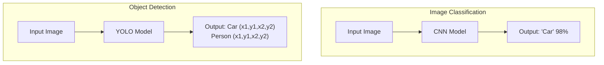
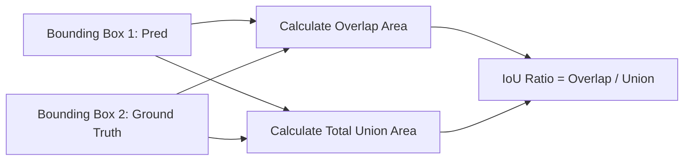

# บทที่ 11: การตรวจจับวัตถุเป้าหมายด้วยแบบจำลอง YOLO (Object Detection Inference)
> **หลักสูตร:** การประมวลผลภาพดิจิทัล (Digital Image Processing)  
> **เครื่องมือ:** Python 3.10, Ultralytics YOLOv8/v11, OpenCV 4.6+, VS Code

---

## ภาพรวมของบทเรียน

ใน 10 สัปดาห์แรก เราได้ศึกษาตั้งแต่พื้นฐานการจัดการพิกเซล ภาพขาวดำ สกัดขอบภาพ ตรวจจับ Contour ไปจนถึงการจำแนกประเภทภาพทั้งภาพ (Image Classification) 

ในบทนี้ เราจะก้าวไปอีกขั้นสู่ **การตรวจจับวัตถุ (Object Detection)** ซึ่งต้องทำนายทั้ง **ประเภทของวัตถุ (Class)** และ **ตำแหน่ง Bounding Box ($x_1, y_1, x_2, y_2$)** ของวัตถุหลายชิ้นพร้อมกันในเฟรมเดียว โดยเลือกใช้โมเดลที่เป็นมาตรฐานอุตสาหกรรมในปัจจุบัน คือ **YOLO (You Only Look Once)** ร่วมกับไลบรารี **Ultralytics** และนำพิกัดที่ประมวลผลได้มาควบคุม GUI ใน OpenCV

---

## บทที่ 1: ทฤษฎีการตรวจจับวัตถุและสถาปัตยกรรม YOLO

### 1.1 ความแตกต่างระหว่าง Classification และ Object Detection



### 1.2 หลักการทำงานของ YOLO (Single-Stage Detector)
YOLO แบ่งรูปภาพออกเป็น Grid ขนาด $S \times S$ ในแต่ละ Grid Cell หากจุดศูนย์กลางของวัตถุตกอยู่ใน Grid นั้น Grid ดังกล่าวจะเป็นผู้รับผิดชอบทำนาย Bounding Box และ Confidence Score:

$$\text{Confidence Score} = P(\text{Object}) \times \text{IoU}_{\text{pred}}^{\text{truth}}$$

### 1.3 ดรรชนีคำนวณ Intersection over Union (IoU)
IoU เป็นตัววัดความแม่นยำของกรอบ Bounding Box ที่โมเดลทำนาย ($B_{\text{pred}}$) เทียบกับกรอบเฉลย ($B_{\text{gt}}$):

$$\text{IoU} = \frac{\text{Area}(B_{\text{pred}} \cap B_{\text{gt}})}{\text{Area}(B_{\text{pred}} \cup B_{\text{gt}})}$$



### 1.4 อัลกอริทึม Non-Maximum Suppression (NMS)
เนื่องจากโมเดลอาจสร้างกรอบทำนายวัตถุชิ้นเดียวกันออกมานับสิบกรอบ NMS ทำหน้าที่ลบกรอบที่ซ้ำซ้อน:
1. เรียงลำดับ Bounding Box ตามค่า Confidence จากมากไปน้อย
2. เลือกกรอบที่มี Confidence สูงที่สุดขึ้นมาไว้ในลิสต์คำตอบ
3. คำนวณ IoU ของกรอบที่เหลือเทียบกับกรอบที่เลือก หาก IoU $> 0.5$ ให้ลบกรอบนั้นทิ้ง
4. ทำซ้ำจนกว่าจะไม่มีกรอบเหลืออยู่

---

## บทที่ 2: การพัฒนาสคริปต์ตรวจจับวัตถุด้วย Ultralytics YOLOv8 และ OpenCV

### 2.1 โครงสร้างเอาต์พุตของ Ultralytics YOLO
เมื่อป้อนภาพเข้าโมเดล YOLO เอาต์พุตจะเป็นวัตถุ `Results` ซึ่งมี Attribute สำคัญ:
* `boxes.xyxy`: พิกัดกรอบ 4 จุด ($x_{\text{min}}, y_{\text{min}}, x_{\text{max}}, y_{\text{max}}$) หน่วยเป็น Pixel
* `boxes.conf`: ค่าความมั่นใจในการทำนาย ($0.0 - 1.0$)
* `boxes.cls`: Index ของประเภทคลาส (เช่น 0 = person, 2 = car)

### 2.2 ตัวอย่างสคริปต์การสกัดพิกัดกรอบไปวาดใน OpenCV
```python
import cv2
from ultralytics import YOLO

# โหลดโมเดล pre-trained YOLOv8 Nano
model = YOLO("yolov8n.pt")

# อ่านภาพ
img = cv2.imread("traffic.jpg")
results = model(img)[0]

# วนลูปสกัด Bounding Box แต่ละวัตถุ
for box in results.boxes:
    x1, y1, x2, y2 = map(int, box.xyxy[0])
    conf = float(box.conf[0])
    cls_id = int(box.cls[0])
    class_name = model.names[cls_id]

    if conf > 0.5:
        # วาดกรอบสีเขียวและข้อความบนภาพ
        cv2.rectangle(img, (x1, y1), (x2, y2), (0, 255, 0), 2)
        cv2.putText(img, f"{class_name} {conf:.2f}", (x1, y1 - 10),
                    cv2.FONT_HERSHEY_SIMPLEX, 0.5, (0, 255, 0), 2)

cv2.imwrite("output_detected.jpg", img)
```
