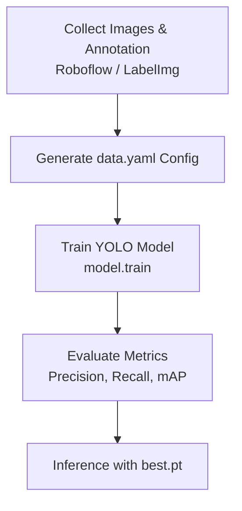

# โครงสร้างเนื้อหารายสัปดาห์ - สัปดาห์ที่ 12
## การสร้างโมเดลตรวจจับวัตถุส่วนบุคคล (Custom YOLO Training & Evaluation)

> **วิชา:** การประมวลผลภาพดิจิทัล (Digital Image Processing)  
> **รหัสวิชา:** 31909-2007  
> **เวลาเรียน:** 5 ชั่วโมง (บรรยาย 2 ชั่วโมง, ปฏิบัติ 3 ชั่วโมง)

---

## 1. วัตถุประสงค์การเรียนรู้ประจำสัปดาห์ (Learning Objectives)
1. **จัดโครงสร้าง Dataset สำหรับ YOLO (CLO 2):** สามารถจัดเตรียมไฟล์รูปภาพและ Label ในฟอร์แมต Bounding Box Normalized ($x_{\text{center}}, y_{\text{center}}, w, h$) พร้อมสร้างไฟล์ `data.yaml`
2. **ฝึกสอนโมเดล Custom YOLO (CLO 3):** เขียนสคริปต์สั่งเทรนโมเดล YOLO บนชุดข้อมูลเฉพาะ (Custom Objects)
3. **วัดผลประสิทธิภาพการทำนาย (CLO 1):** คำนวณและแปลความหมายตัวชี้วัด Precision, Recall, mAP50, และ mAP50-95
4. **นำโมเดลไปใช้งานจริง (CLO 3):** นำ Weights ที่ได้จากการเทรน (`best.pt`) ไปสั่งรันทำนายวัตถุเรียลไทม์

---

## 2. แผนการเรียนรู้ประจำสัปดาห์

* **บรรยาย (2 ชั่วโมง):**
  * ฟอร์แมตการแปะป้าย (Annotation formats): YOLO format vs Pascal VOC (XML) vs COCO (JSON)
  * การแปลงค่าพิกเซลสัมบูรณ์เป็น Normalized Values ($0.0 - 1.0$)
  * การคำนวณ mAP (Mean Average Precision) และ Precision-Recall Curve
* **ปฏิบัติการ (3 ชั่วโมง) - LAB 12:**
  * สร้างไฟล์ `data.yaml` กำหนดเส้นทาง train/val และ class names
  * เขียนสคริปต์ `train_custom_yolo.py` สั่งรันฝึกฝนโมเดล
  * สรุปกราฟ Loss และ Matrix วัดผลประสิทธิภาพ

---

## 3. ฟังก์ชันและคำสั่งสำคัญประจำสัปดาห์

| คำสั่ง / ฟังก์ชัน | คำอธิบาย |
|---|---|
| **`model.train(data="data.yaml", epochs=50, imgsz=640)`** | สั่งเทรนโมเดล YOLO บนชุดข้อมูล Custom |
| **`model.val()`** | ประเมินผลประสิทธิภาพบน Validation Set |
| **`results.box.map`, `map50`** | ดึงค่า Mean Average Precision |
