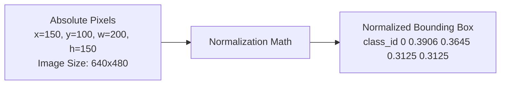

# บทที่ 12: การสร้างโมเดลตรวจจับวัตถุส่วนบุคคล (Custom YOLO Training & Evaluation)
> **หลักสูตร:** การประมวลผลภาพดิจิทัล (Digital Image Processing)  
> **เครื่องมือ:** Python 3.10, Ultralytics YOLOv8/v11, Roboflow, VS Code

---

## ภาพรวมของบทเรียน

ในสัปดาห์ที่ 11 เราเรียนรู้วิธีการนำโมเดล YOLO สำเร็จรูป (Pre-trained on COCO dataset) มาสั่งรันตรวจจับวัตถุ 80 คลาสทั่วไป อย่างไรก็ตาม ในการประยุกต์ใช้งานในภาคอุตสาหกรรม การเกษตร หรือการแพทย์ วัตถุที่เราสนใจมักเป็นวัตถุเฉพาะทาง เช่น รอยตำหนิบนแผ่นโลหะ, โรคพืชบนใบไม้, หรือสินค้าเฉพาะแบรนด์

ในบทนี้ เราจะเรียนรู้กระบวนการ **Custom Model Pipeline** ตั้งแต่การแปะป้าย (Data Labeling), การจัดฟอร์แมตไฟล์ `data.yaml`, การสั่งเทรนโมเดลผ่านสคริปต์ Python และการวิเคราะห์ตัวชี้วัดประสิทธิภาพทางสถิติ (Precision, Recall, mAP)

---

## บทที่ 1: การเตรียมชุดข้อมูลในฟอร์แมต YOLO (YOLO Annotation Format)

### 1.1 คณิตศาสตร์การ Normalize พิกัด Bounding Box
ไฟล์ Label ของ YOLO จะเก็บค่าพิกัด Bounding Box ให้อยู่ในช่วง $[0.0, 1.0]$ เพื่อให้ทนทานต่อการ Resize ขนาดภาพ:

$$x_{\text{center}} = \frac{x_{\text{min}} + \frac{w}{2}}{W_{\text{img}}}, \quad y_{\text{center}} = \frac{y_{\text{min}} + \frac{h}{2}}{H_{\text{img}}}$$

$$w_{\text{norm}} = \frac{w}{W_{\text{img}}}, \quad h_{\text{norm}} = \frac{h}{H_{\text{img}}}$$



### 1.2 โครงสร้างไฟล์ `data.yaml`
```yaml
path: ./dataset # root directory
train: train/images
val: val/images

nc: 2 # number of classes
names: ['scratch', 'dent'] # class names list
```

---

## บทที่ 2: การสั่งเทรนโมเดลด้วย PyTorch & Ultralytics

### 2.1 สคริปต์การสั่งเทรน (`train_custom_yolo.py`)
```python
from ultralytics import YOLO

# 1. โหลดโมเดลตั้งต้น Pre-trained weights
model = YOLO("yolov8n.pt")

# 2. เริ่มต้นกระบวนการฝึกฝน
results = model.train(
    data="data.yaml",
    epochs=50,
    imgsz=640,
    batch=16,
    workers=4,
    project="runs/custom_train",
    name="exp_yolo_custom"
)

print("Training finished! Best weights saved to: runs/custom_train/exp_yolo_custom/weights/best.pt")
```

---

## บทที่ 3: ตัวชี้วัดการประเมินผลประสิทธิภาพ (Evaluation Metrics)

### 3.1 Confusion Matrix & Basic Metrics
* **True Positive (TP):** โมเดลทายว่ามีวัตถุ และมีวัตถุอยู่จริง (IoU $> 0.5$)
* **False Positive (FP):** โมเดลทายว่ามีวัตถุ แต่ตีกรอบเพี้ยนหรือไม่มีวัตถุจริง
* **False Negative (FN):** มีวัตถุจริง แต่โมเดลทายหาไม่เจอ (Missed Detection)

$$\text{Precision} = \frac{TP}{TP + FP}, \quad \text{Recall} = \frac{TP}{TP + FN}$$

### 3.2 Mean Average Precision (mAP)
mAP คำนวณจากพื้นที่ใต้กราฟ Precision-Recall Curve (AUC) เฉลี่ยรวมทุกคลาส:

$$\text{mAP} = \frac{1}{N} \sum_{i=1}^{N} \text{AP}_i$$

* **mAP50:** วัดผลที่ IoU Threshold $0.50$ (เกณฑ์ยืดหยุ่น)
* **mAP50-95:** วัดผลเฉลี่ยที่ IoU Threshold ตั้งแต่ $0.50$ ถึง $0.95$ ทุกๆ ช่วงห่าง $0.05$ (เกณฑ์เข้มงวดมาตรฐานอุตสาหกรรม)
