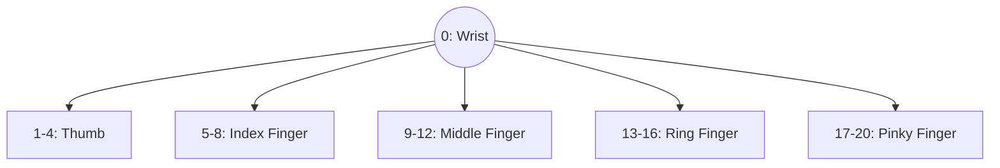
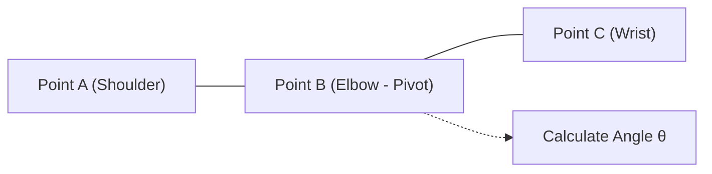

# บทที่ 13: โมเดลการหาจุดข้อต่อร่างกายมนุษย์ด้วย MediaPipe (Pose & Landmark Detection)
> **หลักสูตร:** การประมวลผลภาพดิจิทัล (Digital Image Processing)  
> **เครื่องมือ:** Python 3.10, MediaPipe 0.10+, OpenCV 4.6+, NumPy, VS Code

---

## ภาพรวมของบทเรียน

ในบทนี้ เราจะเรียนรู้การสกัดฟีเจอร์ระดับสูงในรูปแบบ **Keypoint / Landmark Estimation** ซึ่งไม่ได้ตีกรอบ Bounding Box สี่เหลี่ยมทับทั้งตัว แต่มุ่งเน้นการค้นหาพิกัดพิกเซลสำคัญของข้อต่อมนุษย์ เช่น ปลายนิ้ว, ข้อศอก, หัวเข่า, ดวงตา และมุมปาก โดยใช้งานโซลูชัน **MediaPipe** จาก Google ร่วมกับคณิตศาสตร์เวกเตอร์เพื่อสร้างแอปพลิเคชันโต้ตอบแบบเรียลไทม์

---

## บทที่ 1: สถาปัตยกรรม MediaPipe และพิกัด 3D Landmarks

### 1.1 โครงสร้างพิกัด 21 จุดของ MediaPipe Hands



### 1.2 โครงสร้างพิกัด 33 จุดของ MediaPipe Pose
จุด Landmarks ครอบคลุมตั้งแต่จมูก ตา ไหล่ ข้อศอก ข้อมือ สะโพก เข่า จนถึงข้อเท้า แต่ละจุดส่งกลับค่า:
* `x, y`: พิกัด Normalized สัมพัทธ์กับความกว้าง-สูงของภาพ ($[0.0, 1.0]$)
* `z`: พิกัดความลึก (Depth Scale)
* `visibility`: ค่าความมั่นใจว่าจุดนั้นถูกบดบังหรือไม่ ($[0.0, 1.0]$)

---

## บทที่ 2: คณิตศาสตร์เวกเตอร์การคำนวณมุมข้อต่อ ($\theta$)

### 2.1 สูตรคำนวณมุมระหว่าง 3 จุดพิกัด $A, B, C$
ให้ $B$ เป็นจุดหมุน (Pivot Node เช่น ข้อศอก):

$$\vec{u} = A - B = (x_a - x_b, y_a - y_b)$$
$$\vec{v} = C - B = (x_c - x_b, y_c - y_b)$$

$$\cos\theta = \frac{\vec{u} \cdot \vec{v}}{\|\vec{u}\| \|\vec{v}\|}$$

$$\theta = \arccos\left( \frac{(x_a-x_b)(x_c-x_b) + (y_a-y_b)(y_c-y_b)}{\sqrt{(x_a-x_b)^2 + (y_a-y_b)^2} \sqrt{(x_c-x_b)^2 + (y_c-y_b)^2}} \right) \times \frac{180}{\pi}$$



---

## บทที่ 3: สคริปต์การสกัดจุดและแสดงผลใน OpenCV

```python
import cv2
import mediapipe as mp

mp_hands = mp.solutions.hands
mp_draw = mp.solutions.drawing_utils

hands = mp_hands.Hands(max_num_hands=1, min_detection_confidence=0.7)

cap = cv2.VideoCapture(0)
while cap.isOpened():
    ret, frame = cap.read()
    if not ret:
        break

    rgb_frame = cv2.cvtColor(frame, cv2.COLOR_BGR2RGB)
    results = hands.process(rgb_frame)

    if results.multi_hand_landmarks:
        for hand_landmarks in results.multi_hand_landmarks:
            mp_draw.draw_landmarks(frame, hand_landmarks, mp_hands.HAND_CONNECTIONS)
            
            # ดึงพิกัดปลายนิ้วชี้ (Index Finger Tip = Landmark 8)
            h, w, c = frame.shape
            cx, cy = int(hand_landmarks.landmark[8].x * w), int(hand_landmarks.landmark[8].y * h)
            cv2.circle(frame, (cx, cy), 12, (255, 0, 0), cv2.FILLED)

    cv2.imshow("Hand Tracking", frame)
    if cv2.waitKey(1) & 0xFF == 27:
        break

cap.release()
cv2.destroyAllWindows()
```
