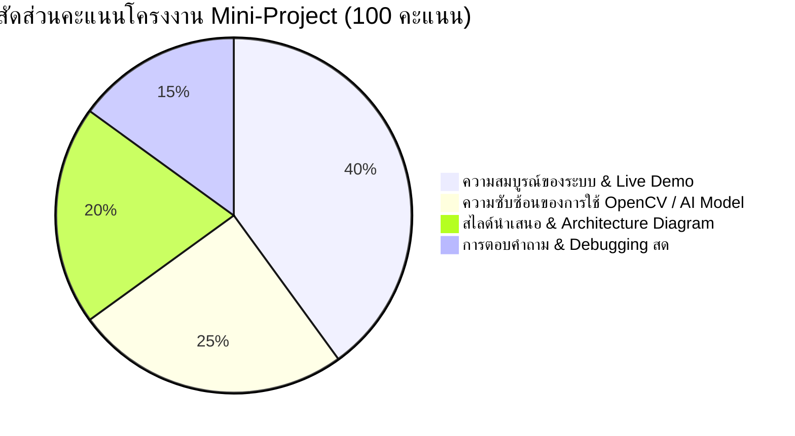

# โครงสร้างเนื้อหารายสัปดาห์ - สัปดาห์ที่ 14
## โครงงานพิเศษและการนำเสนอผลงาน (AI Computer Vision Mini-Project Showcase)

> **วิชา:** การประมวลผลภาพดิจิทัล (Digital Image Processing)  
> **รหัสวิชา:** 31909-2007  
> **เวลาเรียน:** 5 ชั่วโมง (บรรยาย 2 ชั่วโมง, ปฏิบัติ 3 ชั่วโมง)

---

## 1. วัตถุประสงค์การเรียนรู้ประจำสัปดาห์ (Learning Objectives)
1. **บูรณาการองค์ความรู้แบบEnd-to-End (CLO 3):** สามารถเชื่อมโยงเทคนิค Preprocessing, Feature Extraction, Deep Learning Model, และ OpenCV GUI เข้าด้วยกันเป็นแอปพลิเคชัน
2. **การนำเสนอและสาธิตระบบสด (CLO 2):** นำเสนอโครงงานเชิงประยุกต์และสาธิตการรันโปรแกรมสด (Live Demonstration) จาก VS Code Workspace
3. **การสื่อสารและดีบักโค้ด (CLO 4):** สามารถตอบคำถาม ดีบักโค้ดสดตามโจทย์ทดสอบของผู้สอน และอธิบายข้อดี-ข้อจำกัดของสถาปัตยกรรมที่เลือกใช้

---

## 2. เกณฑ์การประเมินโครงงาน (Mini-Project Scoring Rubric)

---

## 3. หัวข้อโครงงานที่แนะนำ (Recommended Mini-Project Topics)
1. **Smart Parking System:** ตรวจจับพื้นที่ว่างในลานจอดรถและอ่านป้ายทะเบียน
2. **PPE Safety Compliance Monitor:** ตรวจสอบการสวมหมวกนิรภัยและเสื้อกั๊กสะท้อนแสงด้วย YOLO Custom
3. **Air Gesture Canvas & UI Control:** ควบคุมระบบนำเสนอหรือวาดภาพด้วยการจับพิกัดมือนิ้ว MediaPipe
4. **Defect Inspection Pipeline:** ระบบตรวจจับตำหนิชิ้นส่วนอุตสาหกรรมด้วย CLAHE, Morphology, และ Contour Auto-Crop
