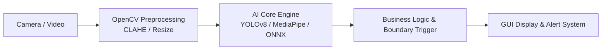

# โครงร่างสไลด์นำเสนอ - สัปดาห์ที่ 14
## โครงงานพิเศษและการนำเสนอผลงาน (AI Computer Vision Mini-Project Showcase)

---

### Slide 1: หน้าปก (Title Slide)
* **ชื่อโครงงาน:** [ระบุชื่อโครงงาน]
* **สมาชิกผู้จัดทำ:** [ชื่อ-นามสกุล, รหัสนักศึกษา]
* **วิชา:** การประมวลผลภาพดิจิทัล (Digital Image Processing)

---

### Slide 2: ที่มาและความสำคัญ (Problem Statement & Motivation)
* ปัญหาในโลกจริงที่ต้องการแก้ไขด้วย Computer Vision
* ทำไมเทคนิคดั้งเดิม หรือ AI ถึงเข้ามาช่วยแก้ปัญหานี้ได้ดีกว่าวิธีเดิม

---

### Slide 3: สถาปัตยกรรมระบบ (System Architecture)

---

### Slide 4: ผลการทดลองและตัวชี้วัด (Experimental Results & Metrics)
* ตารางเปรียบเทียบค่า Accuracy, Precision, Recall, mAP หรือ FPS
* ภาพตัวอย่างการทำนายในสภาวะแสงต่างๆ (แสงปกติ, แสงน้อย, วัตถุบดบัง)

---

### Slide 5: การสาธิตสด (Live Demonstration Setup)
* สรุปการตั้งค่า VS Code Workspace และ Environment `dip_env`
* เตรียมพร้อมรันไฟล์สคริปต์หลัก (`main.py`) สดต่อหน้าผู้สอน

---

### Slide 6: อนาคตและการต่อยอด (Future Improvements)
* การเพิ่มประสิทธิภาพโมเดลให้รันบน Edge Hardware (เช่น Raspberry Pi / Jetson Nano)
* การขยายคลังชุดข้อมูล (Dataset Expansion)
