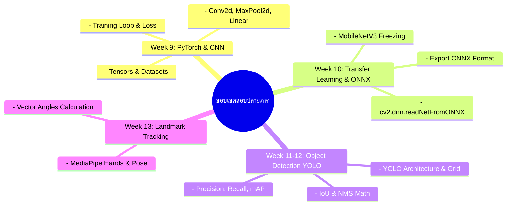

# โครงสร้างเนื้อหารายสัปดาห์ - สัปดาห์ที่ 15
## การทดสอบปลายภาคเรียนและการสรุปภาพรวมวิชา (Final Examination & Course Synthesis)

> **วิชา:** การประมวลผลภาพดิจิทัล (Digital Image Processing)  
> **รหัสวิชา:** 31909-2007  
> **เวลาเรียน:** 5 ชั่วโมง (บรรยาย 2 ชั่วโมง, ปฏิบัติ 3 ชั่วโมง)

---

## 1. วัตถุประสงค์การเรียนรู้ประจำสัปดาห์ (Learning Objectives)
1. **ประเมินทฤษฎี Computer Vision ระดับสูง (CLO 1):** สรุปเปรียบเทียบข้อดี-ข้อจำกัดระหว่าง Classical Image Processing และ Deep Learning Models (CNN, YOLO, ONNX, MediaPipe)
2. **ทดสอบปฏิบัติการขั้นสูงใน VS Code (CLO 2 & CLO 3):** สามารถนำโมเดล AI โหลดเข้า OpenCV รันประมวลผลจำแนกวัตถุและนับจำนวนพร้อมระบุพิกัดแบบเรียลไทม์ภายใต้ข้อจำกัดเวลาสอบ
3. **จริยธรรมและความเป็นส่วนตัวของข้อมูลภาพ (CLO 4):** ตระหนักถึงจริยธรรมในการนำโมเดล Computer Vision ไปใช้ประมวลผลข้อมูลชีวมิติ (Biometrics/Facial Recognition) และความเป็นส่วนตัว

---

## 2. ขอบเขตเนื้อหาข้อสอบปลายภาค (Final Examination Scope)

---

## 3. รูปแบบข้อสอบปลายภาค (Final Exam Structure)

| ส่วนที่ | ประเภทข้อสอบ | เวลา | คะแนนเต็ม | รายละเอียด |
|:---:|---|:---:|:---:|---|
| **ส่วนที่ 1** | ทฤษฎีเชิงวิเคราะห์ (Theory) | 2 ชั่วโมง | 40 คะแนน | ปรนัยและอัตนัย คำนวณ IoU, NMS, Vector Angles, และเปรียบเทียบสถาปัตยกรรมโมเดล |
| **ส่วนที่ 2** | ปฏิบัติการเขียนโปรแกรม (Practical Lab) | 3 ชั่วโมง | 60 คะแนน | พัฒนาโปรแกรมใน VS Code โหลดไฟล์โมเดล AI สแกนวิดีโอ คัดแยกวัตถุ และตีกรอบ Overlay |
