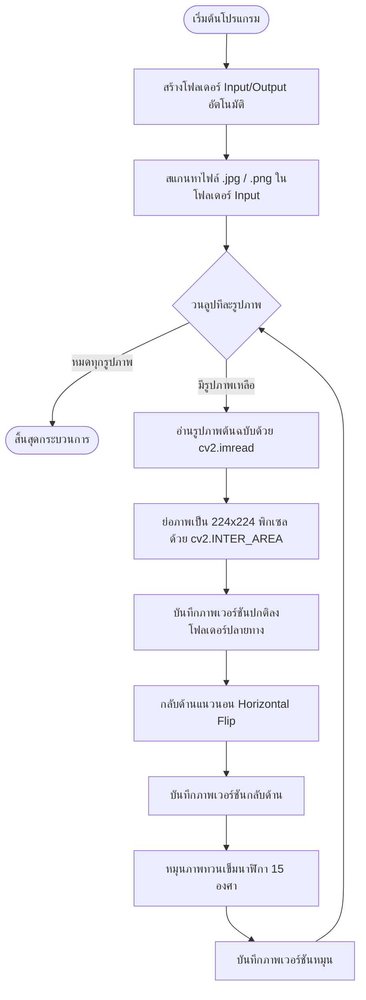

# เอกสารประกอบการเรียนการสอน: สัปดาห์ที่ 2 (Week 2 Tutorial)
## หัวข้อ: การประมวลผลพิกเซลและการดำเนินการเรขาคณิต (Image Manipulation in VS Code)
---

> [!NOTE]
> เอกสารนี้เป็นคู่มือปฏิบัติการแบบทีละขั้นตอน (Step-by-Step) สำหรับสัปดาห์ที่ 2 โดยมุ่งเน้นการเข้าถึงข้อมูลภาพระดับพิกเซลด้วย NumPy การใช้งานฟังก์ชันเรขาคณิตพื้นฐานของ OpenCV และการเขียนสคริปต์ประมวลผลภาพแบบกลุ่ม (Batch Processing) เพื่อเตรียมพร้อมสำหรับการสร้างชุดข้อมูลฝึกฝนโมเดล AI (Data Augmentation) รวมถึงการใช้เครื่องมือดีบัก (Debugger) ใน VS Code เพื่อวิเคราะห์ค่าในอาเรย์รูปภาพ

---

## ส่วนที่ 1: การประมวลผลพิกเซลและการเข้าถึงข้อมูลภาพด้วย NumPy (1.5 ชั่วโมง)

เมื่อเราโหลดภาพเข้ามาโดยใช้ OpenCV ภาพนั้นจะถูกจัดเก็บในรูปแบบของ **NumPy Array (`numpy.ndarray`)** ซึ่งมีโครงสร้างเป็นแมทริกซ์ 2 มิติ (สำหรับเกรย์สเกล) หรือ 3 มิติ (สำหรับภาพสี)

### 1. ระบบพิกัดภาพและการสลับแกน (Coordinate System Pitfall)

> [!WARNING]
> **ความแตกต่างระหว่างพิกัดภาพ (OpenCV) และมิติของอาเรย์ (NumPy):**
> * **OpenCV** มองรูปภาพในระบบพิกัดคาร์ทีเซียน $(x, y)$ โดยที่แกน $x$ คือความกว้าง (แนวนอน) และแกน $y$ คือความสูง (แนวตั้ง)
> * **NumPy** อ้างอิงแถว (Row) และคอลัมน์ (Column) ของอาเรย์ โดยที่แถวแทนความสูง (แนวตั้ง หรือ แกน $y$) และคอลัมน์แทนความกว้าง (แนวนอน หรือ แกน $x$)
> * **ดังนั้น:** การระบุพิกเซลในโค้ด Python ผ่าน NumPy จะใช้รูปแบบ **`img[y, x]`** หรือ **`img[row, col]`** เสมอ (สลับที่กันกับพิกัดทางเรขาคณิตทั่วไป)

```mermaid
matrix
  id1["ระบบพิกัดภาพ (x, y) vs ดัชนีอาเรย์ [y, x]"]
  direction TB
  subgraph OpenCV Coordinate System
    A["(0, 0) มุมซ้ายบนสุด"] -->|แกน x: ความกว้าง (Col)| B["x วิ่งไปทางขวา"]
    A -->|แกน y: ความสูง (Row)| C["y วิ่งลงข้างล่าง"]
  end
  subgraph NumPy Indexing
    D["img[y, x]"] -->|ค่าแรก| E["y = ดัชนีแถว (Row Index)"]
    D -->|ค่าสอง| F["x = ดัชนีคอลัมน์ (Col Index)"]
  end
```

### 2. การเข้าถึงและการดัดแปลงค่าพิกเซล (Access & Modify Pixels)

สร้างไฟล์ชื่อ `pixel_demo.py` ใน VS Code เพื่อทดลองเขียนโค้ดตามตัวอย่างนี้:

```python
# pixel_demo.py
import cv2
import numpy as np

# สร้างภาพสีดำสนิทขนาด 300 x 400 พิกเซล (3 แชนเนลสี BGR)
# numpy.zeros(shape=(height, width, channels), dtype=uint8)
img = np.zeros((300, 400, 3), dtype=np.uint8)

# 1. เข้าถึงค่าพิกเซลเดี่ยว ณ พิกัด x=150, y=100
# ค่าที่ได้จะเป็นอาเรย์ขนาด 3 ช่อง [Blue, Green, Red]
pixel_val = img[100, 150]
print(f"ค่าพิกเซลเริ่มต้นที่ (x=150, y=100): {pixel_val}")

# 2. แก้ไขพิกเซลเดี่ยวให้เป็นสีแดง (ในระบบ BGR สีแดงคือ [0, 0, 255])
img[100, 150] = [0, 0, 255]
print(f"ค่าพิกเซลหลังแก้ไข: {img[100, 150]}")

# 3. การเข้าถึงพื้นที่เฉพาะส่วน (Region of Interest: ROI) ด้วยการหั่นอาเรย์ (Array Slicing)
# ไวยากรณ์: img[y_start:y_end, x_start:x_end]
# ทดลองเปลี่ยนแถบมุมบนซ้าย (y ตั้งแต่ 0-50, x ตั้งแต่ 0-100) ให้เป็นสีเขียว [0, 255, 0]
img[0:50, 0:100] = [0, 255, 0]

# 4. การแยกแชนเนลสี (Color Channels Split)
# ดึงค่าสีน้ำเงิน (Blue) ทั้งหมดในภาพออกมา (แชนเนลดัชนีที่ 0)
blue_channel = img[:, :, 0]

# แสดงผลภาพ
cv2.imshow("Pixel Manipulation", img)
cv2.waitKey(0)
cv2.destroyAllWindows()
```

### 3. คู่มือการดีบักดูค่าพิกเซลผ่าน VS Code Debugger (Step-by-Step)

การเขียนโปรแกรมจัดการรูปภาพมีความซับซ้อนเนื่องจากข้อมูลเป็นตัวเลขจำนวนมหาศาล การใช้ `print()` เพียงอย่างเดียวจึงไม่สะดวก วิธีที่มีประสิทธิภาพมากที่สุดคือการใช้ **Debugger** ใน VS Code

1. **ตั้งจุด Breakpoint**: เปิดสคริปต์ `pixel_demo.py` และคลิกที่พื้นที่ว่างทางซ้ายของเลขบรรทัด (เช่น บรรทัดที่ 19 `img[0:50, 0:100] = [0, 255, 0]`) จะเกิดจุดสีแดงขึ้น
2. **เริ่มดีบักเกอร์**:
   * กดปุ่ม **F5** หรือไปที่แท็บ **Run and Debug** ทางซ้ายมือ แล้วกดปุ่ม **Run and Debug**
   * เลือกตัวเลือกเป็น **Python File**
3. **วิเคราะห์ค่าในตัวแปร**:
   * โปรแกรมจะหยุดการทำงานที่จุด Breakpoint บรรทัดสีเหลือง
   * ที่แถบ **Variables (ตัวแปร)** ด้านซ้ายมือ คุณจะพบตัวแปร `img`
   * สามารถขยายตัวแปร `img` เพื่อดูโครงสร้าง มิติ และข้อมูลพิกเซลที่เป็นแมทริกซ์ 3 มิติได้สด ๆ
4. **ใช้ Debug Console ในการสืบค้นสด**:
   * สลับไปที่แท็บ **Debug Console** (อยู่บริเวณหน้าต่างแสดงผล Terminal ด้านล่าง)
   * พิมพ์คำสั่งตรวจสอบค่าของอาเรย์ เช่น `img.shape` หรือคำนวณสถิติ เช่น `np.mean(img)` หรือตรวจสอบค่าพิกเซลเจาะจง เช่น `img[100, 150]` แล้วกด Enter เพื่อรับคำตอบได้ทันที

---

## ส่วนที่ 2: การแปลงสัดส่วนและการดำเนินการเรขาคณิต (1 ชั่วโมง)

การดำเนินการทางเรขาคณิต (Geometric Transformations) เป็นกระบวนการย้ายตำแหน่งพิกเซลตามสมการคณิตศาสตร์ เพื่อเปลี่ยนมิติ ขนาด หรือมุมของรูปภาพ

### 1. การเปลี่ยนขนาดภาพ (Resizing)

การใช้ฟังก์ชัน `cv2.resize()` เพื่อย่อหรือขยายภาพ

> [!IMPORTANT]
> ในฟังก์ชัน `cv2.resize(src, dsize, interpolation)` ตัวแปรขนาดภาพปลายทาง `dsize` จะต้องระบุในรูปแบบ **`(width, height)`** หรือ **`(x_size, y_size)`** ซึ่งกลับข้างกับมิติใน NumPy Array ของรูปภาพ

```python
# ตัวอย่างการใช้งาน cv2.resize
import cv2

img = cv2.imread("test_image.jpg")
h, w, c = img.shape

# วิธีที่ 1: กำหนดขนาดกว้าง x สูงแบบเจาะจงพิกเซล (เช่น 224 x 224)
resized_exact = cv2.resize(img, (224, 224))

# วิธีที่ 2: ย่อ/ขยายด้วยอัตราส่วน (Scaling Factor)
# เช่น ย่อขนาดลงครึ่งหนึ่ง (0.5 เท่า ทั้งกว้างและสูง)
resized_scaled = cv2.resize(img, (0, 0), fx=0.5, fy=0.5, interpolation=cv2.INTER_AREA)
```

#### ตารางเปรียบเทียบวิธีการคำนวณพิกเซลที่เปลี่ยนไป (Interpolation Methods)

| ฟังก์ชันอัลกอริทึม | ความเหมาะในการใช้งาน | ข้อดี / ข้อเสีย |
| :--- | :--- | :--- |
| `cv2.INTER_NEAREST` | ใช้สำหรับขยายภาพสไตล์ Pixel Art หรือแผนที่ป้ายกำกับ (Label Mask) | ทำงานเร็วมากที่สุด แต่ภาพจะเกิดรอยขั้นบันได (Jagged edges) |
| `cv2.INTER_LINEAR` | เป็นค่าเริ่มต้น (Default) เหมาะสำหรับงานทั่วไปและสเกลขนาดเพิ่ม | ทำงานเร็วและได้ภาพที่ค่อนข้างสมดุลราบเรียบ |
| `cv2.INTER_AREA` | **ดีที่สุดสำหรับการย่อภาพขนาดใหญ่ลงให้เล็กลง** | ป้องกันไม่ให้เกิดสัญญาณรบกวน Moire patterns บนภาพผลลัพธ์ |
| `cv2.INTER_CUBIC` | ดีสำหรับการขยายรูปภาพขนาดเล็กให้ใหญ่ขึ้น | คำนวณโดยใช้สภาพแวดล้อม 4x4 พิกเซล ได้ขอบที่เนียนกว่าแต่ช้ากว่า |
| `cv2.INTER_LANCZOS4` | ใช้สำหรับการขยายภาพคุณภาพสูงมาก | มีความสมดุลด้านมิติมุมมองดีที่สุด แต่ใช้พลังประมวลผลสูงที่สุด |

### 2. การครอบตัดรูปภาพ (Cropping)

การครอบตัดรูปภาพสามารถทำได้โดยตรงผ่าน **NumPy Slicing** โดยไม่จำเป็นต้องใช้ฟังก์ชันเฉพาะของ OpenCV:

```python
# ครอบภาพดึงเฉพาะส่วนตรงกลางพิกัด
# ตัวอย่าง: สมมติภาพขนาด 600x800 ต้องการครอบตัดเอาบริเวณแถวที่ 100-400 และคอลัมน์ที่ 200-600
cropped_image = img[100:400, 200:600]
```

### 3. การกลับด้านรูปภาพ (Flipping)

การกลับด้านภาพใช้คำสั่ง `cv2.flip(src, flipCode)` โดยมีรูปแบบการใช้งานดังนี้:

| ค่า `flipCode` | ทิศทางการกลับด้าน | คำอธิบาย |
| :---: | :--- | :--- |
| `0` | กลับด้านแนวตั้ง (Vertical Flip) | กลับภาพจากบนลงล่าง (พลิกตามแกนแนวนอน/แกน X) |
| `1` | กลับด้านแนวนอน (Horizontal Flip) | กลับภาพจากซ้ายไปขวา (พลิกตามแกนตั้ง/แกน Y) เหมาะสำหรับ Mirror effect |
| `-1` | กลับทั้งแนวนอนและแนวตั้ง | กลับหัวภาพพร้อมกระจกเงา (หมุนภาพ 180 องศา) |

```python
# ตัวอย่างโค้ดกลับด้านภาพ
flipped_horiz = cv2.flip(img, 1) # กลับซ้าย-ขวา
flipped_vert = cv2.flip(img, 0)  # กลับบน-ล่าง
```

### 4. การหมุนรูปภาพ (Rotation)

* **กรณีหมุนมุมตรง 90, 180, 270 องศา**: สามารถใช้ `cv2.rotate(src, rotateCode)` ได้ทันที มีประสิทธิภาพและรวดเร็ว:
  * `cv2.ROTATE_90_CLOCKWISE` (หมุนตามเข็มนาฬิกา 90 องศา)
  * `cv2.ROTATE_180` (หมุน 180 องศา)
  * `cv2.ROTATE_90_COUNTERCLOCKWISE` (หมุนทวนเข็มนาฬิกา 90 องศา)
* **กรณีหมุนมุมใด ๆ (เช่น 15 องศา 45 องศา)**: จะต้องคำนวณแมทริกซ์การแปลงสภาพเชิงเส้น (Affine Transformation Matrix) ผ่านฟังก์ชัน `cv2.getRotationMatrix2D()` แล้วนำไปประยุกต์ใช้งานด้วย `cv2.warpAffine()`:

```python
# หมุนภาพไปในทิศทางทวนเข็มนาฬิกา 30 องศา โดยใช้จุดศูนย์กลางภาพเป็นหลัก
h, w = img.shape[:2]
center = (w // 2, h // 2)

# 1. คำนวณหาแอฟฟีนแมทริกซ์ (M): getRotationMatrix2D(จุดศูนย์กลาง, มุมหมุน, อัตราส่วนสเกลภาพ)
# มุมหมุนเป็นบวกคือทวนเข็มนาฬิกา มุมเป็นลบคือตามเข็มนาฬิกา
M = cv2.getRotationMatrix2D(center, 30, 1.0)

# 2. ทำการบิด/หมุนภาพตามแมทริกซ์ M ด้วย warpAffine
# warpAffine(ภาพต้นทาง, แมทริกซ์การย้ายพิกเซล, (ขนาดความกว้างปลายทาง, ขนาดความสูงปลายทาง))
rotated_image = cv2.warpAffine(img, M, (w, h))
```

---

## ส่วนที่ 3: โค้ดแล็บปฏิบัติการ - สคริปต์ประมวลผลภาพแบบกลุ่ม (1.5 ชั่วโมง)

ในการทำงานจริง เช่น การพัฒนา AI ในการตรวจสอบคัดแยกรูปภาพสินค้า หรือวัตถุในสายพาน เรามักมีภาพต้นแบบจำนวนหนึ่ง และต้องการจำลองปรับปรุงขนาดและแต่งสีเพิ่มขยาย (Data Augmentation) อัตโนมัติในลักษณะของสคริปต์ประมวลผลเป็นกลุ่ม (Batch Script)

### แผนผังขั้นตอนการทำงานของ Batch Processing Pipeline



สร้างไฟล์ชื่อ `batch_processor.py` ลงใน VS Code Workspace แล้วคัดลอกโค้ดด้านล่างเพื่อทำการทดลองใช้งาน:

```python
# batch_processor.py
import cv2
import numpy as np
import os
import glob

def process_batch():
    # กำหนดโฟลเดอร์นำเข้าและส่งออก
    input_folder = "dataset_raw"
    output_folder = "dataset_augmented"
    
    # 1. ตรวจสอบและสร้างโฟลเดอร์อัตโนมัติหากไม่มีอยู่ในระบบ
    if not os.path.exists(input_folder):
        os.makedirs(input_folder)
        print(f"สร้างโฟลเดอร์สำหรับใส่รูปภาพ '{input_folder}' แล้ว")
        print("--> กรุณานำรูปภาพตัวอย่างไปใส่ไว้ในโฟลเดอร์นี้เพื่อเริ่มการประมวลผล!")
        return

    if not os.path.exists(output_folder):
        os.makedirs(output_folder)
        print(f"สร้างโฟลเดอร์ผลลัพธ์ '{output_folder}' เรียบร้อย")

    # 2. ค้นหารูปภาพทั้งหมดนามสกุล .jpg, .jpeg, .png
    # ใช้ไลบรารี glob ในการกรองไฟล์
    image_extensions = ("*.jpg", "*.jpeg", "*.png")
    image_paths = []
    for ext in image_extensions:
        image_paths.extend(glob.glob(os.path.join(input_folder, ext)))
        
    if len(image_paths) == 0:
        print(f"แจ้งเตือน: ไม่พบไฟล์รูปภาพในโฟลเดอร์ '{input_folder}'")
        return
        
    print(f"พบรูปภาพเตรียมประมวลผลทั้งหมด: {len(image_paths)} รูป")
    
    # ขนาดภาพปลายทางที่ต้องการสำหรับโมเดล AI (เช่น YOLO หรือ CNN)
    target_size = (224, 224) 
    
    # 3. วนลูปประมวลผลรูปภาพทีละภาพ
    for idx, path in enumerate(image_paths):
        # ดึงชื่อไฟล์ออกมาโดยไม่มีนามสกุล
        filename = os.path.splitext(os.path.basename(path))[0]
        
        # อ่านรูปภาพต้นฉบับ
        img = cv2.imread(path)
        if img is None:
            print(f"ข้อผิดพลาด: ไม่สามารถเปิดไฟล์ภาพ {path} ได้ ข้ามขั้นตอน...")
            continue
            
        print(f"[{idx+1}/{len(image_paths)}] กำลังประมวลผล: {filename}...")
        
        # --- ขั้นตอนที่ 3.1: ย่อรูปภาพเป็นขนาดมาตรฐาน (Resize) ---
        # เลือกใช้ cv2.INTER_AREA เพื่อรักษาความละเอียดเมื่อย่อภาพลง
        img_resized = cv2.resize(img, target_size, interpolation=cv2.INTER_AREA)
        orig_save_path = os.path.join(output_folder, f"{filename}_resized.jpg")
        cv2.imwrite(orig_save_path, img_resized)
        
        # --- ขั้นตอนที่ 3.2: กลับด้านภาพแบบกระจกเงา (Horizontal Flip) ---
        img_flipped = cv2.flip(img_resized, 1)
        flipped_save_path = os.path.join(output_folder, f"{filename}_flipped.jpg")
        cv2.imwrite(flipped_save_path, img_flipped)
        
        # --- ขั้นตอนที่ 3.3: หมุนรูปภาพเอียง 15 องศา (Rotation) ---
        h, w = img_resized.shape[:2]
        center = (w // 2, h // 2)
        # สุ่มหมุน 15 องศา (ทวนเข็มนาฬิกา)
        M = cv2.getRotationMatrix2D(center, 15, 1.0)
        img_rotated = cv2.warpAffine(img_resized, M, (w, h), borderValue=(0, 0, 0)) # กำหนดขอบที่แหว่งให้เป็นสีดำ
        rotated_save_path = os.path.join(output_folder, f"{filename}_rotated.jpg")
        cv2.imwrite(rotated_save_path, img_rotated)
        
    print("\n--- เสร็จสิ้นการประมวลผลข้อมูลภาพทั้งหมดแล้ว! ---")
    print(f"สามารถตรวจสอบไฟล์ผลลัพธ์ได้ที่โฟลเดอร์: '{output_folder}'")

if __name__ == "__main__":
    process_batch()
```

---

## ส่วนที่ 4: ใบงานและการส่งงาน LAB 2 (1 ชั่วโมง)

**โจทย์แล็บประจำสัปดาห์ที่ 2**:
เพื่อเรียนรู้การประมวลผลพิกเซลและการดำเนินการแปลงทางเรขาคณิตด้วยตนเอง ให้นักศึกษาทำตามโจทย์ต่อไปนี้:

1. **เตรียมรูปภาพสินค้าหรือวัตถุ** จำนวนอย่างน้อย **3 รูป** ลงในโฟลเดอร์ `dataset_raw`
2. **แก้ไขเขียนโปรแกรมเพิ่มเติมใน** `batch_processor.py` เพื่อเพิ่มชุดขั้นตอนประมวลผลภาพ (Augmentation Pipeline) ต่อท้ายขั้นตอนเดิมดังนี้:
   * **การครอบตัดแบบตรงกลางภาพ (Center Crop)**: 
     * คำนวณหาจุดศูนย์กลางของภาพ 224x224 พิกเซล
     * ทำการครอบตัด (Crop) พื้นที่บริเวณตรงกลางภาพขนาด $150 \times 150$ พิกเซล (โดยใช้ NumPy slicing เช่น `img[y_start:y_end, x_start:x_end]`)
     * นำผลลัพธ์ที่ได้จากการครอบตัด ไปขยายขนาดกลับเป็นขนาดเป้าหมาย $224 \times 224$ พิกเซล ด้วยการขยายภาพแบบคมชัดสูง `cv2.INTER_CUBIC`
     * บันทึกรูปภาพตัวอย่างนี้ในชื่อไฟล์ต่อท้ายว่า `_centercrop.jpg`
   * **การสุ่มทำภาพมืด (Dimming/Brightness Reduction)**:
     * เข้าถึงข้อมูลพิกเซลของภาพ resized แบบตรง ๆ
     * ปรับแต่งพิกเซลโดยลดความสว่างลงครึ่งหนึ่ง (หารค่าพิกเซลด้วย 2 หรือคูณด้วย 0.5)
     * *ข้อแนะนำสำคัญ*: ต้องแปลงชนิดข้อมูลหรือคำนวณอย่างระมัดระวังเพื่อไม่ให้พิกเซลเกิดการล้นค่า (Underflow / Overflow) หรือสามารถใช้ NumPy ในการตัดขอบเขตความถูกต้องให้อยู่ในช่วง 0-255 โดยระมัดระวังชนิดข้อมูล `np.uint8`
     * บันทึกผลลัพธ์ในชื่อไฟล์ต่อท้ายว่า `_dimmed.jpg`
3. **การดีบักรายงานผล**:
   * ปักจุด Breakpoint ในบรรทัดที่ทำการคำนวณ Center Crop และแคปเจอร์ภาพหน้าจอ VS Code ในขณะที่ดีบักเกอร์ทำงานค้างอยู่ (แสดงให้เห็นค่าตัวแปร Matrix ในแถบ Variables ทางซ้ายมือ)
4. **จัดทำรายงานการเรียนรู้**:
   * สร้างไฟล์รายงานส่งผู้สอนโดยใช้ไฟล์ประเภท Jupyter Notebook ชื่อ `lab2_report.ipynb` (หรือสร้างหน้าแสดงโค้ดและผลลัพธ์ผ่าน `# %%` แบบ Jupyter Interactive)
   * แสดงรูปเปรียบเทียบผลลัพธ์ 5 รูปที่ได้จากภาพตัวอย่างเดียวกัน ได้แก่:
     1. ภาพปกติที่ถูกย่อขนาดแล้ว (`_resized.jpg`)
     2. ภาพกลับด้านกระจก (`_flipped.jpg`)
     3. ภาพหมุนเอียง (`_rotated.jpg`)
     4. ภาพที่ผ่านการครอบตัดจุดสำคัญตรงกลางภาพ (`_centercrop.jpg`)
     5. ภาพที่ทำการปรับความสว่างมืดลง (`_dimmed.jpg`)
   * เขียนบรรยายสรุปสั้น ๆ อธิบายว่าการทำ Data Augmentation ในสัปดาห์นี้มีประโยชน์ต่องานคอมพิวเตอร์วิทัศน์ด้านปัญญาประดิษฐ์อย่างไร
