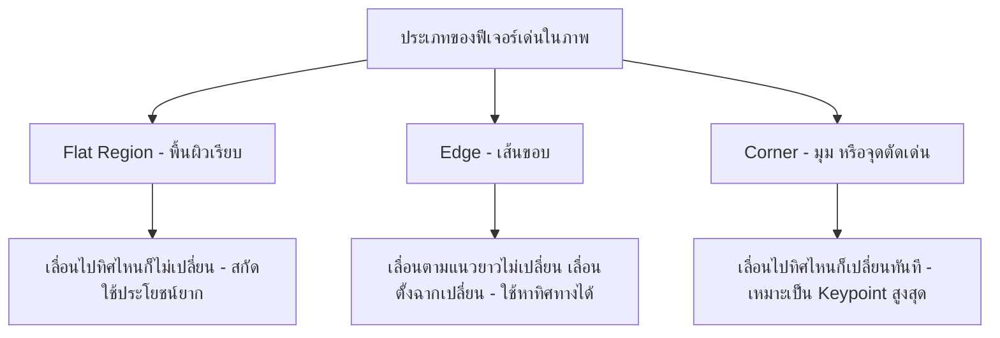
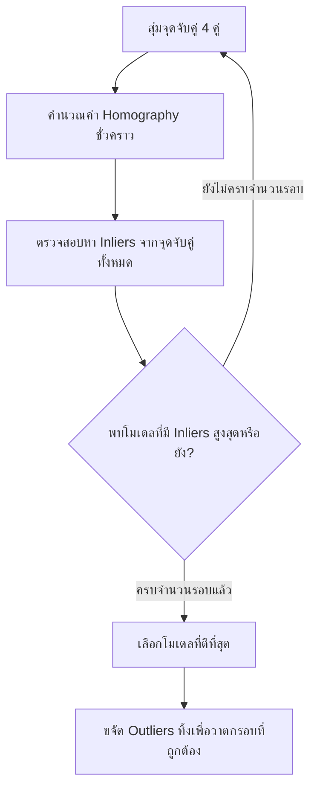

# บทที่ 7: การดึงจุดเด่นของภาพและการจับคู่ฟีเจอร์แบบดั้งเดิม
# (Classical Feature Matching)

> **หลักสูตร:** การประมวลผลภาพดิจิทัล (Digital Image Processing)
> **เครื่องมือ:** Python 3.10, OpenCV 4.6, NumPy, Matplotlib, VS Code

---

## ภาพรวมของบทนี้

ในการทำคอมพิวเตอร์วิทัศน์แบบดั้งเดิม (Classical Computer Vision) งานพื้นฐานที่สำคัญที่สุดอย่างหนึ่งคือ การจดจำและค้นหาวัตถุเป้าหมายที่อยู่ในรูปภาพ ตัวอย่างเช่น การหาโลโก้แบรนด์สินค้าบนชั้นวาง, การสแกนปกหนังสือ, หรือการสืบค้นว่ารูปภาพอ้างอิงที่เรามี ถูกนำไปวางเอียงหรือซ้อนทับอยู่ในภาพขนาดใหญ่อื่นหรือไม่

สัปดาห์ที่ผ่านมาเราได้ศึกษาเทคนิคต่าง ๆ ใน Spatial Domain และ Frequency Domain รวมถึงการทำ Contour Detection เพื่อแยกวัตถุจากพื้นหลัง อย่างไรก็ดี Contour Detection จะล้มเหลวทันทีเมื่อพื้นหลังมีความซับซ้อน หรือวัตถุเกิดการบดบังบางส่วน (Occlusion) 

ในบทนี้ เราจะเข้าสู่เทคนิค **Classical Feature Matching** ซึ่งจะสกัดจุดสำคัญ (Keypoints) และคุณสมบัติจำเพาะ (Descriptors) ของวัตถุที่มีความมั่นคงต่อการหมุนเอียง (Rotation-Invariant) การเปลี่ยนขนาด (Scale-Invariant) และการเปลี่ยนแปลงแสงสว่าง (Illumination-Invariant) ทำให้เราตรวจจับวัตถุได้แม้อยู่ในมุมมองที่บิดเบี้ยวหรือแสงไม่สม่ำเสมอ

---

## บทที่ 1: แนวคิดของ Keypoints และ Descriptors

หากเราพิจารณารูปภาพ 1 รูป แล้วถามว่า "ส่วนใดของรูปภาพที่มีความโดดเด่นและจำได้ง่ายที่สุด?" คำตอบมักจะเป็นส่วนที่มีรายละเอียดสูงหรือมีลักษณะที่ระบุพิกัดได้ง่าย

### 1.1 ประเภทของบริเวณในรูปภาพ (Flat, Edge, Corner)

ในการระบุจุดเด่น เราจัดกลุ่มโครงสร้างภายในภาพออกเป็น 3 ประเภทหลัก:

1. **บริเวณเรียบ (Flat regions):** เป็นพื้นที่สีเรียบ เช่น ท้องฟ้า หรือผนังว่างเปล่า หากเราเลื่อนหน้าต่างตรวจจับ (Window) เล็กน้อย ค่าพิกเซลในหน้าต่างจะไม่เกิดการเปลี่ยนแปลงใดๆ ทำให้ระบุพิกัดที่ชัดเจนไม่ได้
2. **ขอบภาพ (Edges):** เป็นแนวเส้นตรงหรือเส้นโค้ง หากเราเลื่อนหน้าต่างไปตามทิศทางของขอบ ค่าพิกเซลจะไม่เปลี่ยน แต่หากเลื่อนในทิศทางตั้งฉากกับขอบ จะเกิดการเปลี่ยนแปลงสูง ขอบจึงมีประโยชน์ระดับหนึ่งแต่ยังมีปัญหาความคลุมเครือในแนวยาว
3. **มุมภาพ (Corners):** เป็นจุดตัดกันของขอบ หรือจุดที่ความเข้มสีเปลี่ยนฉับพลันในทุกทิศทาง หากเราเลื่อนหน้าต่างไปในทิศทางใดก็ตาม ค่าพิกเซลจะเปลี่ยนแปลงอย่างรวดเร็วและรุนแรงเสมอ จุดนี้จึงเป็นจุดที่มีความเฉพาะเจาะจงสูงสุด เรียกว่า **จุดสำคัญ (Keypoint)**

### 1.2 นิยามของ Keypoints และ Descriptors

* **Keypoints (จุดสำคัญ / จุดสนใจ):** คือพิกัด $(x, y)$ ที่ตรวจพบบนรูปภาพที่มีความโดดเด่นเฉพาะตัว (มักจะเป็นมุมหรือจุดขอบที่มีความคมชัดสูง) นอกเหนือจากพิกัดแล้ว Keypoint ใน OpenCV ยังเก็บข้อมูลขนาดของจุด (Size), มุมการวางตัว (Angle/Orientation), และความเด่นชัด (Response) อีกด้วย
* **Descriptors (ตัวบรรยายลักษณะจุดเด่น):** เนื่องจากเพียงพิกัด $(x, y)$ ไม่เพียงพอที่จะบอกได้ว่าจุดนี้คืออะไร Descriptor จึงถูกคำนวณขึ้นมาเพื่ออธิบายคุณสมบัติรอบข้างของจุดสำคัญนั้นในรูปแบบเวกเตอร์ตัวเลข (Feature Vector) ทำให้เราเปรียบเทียบความคล้ายคลึงกันระหว่างสองจุดในรูปภาพต่าง ๆ ได้

---

## บทที่ 2: อัลกอริทึมสกัดจุดเด่น SIFT เทียบกับ ORB

ตลอดประวัติศาสตร์คอมพิวเตอร์วิทัศน์ มีผู้นำเสนออัลกอริทึมสกัดจุดเด่นหลายวิธี แต่ละวิธีมีจุดแข็งที่แตกต่างกัน

### 2.1 SIFT (Scale-Invariant Feature Transform)

พัฒนาโดย David Lowe ในปี ค.ศ. 1999 เป็นอัลกอริทึมที่มีความแม่นยำและทนทานสูงมาก
* **หลักการทำงาน:** 
  1. สร้าง **Scale Space** โดยนำภาพมาทำ Gaussian Blur หลายขนาดเพื่อจำลองระยะภาพที่เปลี่ยนไป
  2. หาค่าความแตกต่างของภาพที่เบลอเหล่านั้น (Difference of Gaussians - DoG) เพื่อตรวจหาจุดเด่น
  3. คัดกรองและปรับปรุงตำแหน่งจุดเด่นให้มีความละเอียดระดับซับพิกเซล (Sub-pixel accuracy)
  4. กำหนดทิศทางเด่น (Orientation) ให้จุดเด่นเพื่อทนต่อการหมุน
  5. สร้าง Descriptor ขนาด 128 มิติ (128-dimensional vector) อ้างอิงจากฮิสโตแกรมของเกรเดียนต์รอบจุด
* **ข้อดี:** ทนทานต่อการหมุน, การย่อขยายขนาดภาพ, และแสงสะท้อนได้อย่างดีเยี่ยม
* **ข้อเสีย:** คำนวณช้าเนื่องจากขั้นตอนที่ซับซ้อน และในอดีตเคยติดสิทธิบัตรทางการค้า (ปัจจุบันสิทธิบัตรหมดอายุแล้ว)

### 2.2 ORB (Oriented FAST and Rotated BRIEF)

พัฒนาขึ้นในปี ค.ศ. 2011 โดย Ethan Rublee และคณะ เพื่อเป็นทางเลือกแทน SIFT ที่ทำงานได้เร็วมากและเป็นมิตรกับนักพัฒนาเนื่องจากไม่มีปัญหาลิขสิทธิ์
* **หลักการทำงาน:** เป็นการผสมผสานสองอัลกอริทึมที่เร็วอยู่แล้วมารวมกันและปรับแต่ง
  * **FAST (Features from Accelerated Segment Test):** อัลกอริทึมตรวจหาจุดสนใจระดับมุมที่รวดเร็วมาก โดยเปรียบเทียบความสว่างของพิกเซลรอบจุดศูนย์กลางเป็นวงกลม 16 พิกเซล และทาง ORB ได้เพิ่มการคำนวณหาทิศทางเอียง (Orientation) เพิ่มเข้าไปเรียกว่า **Oriented FAST**
  * **BRIEF (Binary Robust Independent Elementary Features):** ตัวสร้าง Descriptor แบบไบนารี (Binary Descriptor) โดยเลือกคู่พิกเซลรอบจุดสำคัญมาเปรียบเทียบความสว่างแบบสุ่ม แล้วเก็บผลลัพธ์เป็นค่า 0 หรือ 1 ทาง ORB ได้พัฒนาให้รองรับการหมุนเรียกว่า **Rotated BRIEF**
* **ข้อดี:** ทำงานเร็วเป็นพิเศษ (เร็วกว่า SIFT หลายสิบเท่า), ใช้ทรัพยากรหน่วยความจำต่ำมาก, เหมาะกับการรันแบบ Real-time บนระบบฝังตัวหรือกล้องวิดีโอทั่วไป
* **ข้อเสีย:** ความทนทานต่อการขยายขนาดภาพ (Scale changes) จะด้อยกว่า SIFT เล็กน้อย

| คุณสมบัติ | SIFT | ORB |
|---|---|---|
| **ประเภท Descriptor** | เวกเตอร์ทศนิยม (Floating point - 128 มิติ) | เวกเตอร์ไบนารี (Binary Vector - 256 บิต) |
| **ความเร็วในการประมวลผล** | ปานกลาง - ช้า | รวดเร็วมาก (Real-time) |
| **ความคงทนต่อการเปลี่ยนขนาด (Scale)** | ยอดเยี่ยม | ดี (จำกัดตามจำนวนชั้นพีระมิดภาพ) |
| **ความคงทนต่อการหมุน (Rotation)** | ยอดเยี่ยม | ยอดเยี่ยม |
| **การวัดระยะห่าง (Distance Metric)** | L2 Distance (Euclidean) | Hamming Distance (เร็วในระดับสถาปัตยกรรม CPU) |

---

## บทที่ 3: กระบวนการจับคู่ฟีเจอร์ (Feature Matching)

เมื่อเรามีเซตของ Descriptors จากภาพอ้างอิง ($D_1$) และภาพเป้าหมาย ($D_2$) ขั้นตอนต่อไปคือการหาจุดสบที่มีความใกล้เคียงกันที่สุด

### 3.1 Brute-Force Matcher (BFMatcher)

เป็นวิธีที่ตรงไปตรงมาที่สุด โดยหยิบ Descriptor แต่ละตัวใน $D_1$ ไปเปรียบเทียบวัดระยะห่าง (Distance) กับทุกตัวใน $D_2$ เพื่อหาตัวที่มีระยะห่างสั้นที่สุด
* สำหรับ ORB (Binary Descriptor) เราใช้วัดระยะห่างแบบ **Hamming Distance** ซึ่งคำนวณจากจำนวนบิตที่ต่างกันผ่านคำสั่ง XOR ระดับ CPU ซึ่งทำงานได้เร็วมาก
* สำหรับ SIFT เรารับส่งตัวเลขทศนิยม จึงต้องใช้ระยะห่างแบบ **Euclidean Distance (L2)**

### 3.2 Lowe's Ratio Test (การกรองความถูกต้อง)

เนื่องจากหน้าตาหรือสีของพิกเซลในภาพอาจจะมีความคล้ายคลึงกันในหลายส่วน (เช่น รูปทรงหน้าต่างของตึกหลายๆ บาน) การสุ่มจับคู่ที่มีระยะสั้นที่สุดอาจส่งผลให้จับคู่ผิดพลาด เพื่อป้องกันสิ่งนี้ David Lowe เสนอให้ใช้ **Ratio Test**:

สำหรับ Descriptor หนึ่งตัว ให้ค้นหาคู่สบที่ดีที่สุด 2 อันดับแรก ($m$ และ $n$) โดยมีระยะห่าง $d_m$ และ $d_n$ ตามลำดับ:

$$\text{Ratio} = \frac{d_m}{d_n}$$

* หากคู่ที่ดีที่สุดมีระยะสั้นกว่าคู่รองลงมาอย่างชัดเจน (เช่น Ratio < 0.75) แสดงว่าจุดจับคู่นั้นมีความมั่นใจสูงและเป็นจุดเด่นเฉพาะตัวจริง
* หากระยะใกล้เคียงกันมาก (Ratio เข้าใกล้ 1) แสดงว่าในภาพนั้นมีจุดที่มีหน้าตาคล้ายๆ กันเต็มไปหมด ส่งผลให้เกิดความสับสนในการจับคู่ ให้ปัดทิ้ง

---

## บทที่ 4: Perspective Homography และ RANSAC

หลังจากได้คู่จับคู่ที่ดี (Good Matches) แล้ว หากวัตถุเป้าหมายของเราถูกวางทำมุมเอียงเฉียงไปกับกล้อง พิกัดจะเกิดการเปลี่ยนรูปแบบทรานส์ฟอร์มเชิงพิกัด

### 4.1 คณิตศาสตร์ Homography

**Homography ($H$)** คือ ความสัมพันธ์เชิงพิกัดพื้นที่แบบสลักภาพ (Projective transformation) ที่แปลงระนาบ 2 มิติหนึ่งไปยังอีกระนาบหนึ่ง เขียนในรูปสมการเมทริกซ์ขนาด $3 \times 3$ ดังนี้:

$$\begin{bmatrix} x' \\ y' \\ 1 \end{bmatrix} = \begin{bmatrix} h_{11} & h_{12} & h_{13} \\ h_{21} & h_{22} & h_{23} \\ h_{31} & h_{32} & h_{33} \end{bmatrix} \begin{bmatrix} x \\ y \\ 1 \end{bmatrix}$$

โดยที่ $(x, y)$ คือพิกัดพิกเซลในภาพอ้างอิง และ $(x', y')$ คือพิกัดที่แปลงแล้วในภาพปลายทาง เมทริกซ์นี้สามารถจัดการทั้งการยืด หด ย่อ ขยาย หมุน และเอียงมุมมองภาพได้

ในการหาค่าของเมทริกซ์ $H$ ที่มีองค์ประกอบอิสระ 8 ค่า เราต้องการคู่จุดจับคู่ที่ถูกต้องอย่างน้อยที่สุด **4 คู่**

### 4.2 ขจัดสิ่งรบกวนด้วย RANSAC

ในความเป็นจริง แม้จะทำ Ratio Test แล้วก็ตาม แต่อาจจะมีจุดจับคู่ผิดปะปนอยู่ (เรียกว่า Outliers) หากเรานำ Outliers เหล่านี้ไปคำนวณหา Homography จะทำให้กรอบสี่เหลี่ยมบิดเบี้ยวเสียหาย

เพื่อขจัดปัญหานี้ เราจึงต้องประยุกต์ใช้ **RANSAC (Random Sample Consensus)**:
1. สุ่มหยิบจุดจับคู่ขึ้นมา 4 คู่ เพื่อคำนวณเมทริกซ์ $H$ ชั่วคราว
2. ตรวจสอบว่ามีจุดจับคู่ที่เหลืออีกกี่จุดที่สอดคล้องกับเมทริกซ์นี้ภายในเกณฑ์ผิดพลาดที่ยอมรับได้ (จุดที่สอดคล้องเรียกว่า Inliers)
3. ทำซ้ำขั้นตอนข้างต้นหลายร้อยรอบ
4. เลือกเมทริกซ์ $H$ ที่สร้างจำนวน Inliers ได้สูงที่สุด จากนั้นขจัดจุดจับคู่ที่เป็น Outliers ทิ้งไปอย่างสมบูรณ์

กระบวนการทั้งหมดนี้จะช่วยให้สคริปต์ของเรา ค้นหาพิกัดและวางกรอบมุมมองวัตถุเป้าหมายได้อย่างแม่นยำ 100% แม้สภาพแวดล้อมจริงจะยากและมีความหนาแน่นสูงก็ตาม
