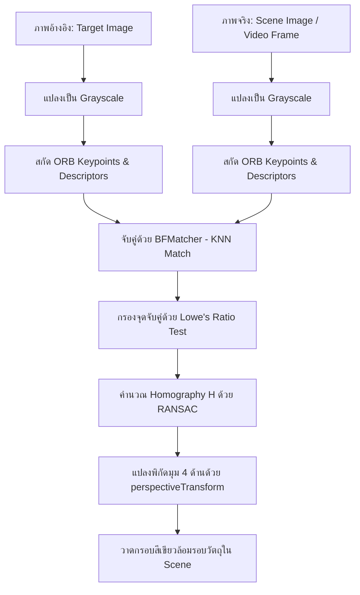

# เอกสารประกอบการเรียนการสอน: สัปดาห์ที่ 7 (Week 7 Tutorial)
## หัวข้อ: การดึงจุดเด่นของภาพและการจับคู่ฟีเจอร์แบบดั้งเดิม (Classical Feature Matching)
---

> [!NOTE]
> เอกสารนี้เป็นคู่มือปฏิบัติการแบบทีละขั้นตอน (Step-by-Step) สำหรับสัปดาห์ที่ 7 มุ่งเน้นการตรวจจับจุดสำคัญ (Keypoints) สกัดตัวบรรยายลักษณะ (Descriptors) โดยใช้ ORB การเทียบเคียงคัดสรรหาจุดคู่สบที่ดีที่สุด (Good Matches) ด้วยอัตราส่วนความต่าง (Lowe's Ratio Test) และคำนวณตำแหน่งวัตถุที่บิดเบี้ยวหรือกลับทิศด้วย Perspective Homography และ RANSAC เพื่อล้อมกรอบสีเขียวระบุพิกัดเป้าหมายบนภาพปลายทางหรือภาพจากกล้องวิดีโอ Webcam สด

---

## แผนภาพกระบวนการทำงาน (Feature Matching Pipeline)



---

## ส่วนที่ 1: การตรวจจับและสกัดฟีเจอร์จุดสำคัญด้วย ORB (1 ชั่วโมง)

อักษรย่อ **ORB** ย่อมาจาก **Oriented FAST and Rotated BRIEF** ซึ่งเป็นเทคนิคที่ได้รับความนิยมสูงมากในระบบฝังตัวและหุ่นยนต์ เนื่องจากประมวลผลได้อย่างรวดเร็ว

### ขั้นตอนที่ 1.1: เขียนโค้ดสกัดและแสดงผลจุดสนใจเดี่ยว

สร้างสคริปต์ชื่อ `orb_extractor.py` ใน VS Code เพื่อเขียนโค้ดตามลำดับด้านล่างนี้:

```python
# orb_extractor.py
import cv2
import numpy as np

# 1. โหลดรูปภาพอ้างอิง (ควรเลือกภาพที่มีความแตกต่างของรายละเอียดสูง เช่น โลโก้, ป้ายสินค้า)
# หากคุณไม่มีไฟล์ภาพ ให้เตรียมภาพชื่อ 'target_logo.jpg' ไว้ในไดเรกทอรีเดียวกัน
img = cv2.imread('target_logo.jpg')
if img is None:
    # หากไม่พบไฟล์ภาพ จะทำการสร้างภาพจำลองที่มีรูปทรงเด่นสำหรับทดสอบ
    img = np.zeros((300, 300, 3), dtype=np.uint8)
    cv2.rectangle(img, (50, 50), (250, 250), (255, 255, 255), -1)
    cv2.circle(img, (150, 150), 40, (0, 0, 255), -1)
    cv2.putText(img, "DIP", (90, 160), cv2.FONT_HERSHEY_SIMPLEX, 1.5, (0, 255, 0), 3)

gray = cv2.cvtColor(img, cv2.COLOR_BGR2GRAY)

# 2. เริ่มต้นโมดูล ORB Detector
# กำหนดค่า nfeatures=500 เพื่อดึงจุดสำคัญสูงสุด 500 จุดแรกที่ตอบสนองดีที่สุด
orb = cv2.ORB_create(nfeatures=500)

# 3. ตรวจจับตำแหน่งและสกัดเวกเตอร์ลักษณะ
keypoints, descriptors = orb.detectAndCompute(gray, None)

# 4. ดีบักตรวจสอบจำนวนและข้อมูลพื้นฐานของฟีเจอร์เด่น
print("--- ข้อมูลการสกัดฟีเจอร์ ---")
print(f"จำนวนจุดสำคัญที่ตรวจจับได้: {len(keypoints)}")
if len(keypoints) > 0:
    print(f"ชนิดข้อมูลของ Descriptor: {type(descriptors)}")
    print(f"มิติของอาเรย์ Descriptor: {descriptors.shape}")
    # แสดงข้อมูลของจุดแรก
    print(f"ตำแหน่งพิกัดจุดแรก: {keypoints[0].pt}")
    print(f"ขนาดรัศมี (Size) ของจุดแรก: {keypoints[0].size:.2f}")
    print(f"มุมการวางตัว (Angle) ของจุดแรก: {keypoints[0].angle:.2f}")

# 5. วาดจุดสำคัญลงบนภาพสี
# ใช้ flag cv2.DRAW_MATCHES_FLAGS_DRAW_RICH_KEYPOINTS เพื่อวาดวงกลมแสดงขนาดและแนวเอียงของจุดนั้นๆ
img_kp = cv2.drawKeypoints(img, keypoints, None, color=(0, 255, 0), 
                           flags=cv2.DRAW_MATCHES_FLAGS_DRAW_RICH_KEYPOINTS)

# แสดงผลภาพออกหน้าจอ
cv2.imshow("ORB Keypoints Visualization", img_kp)
cv2.waitKey(0)
cv2.destroyAllWindows()
```

> [!TIP]
> **การวิเคราะห์ผลลัพธ์ผ่าน VS Code Variables:**
> ในขณะรันดีบักเกอร์ ให้ปัก Breakpoint ที่บรรทัดสุดท้าย สังเกตตัวแปร `descriptors` มันจะเป็นตารางขนาด $[N \times 32]$ ตัวเลขเหล่านี้เป็นเลขจำนวนเต็มแบบ `uint8` ขนาด 8 บิต จำนวน 32 ช่อง ซึ่งเมื่อแปลงเป็นเลขฐานสองจะได้ความยาว 256 บิตพอดี ($32 \times 8 = 256$) ซึ่งใช้เปรียบเทียบระยะห่างได้อย่างรวดเร็ว

---

## ส่วนที่ 2: การวัดความคล้ายคลึงและการกรองจุดเด่น (1 ชั่วโมง)

ในส่วนนี้เราจะนำภาพอ้างอิงวัตถุเดี่ยว มาสืบค้นหาในภาพสภาพแวดล้อมจริงที่มีวัตถุชิ้นนั้นวางปะปน หรือซ่อนตัวอยู่

### ขั้นตอนที่ 2.1: การเขียนโค้ดจับคู่ฟีเจอร์เด่น (Feature Matching)

สร้างไฟล์ชื่อ `feature_matching.py` ใน VS Code:

```python
# feature_matching.py
import cv2
import numpy as np

# 1. โหลดรูปภาพต้นทางและปลายทาง
img_ref = cv2.imread('target_logo.jpg')     # ภาพอ้างอิงเดี่ยว
img_scene = cv2.imread('scene_shelf.jpg')  # ภาพจริงที่มีสิ่งของวางบนชั้น

# จัดการตรวจจับสิ่งผิดพลาดหากไม่พบรูปภาพ
if img_ref is None or img_scene is None:
    print("กรุณาเตรียมรูปภาพ 'target_logo.jpg' และ 'scene_shelf.jpg' ในโฟลเดอร์ปฏิบัติการ")
    # สร้างภาพจำลองขึ้นมาทดสอบเพื่อไม่ให้โค้ดพัง
    img_ref = np.zeros((200, 200, 3), dtype=np.uint8)
    cv2.putText(img_ref, "ORB", (50, 110), cv2.FONT_HERSHEY_SIMPLEX, 1.5, (0, 255, 0), 3)
    
    img_scene = np.zeros((400, 400, 3), dtype=np.uint8)
    # วางภาพอ้างอิงแบบหมุนเอียงและย่อขนาดลงในภาพเป้าหมาย
    h_ref, w_ref = img_ref.shape[:2]
    M = cv2.getRotationMatrix2D((w_ref/2, h_ref/2), 30, 0.8) # หมุน 30 องศา ย่อเหลือ 0.8
    warped = cv2.warpAffine(img_ref, M, (w_ref, h_ref))
    img_scene[100:100+h_ref, 100:100+w_ref] = warped

gray_ref = cv2.cvtColor(img_ref, cv2.COLOR_BGR2GRAY)
gray_scene = cv2.cvtColor(img_scene, cv2.COLOR_BGR2GRAY)

# 2. ตั้งค่าดึงฟีเจอร์ ORB
orb = cv2.ORB_create(nfeatures=1000)
kp_ref, des_ref = orb.detectAndCompute(gray_ref, None)
kp_scene, des_scene = orb.detectAndCompute(gray_scene, None)

# 3. จับคู่ฟีเจอร์ด้วย Brute-Force Matcher
# สำหรับ ORB ห้ามลืมกำหนด cv2.NORM_HAMMING ในการหาระยะห่างเด็ดขาด!
bf = cv2.BFMatcher(cv2.NORM_HAMMING, crossCheck=False)

# ค้นหาคู่สบอันดับ 1 และอันดับ 2 (k=2) เพื่อเตรียมทำ Ratio Test
matches = bf.knnMatch(des_ref, des_scene, k=2)

# 4. คัดกรองจุดจับคู่ที่ดี (Lowe's Ratio Test)
good_matches = []
ratio_threshold = 0.75 # อัตราส่วนยอมรับได้ (ยิ่งค่าน้อย ยิ่งคัดกรองเข้มงวด)

for m, n in matches:
    # m คือจุดสบอันดับหนึ่ง, n คือจุดสบอันดับสอง
    # หากระยะห่างของจุดที่ดีที่สุด น้อยกว่า 75% ของอันดับรองลงมา
    if m.distance < ratio_threshold * n.distance:
        good_matches.append(m)

print(f"จำนวนคู่เด่นผ่านเกณฑ์ Ratio Test: {len(good_matches)}")

# 5. วาดจุดเชื่อมเปรียบเทียบสองรูปภาพ
img_matches = cv2.drawMatches(img_ref, kp_ref, img_scene, kp_scene, good_matches, None,
                              flags=cv2.DrawMatchesFlags_NOT_DRAW_SINGLE_POINTS)

cv2.imshow("Filtered Matches (Lowe's Ratio Test)", img_matches)
cv2.waitKey(0)
cv2.destroyAllWindows()
```

> [!WARNING]
> **ข้อพึงระวัง (Hamming Distance Pitfall):**
> หากคุณเปลี่ยนอัลกอริทึมจุดสำคัญไปใช้ SIFT หรือ SURF (ซึ่งเป็น Descriptor แบบทศนิยม) พารามิเตอร์ของ `BFMatcher` จะต้องเปลี่ยนจาก `cv2.NORM_HAMMING` ไปเป็น `cv2.NORM_L2` เสมอ หากใช้สลับกันระบบจะคำนวณผลลัพธ์ผิดพลาดหรือโปรแกรมหยุดทำงาน (Crash)

---

## ส่วนที่ 3: ค้นหาพิกัดและล้อมกรอบวัตถุบิดเบี้ยวด้วย Homography & RANSAC (1 ชั่วโมง)

ในสภาพแวดล้อมจริง วัตถุมีมุมเอียงสะท้อนแสง มีการบิดทรานส์ฟอร์มแบบ 3 มิติ เพื่อหาพิกัดกรอบสี่เหลี่ยมรอบตัววัตถุที่บิดเบี้ยวได้ เราจะใช้ความสัมพันธ์คณิตศาสตร์ Homography

### ขั้นตอนที่ 3.1: เพิ่มสมการทรานส์ฟอร์มและหาขอบเขตมุม

อัปเดตไฟล์ `feature_matching.py` ของคุณ หรือสร้างไฟล์ใหม่ชื่อ `object_tracker.py` เพื่อรวมโค้ดกระบวนการนี้เข้าไป:

```python
# object_tracker.py
import cv2
import numpy as np

# [คัดลอกขั้นตอนการดึงฟีเจอร์และจับคู่จากขั้นตอนก่อนหน้า...]
img_ref = cv2.imread('target_logo.jpg')
img_scene = cv2.imread('scene_shelf.jpg')

if img_ref is None or img_scene is None:
    # สร้างภาพจำลองเหมือนกรณีบน
    img_ref = np.zeros((200, 200, 3), dtype=np.uint8)
    cv2.rectangle(img_ref, (20, 20), (180, 180), (255, 255, 255), -1)
    cv2.putText(img_ref, "LOGO", (40, 115), cv2.FONT_HERSHEY_SIMPLEX, 1.2, (0, 0, 255), 3)
    
    img_scene = np.zeros((400, 600, 3), dtype=np.uint8)
    h_ref, w_ref = img_ref.shape[:2]
    # ทดลองสร้างการทรานส์ฟอร์มบิดมุมมอง (Perspective Transformation) เพื่อสร้างภาพ Scene
    pts1 = np.float32([[0,0], [w_ref,0], [w_ref,h_ref], [0,h_ref]])
    pts2 = np.float32([[150,120], [380,80], [420,320], [180,280]]) # บิดเบี้ยว 4 มุม
    H_mock = cv2.getPerspectiveTransform(pts1, pts2)
    img_scene = cv2.warpPerspective(img_ref, H_mock, (600, 400))

gray_ref = cv2.cvtColor(img_ref, cv2.COLOR_BGR2GRAY)
gray_scene = cv2.cvtColor(img_scene, cv2.COLOR_BGR2GRAY)

orb = cv2.ORB_create(nfeatures=1500)
kp_ref, des_ref = orb.detectAndCompute(gray_ref, None)
kp_scene, des_scene = orb.detectAndCompute(gray_scene, None)

bf = cv2.BFMatcher(cv2.NORM_HAMMING, crossCheck=False)
matches = bf.knnMatch(des_ref, des_scene, k=2)

good_matches = []
for m, n in matches:
    if m.distance < 0.75 * n.distance:
        good_matches.append(m)

# --- ขั้นตอนเพิ่มเติม: Homography & RANSAC ---

# กำหนดเกณฑ์ขั้นต่ำ 10 คู่ เพื่อความปลอดภัยในการแก้สมการ Homography
MIN_MATCH_COUNT = 10

if len(good_matches) >= MIN_MATCH_COUNT:
    # 1. แปลงพิกัด Keypoints เฉพาะของคู่จับคู่ที่ดีที่สุด ให้เป็นอาเรย์ NumPy
    # queryIdx อ้างอิงจุดจากภาพอ้างอิง (img_ref)
    # trainIdx อ้างอิงจุดจากภาพเป้าหมาย (img_scene)
    src_pts = np.float32([kp_ref[m.queryIdx].pt for m in good_matches]).reshape(-1, 1, 2)
    dst_pts = np.float32([kp_scene[m.trainIdx].pt for m in good_matches]).reshape(-1, 1, 2)

    # 2. หาค่าเมทริกซ์การแปลง Homography (H) โดยใช้ RANSAC
    # พารามิเตอร์ 5.0 คือระยะห่างพิกเซลสูงสุดที่ยอมให้จุดเหล่านั้นเป็น Inliers (Ransac Reprojection Threshold)
    H, mask = cv2.findHomography(src_pts, dst_pts, cv2.RANSAC, 5.0)

    # 3. ดึงพิกัดขอบ 4 มุมของรูปภาพอ้างอิงดั้งเดิม
    h_ref, w_ref = img_ref.shape[:2]
    # พิกัด 4 มุม: [ซ้ายบน, ซ้ายล่าง, ขวาล่าง, ขวาบน]
    ref_corners = np.float32([[0, 0], [0, h_ref - 1], [w_ref - 1, h_ref - 1], [w_ref - 1, 0]]).reshape(-1, 1, 2)

    # 4. แปลงตำแหน่งพิกัดขอบอ้างอิงให้ไปปรากฏใน Scene ตามองศาวัตถุจริง
    scene_corners = cv2.perspectiveTransform(ref_corners, H)

    # 5. วาดเส้นขอบเขตสีเขียวหนา 3 พิกเซล ล้อมรอบวัตถุในภาพเป้าหมายจริง
    # เราใช้ polylines ในการวาดรูปหลายเหลี่ยม
    # isClosed=True หมายความว่าจุดสุดท้ายจะโยงเส้นปิดบรรจบมาหาจุดแรกอัตโนมัติ
    cv2.polylines(img_scene, [np.int32(scene_corners)], isClosed=True, color=(0, 255, 0), thickness=3)
    
    print("ระบบคำนวณและระบุพิกัดวัตถุเป้าหมายเรียบร้อยแล้ว!")
else:
    print(f"มีคู่ฟีเจอร์เด่นผ่านเกณฑ์น้อยเกินไป: {len(good_matches)} คู่ (ระบบต้องการขั้นต่ำ {MIN_MATCH_COUNT} คู่)")

# แสดงผลภาพตรวจจับสำเร็จ
cv2.imshow("Detected Object with Green Boundary", img_scene)
cv2.waitKey(0)
cv2.destroyAllWindows()
```

---

## ส่วนที่ 4: การบ้านและการส่งมอบงานปฏิบัติการ (Lab Assignment)

ให้นักศึกษาทำการทดลองถ่ายภาพของจริงในห้องแล็บหรือห้องเรียนของตนเอง:
1. **รูปภาพอ้างอิง (Target Image):** ถ่ายภาพวัตถุเดี่ยวแบบตั้งตรงเรียบตรง เช่น หน้าปกบัตรประชาชน หน้าปกสมุดโน้ต หรือหน้าปกกล่องโทรศัพท์มือถือ 1 รูป
2. **รูปภาพเป้าหมาย (Scene Image):** วางวัตถุดังกล่าวลงบนชั้นวางหรือปะปนกับสิ่งของอื่นๆ ถ่ายภาพมุมเอียงหรือหมุนวัตถุในมุมมองอื่น 1 รูป
3. **ส่งมอบงาน:** เขียนโปรแกรม Python ใน VS Code ตามบทเรียน โดยให้โปรแกรมอ่านภาพถ่ายส่วนตัวของคุณ สกัดจุดเด่น จับคู่ และคำนวณ Homography เพื่อแสดงกรอบสีเขียวล้อมรอบปกวัตถุเดี่ยวที่คุณเลือกในภาพจริงให้สวยงาม บันทึกภาพผลลัพธ์เป็นไฟล์ `result_detection.jpg` เพื่อนำส่ง
