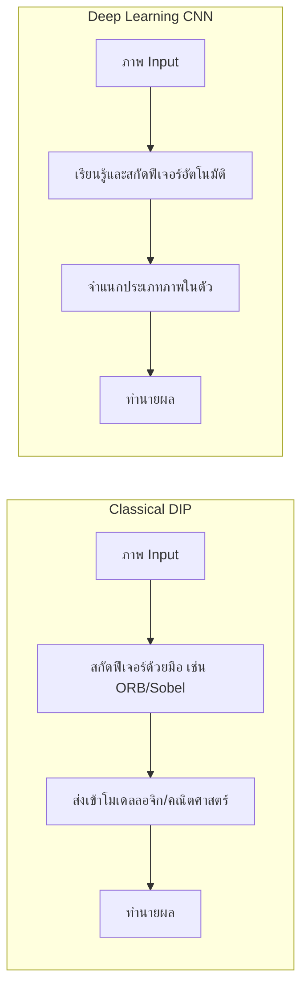
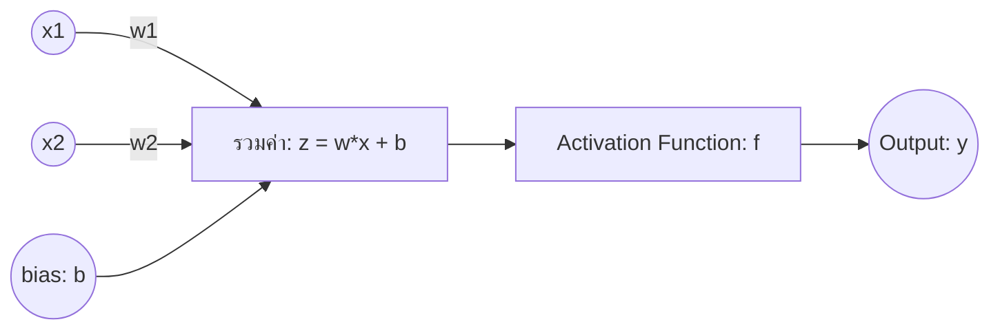
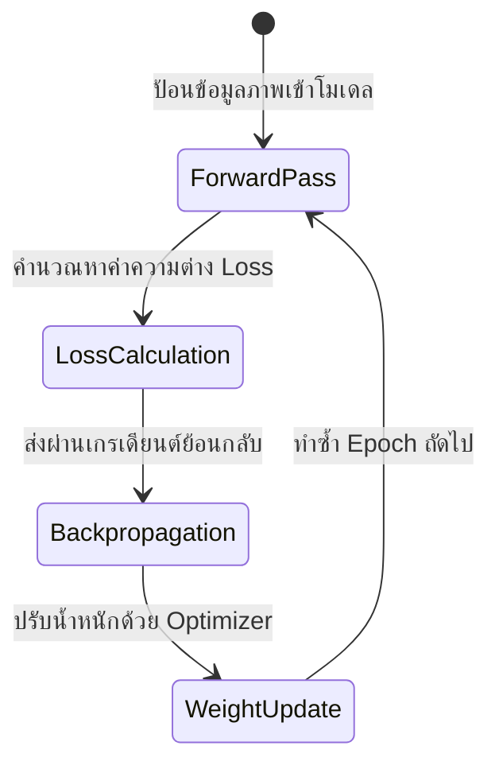

# บทที่ 9: การก้าวเข้าสู่โมเดลประสาทเทียมและการจำแนกภาพแรกด้วย PyTorch
> **หลักสูตร:** การประมวลผลภาพดิจิทัล (Digital Image Processing)
> **เครื่องมือ:** Python 3.10, PyTorch 2.0+, NumPy, Matplotlib, OpenCV, VS Code

---

## ภาพรวมของบทนี้

ในช่วง 7 สัปดาห์แรกของหลักสูตร เราได้ทำความเข้าใจเกี่ยวกับทฤษฎีภาพดิจิทัล การกรองภาพเพื่อลบ Noise การหาขอบเขตพิกเซล และการสกัดคุณลักษณะ (Features) ของวัตถุแบบกำหนดเงื่อนไขทางคณิตศาสตร์ด้วยมือ (Hand-Crafted Features) เช่น Sobel, Canny และ ORB 

อย่างไรก็ดี เมื่อเรานำภาพที่มีความหลากหลายสูงในโลกความเป็นจริงมาสืบค้น เช่น ภาพใบหน้าที่มีแสงเปลี่ยนทิศทาง รูปทรงใบไม้ที่มีความแปรปรวน หรือตัวเลขเขียนลายมือที่คนแต่ละคนเขียนไม่เหมือนกันเลย อัลกอริทึมแบบดั้งเดิมมักจะมีอัตราการทำนายถูกต่ำและต้องการการปรับแต่งค่า Parameter (เช่น Threshold) มากจนยากที่จะใช้งานได้ในระดับอุตสาหกรรม

ในบทนี้ เราจะเปลี่ยนกระบวนทัศน์เข้าสู่ **การเรียนรู้เชิงลึก (Deep Learning)** โดยใช้ **โครงข่ายประสาทเทียมแบบคอนโวลูชัน (Convolutional Neural Networks: CNN)** ซึ่งจะเข้ามาทำหน้าที่เรียนรู้และสกัดคุณลักษณะเด่นจากรูปภาพโดยอัตโนมัติ (End-to-End Feature Learning) จากข้อมูลภาพขนาดใหญ่ที่เราป้อนเข้าสู่ระบบ



---

## บทที่ 1: จาก Perceptron สู่ Multi-Layer Perceptron (MLP)

โครงข่ายประสาทเทียม (Artificial Neural Networks: ANN) ได้รับแรงบันดาลใจมาจากเซลล์ประสาทในสมองของมนุษย์ (Neuron) 

### 1.1 เซลล์ประสาทเทียมเดี่ยว (Perceptron)
โครงสร้างพื้นฐานที่สุดของเซลล์ประสาทเทียมประกอบไปด้วยองค์ประกอบหลักดังนี้:
1. **ค่านำเข้า (Inputs: $x_1, x_2, \dots, x_n$):** สัญญาณข้อมูลดิบ เช่น ค่าสีพิกเซลของภาพ
2. **ค่าน้ำหนัก (Weights: $w_1, w_2, \dots, w_n$):** ค่าพารามิเตอร์ที่ใช้ควบคุมปริมาณผลกระทบของสัญญาณแต่ละตัว (นี่คือค่าที่คอมพิวเตอร์จะปรับปรุงระหว่างการเรียนรู้)
3. **ค่าเอนเอียง (Bias: $b$):** ค่าชดเชยที่ช่วยให้เซลล์ประสาทเทียมสามารถเบี่ยงเบนผลเฉลยขึ้นลงได้อย่างยืดหยุ่น
4. **ฟังก์ชันกระตุ้น (Activation Function):** ทำหน้าที่แปลงผลลัพธ์การรวมเชิงเส้นให้กลายเป็นข้อมูลแบบไม่เป็นเส้นตรง (Non-linear) เช่น ป้องกันผลลัพธ์ทะลุพิกัด หรือบีบค่าให้อยู่ในช่วงที่ต้องการ

สูตรคณิตศาสตร์ของเซลล์ประสาทเทียมเดี่ยว:
$$z = \sum_{i=1}^{n} w_i x_i + b$$
$$y = f(z)$$



### 1.2 โครงข่ายแบบหลายชั้น (Multi-Layer Perceptron: MLP)
เมื่อนำ Perceptron หลายตัวมาต่อขนานกันและซ้อนกันหลายชั้น จะเกิดเป็นโครงสร้าง **MLP** ซึ่งประกอบไปด้วยชั้นป้อนข้อมูล (Input Layer) ชั้นซ่อนตัวกรอง (Hidden Layer) และชั้นส่งผลลัพธ์ (Output Layer) โครงสร้างนี้ช่วยให้ระบบเรียนรู้สมการที่ซับซ้อนอย่างยิ่งยวดได้

**ข้อจำกัดของ MLP ในงานวิเคราะห์ภาพ:**
หากเรามีรูปภาพขนาดเล็ก $28 \times 28$ พิกเซล 1 Channel (ขาวดำ) หากนำไปป้อนเข้า MLP เราต้องแผ่ภาพเป็นเวกเตอร์ขนาดยาว $28 \times 28 = 784$ ค่า ทำให้ **สูญเสียความสัมพันธ์เชิงพิกเซลข้างเคียง (Spatial Information)** ยิ่งถ้าเป็นภาพสีความละเอียดสูง เช่น $1080p$ จำนวนพิกเซลจะมีมากถึง 6 ล้านค่า ซึ่งทำให้จำนวนตัวแปรค่าน้ำหนักพุ่งสูงจนคอมพิวเตอร์ทั่วไปประมวลผลไม่ไหว และเกิดปัญหาการจดจำข้อมูลจำเจเกินไป (Overfitting)

---

## บทที่ 2: โครงข่ายประสาทเทียมแบบคอนโวลูชัน (CNN)

เพื่อแก้ข้อจำกัดของ MLP จึงเกิดสถาปัตยกรรม **CNN** ขึ้น โดยออกแบบมาให้เหมาะสมกับการรับข้อมูลรูปภาพที่เป็น 2D หรือ 3D โดยการนำเทคนิคการทำฟิลเตอร์ (Filtering) เชิงพื้นที่ที่เราเรียนรู้ในสัปดาห์ที่ 3 และ 4 มาบูรณาการ

### 2.1 เลเยอร์คอนโวลูชัน (Convolutional Layer)
แทนที่จะต่อเส้นสายพิกเซลทั้งหมดไปให้เซลล์ประสาทรับรู้ทีละจุด CNN จะใช้ **ตัวกรอง (Kernel / Filter)** ขนาดเล็ก (เช่น $3 \times 3$ หรือ $5 \times 5$ พิกเซล) ค่อยๆ สไลด์ลากตรวจจับไปทั่วผืนภาพ (Convolution Operation) 

* **พารามิเตอร์ของเลเยอร์นี้:**
  * **Kernel Size:** ขนาดกว้างคูณสูงของตัวกรอง เช่น 3 หมายถึง $3 \times 3$ พิกเซล
  * **Stride (ก้าวเดิน):** ระยะห่างของการขยับตัวกรองทีละกี่พิกเซลในแต่ละสเต็ป (ปกติ Stride = 1)
  * **Padding (การขยายขอบ):** การเสริมพิกเซลสีดำ (ค่า 0) รอบๆ ขอบภาพเดิมเพื่อป้องกันไม่ให้ขอบภาพดรอปหายและช่วยรักษาขนาดรูปภาพปลายทางให้อัตราเท่าเดิม
  * **Input Channels / Output Channels:** จำนวนช่องสีนำเข้า (เช่น ภาพสีมี 3 ช่อง) และจำนวนตัวกรองที่ต้องการสกัดในเลเยอร์นั้นๆ

```
ตัวอย่างการทำ Convolution ขนาด 3x3 บนภาพ 5x5:
[ภาพต้นฉบับ 5x5]             [ตัวกรอง 3x3]             [Feature Map ผลลัพธ์]
1  1  1  0  0               1  0  1
0  1  1  1  0  *Convolution* 0  1  0  ===>        4  3  4
0  0  1  1  1               1  0  1               2  4  3
0  0  1  1  0                                     2  3  4
0  1  1  0  0
```

### 2.2 ฟังก์ชันกระตุ้นแบบเรลู (ReLU - Rectified Linear Unit)
หลังจากผ่านการคอนโวลูชัน ค่าพิกเซลผลลัพธ์จะถูกส่งเข้าเลเยอร์กระตุ้น **ReLU** ซึ่งเป็นฟังก์ชันที่เข้าใจง่ายและมีความสำคัญสูงยิ่ง:
$$f(x) = \max(0, x)$$
* **หลักการ:** หากค่าพิกเซลเป็นบวก จะส่งต่อค่าเดิมโดยไม่มีการดัดแปลง แต่ถ้าเป็นลบจะเปลี่ยนค่าเป็น $0$ ทันที
* **ประโยชน์:** ช่วยเร่งความเร็วในการประมวลผลโมเดลและขจัดปัญหาระดับลาดชันข้อมูลเบาบาง (Vanishing Gradient Problem)

### 2.3 เลเยอร์พูลลิ่ง (Pooling Layer)
ทำหน้าที่ **ย่อยขนาดภาพ (Downsampling)** ลงเพื่อลดทรัพยากรการประมวลผล และสร้างคุณสมบัติความคงทนต่อตำแหน่งขยับ (Translation Invariance) 

* **Max Pooling:** เป็นรูปแบบที่นิยมที่สุด ทำงานโดยเลือกดึงเฉพาะค่าพิกเซลสูงสุดจากหน้าต่างพื้นที่ย่อย (เช่น ขนาด $2\times2$) 
* **ตัวอย่างการทำ Max Pooling ขนาด 2x2, Stride 2:**
```
[Matrix ขนาด 4x4]             [หลังทำ Max Pooling 2x2]
12  20 | 30   0
 8  12 |  2  30    ========>     20  30
-------+-------                  11  37
 2   3 | 15  37
 9  11 |  7  12
```

### 2.4 เลเยอร์เชื่อมต่อสมบูรณ์ (Fully Connected Layer หรือ Linear Layer)
เมื่อประมวลผลภาพผ่านการสกัดขอบและย่อยขนาดหลายเลเยอร์เรียบร้อยแล้ว ในเลเยอร์สุดท้ายเราจะทำการ **แผ่ภาพ (Flatten)** จาก Matrix สารสนเทศแบบหลายมิติให้กลายเป็น เวกเตอร์ 1 มิติ เพื่อส่งต่อไปประมวลผลบน **Linear Layer** เพื่อสรุปคลาสน้ำหนักพยากรณ์ปลายทาง

---

## บทที่ 3: กระบวนการฝึกสอนตัวแบบ (Training Dynamics)

เพื่อให้คอมพิวเตอร์เรียนรู้ได้ว่า ค่าน้ำหนักในตัวกรอง (Kernels) และค่าเอนเอียง (Biases) ในโมเดลควรเป็นค่าใด ระบบจำเป็นต้องทำกระบวนการวนซ้ำ 3 ส่วนหลัก:



### 3.1 ฟังก์ชันสูญเสีย (Loss Function)
เป็นตัววัดว่าคำพยากรณ์ของโมเดลปัจจุบันแตกต่างจากผลเฉลยจริงมากเพียงใด สำหรับงานจำแนกประเภทหลายคลาส (Multi-class Classification) เราจะเลือกใช้ **Cross-Entropy Loss** ซึ่งวัดระยะห่างความน่าจะเป็น:
$$\mathcal{L} = -\sum_{i=1}^{C} y_i \log(\hat{y}_i)$$
เมื่อ $y_i$ คือผลเฉลยจริง (แบบ One-hot Vector) และ $\hat{y}_i$ คือค่าคาดการณ์ความน่าจะเป็นจากระบบ

### 3.2 การคำนวณย้อนกลับ (Backpropagation)
เป็นกลไกที่อาศัยกฎลูกโซ่ (Chain Rule) ในการคำนวณหาค่าอนุพันธ์ย่อย (Gradients) ของฟังก์ชันความสูญเสียเมื่อเทียบกับค่าน้ำหนักแต่ละตัวในโครงข่าย เพื่อระบุว่าต้องอัปเดตตัวแปรน้ำหนักอย่างไรให้ค่า Loss โดยรวมลดลงมากที่สุด

### 3.3 ตัวปรับปรุงค่าน้ำหนัก (Optimizer)
ทำหน้าที่นำข้อมูล Gradients จากกระบวนการ Backpropagation มาแก้ไขปรับปรุงค่าน้ำหนักจริงในแต่ละรอบการวนซ้ำ
* **SGD (Stochastic Gradient Descent):** ขยับตามทิศทางคณิตศาสตร์ลาดชันแบบดั้งเดิม
* **Adam (Adaptive Moment Estimation):** ตัวปรับปรุงที่ได้รับความนิยมสูง ปรับอัตราการเรียนรู้ (Learning Rate) ของพารามิเตอร์แต่ละตัวโดยอัตโนมัติ ทำให้ฝึกโมเดลสำเร็จรวดเร็วขึ้น

---

## บทที่ 4: ตัวประเมินผลลัพธ์ประสิทธิภาพ (Evaluation Metrics)

หลังจากที่โมเดลเสร็จสิ้นกระบวนการฝึกฝนแล้ว เราจำเป็นต้องตรวจสอบคุณภาพโดยใช้ชุดข้อมูลทดสอบ (Test Set) ที่โมเดลไม่เคยเห็นในตอนเรียนรู้ออกมาเปรียบเทียบ

### 4.1 ความถูกต้องรวม (Accuracy)
วัดสัดส่วนการตอบถูกทั้งหมดเทียบกับจำนวนข้อมูลทั้งหมด:
$$\text{Accuracy} = \frac{\text{Correct Predictions}}{\text{Total Predictions}}$$
*ข้อควรระวัง:* ค่า Accuracy อาจนำมาหลอกเราได้หากชุดข้อมูลมีความไม่สมดุลสูง เช่น ในคลังภาพ 1,000 รูป มีรูปมะเร็งเพียง 10 รูป หากโมเดลตอบว่า "ไม่เป็นมะเร็ง" ทุกภาพ ค่า Accuracy จะสูงถึง $99\%$ แต่ไม่สามารถนำไปใช้งานได้จริง

### 4.2 ตารางเปรียบเทียบผลพยากรณ์ (Confusion Matrix)
เป็นตารางไขว้ระหว่างค่าจริง (Actual) และค่าที่ทำนาย (Predicted) เพื่อให้ผู้พัฒนาเห็นว่าโมเดลมักจำแนกคลาสใดผิดพลาดบ่อยที่สุด

| | Predicted Positive | Predicted Negative |
|---|---|---|
| **Actual Positive** | True Positive (TP) | False Negative (FN) |
| **Actual Negative** | False Positive (FP) | True Negative (TN) |

* **Precision (ความแม่นยำจำเพาะ):** อัตราส่วนที่ทำนายว่าใช่ แล้วถูกต้องจริง
  $$\text{Precision} = \frac{\text{TP}}{\text{TP} + \text{FP}}$$
* **Recall (ความครอบคลุม):** อัตราส่วนที่สิ่งนั้นเกิดจริง แล้วทำนายได้ครบถ้วน
  $$\text{Recall} = \frac{\text{TP}}{\text{TP} + \text{FN}}$$
* **F1-Score:** ค่าเฉลี่ยฮาร์มอนิกของ Precision และ Recall
  $$\text{F1-Score} = 2 \times \frac{\text{Precision} \times \text{Recall}}{\text{Precision} + \text{Recall}}$$
