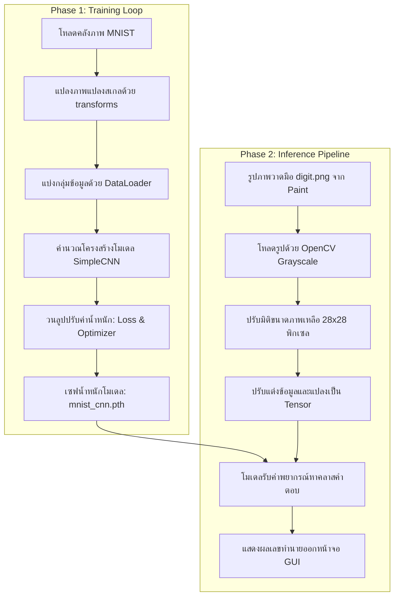

# เอกสารประกอบการเรียนการสอน: สัปดาห์ที่ 9 (Week 9 Tutorial)
## หัวข้อ: การสร้างและฝึกสอนโมเดล Simple CNN บน MNIST และทดสอบภาพจริง
---

> [!NOTE]
> เอกสารนี้เป็นคู่มือปฏิบัติการแบบทีละขั้นตอน (Step-by-Step) สำหรับสัปดาห์ที่ 9 มุ่งเน้นการสร้างสถาปัตยกรรมโครงข่ายประสาทเทียมคอนโวลูชัน (CNN) โดยใช้เฟรมเวิร์ก PyTorch ดาวน์โหลดข้อมูลตัวเลขเขียนด้วยลายมือ MNIST ดำเนินกระบวนการฝึกฝน (Training Loop) และบันทึกค่าน้ำหนักโมเดล (`.pth`) จากนั้นผู้เรียนจะได้ใช้ OpenCV ในการโหลดรูปภาพตัวเลขที่วาดขึ้นมาใหม่ นำเสนอเตรียมข้อมูล และเรียกใช้งานโมเดลจำแนกผลตัวเลขนั้นอย่างสมบูรณ์แบบ

---

## แผนภาพกระบวนการทำงาน (Model Training & Inference Pipeline)



---

## ส่วนที่ 1: การตรวจสอบและทำความเข้าใจ Environment (20 นาที)

ก่อนเริ่มปฏิบัติงานในสัปดาห์นี้ นักศึกษาต้องมั่นใจว่าสภาพแวดล้อมเสมือนของตนเอง (`dip_env`) ได้ถูกติดตั้งเฟรมเวิร์ก PyTorch เป็นที่เรียบร้อย

### ขั้นตอนที่ 1.1: รันตรวจสอบ Environment
1. เปิดโปรแกรม **VS Code** และเปิด Workspace โฟลเดอร์โครงการวิชาการประมวลผลภาพ
2. เปิด Terminal ใน VS Code และทำการเรียกใช้งาน Conda Environment:
   ```bash
   conda activate dip_env
   ```
3. รันคำสั่งตรวจสอบผ่านสคริปต์กลางที่มีอยู่แล้วในระบบ:
   ```bash
   python check_env.py
   ```
   *ตรวจสอบว่าในแถว PyTorch และ torchvision แสดงสัญลักษณ์* ✅

---

## ส่วนที่ 2: พัฒนาสคริปต์ฝึกสอนแบบจำลอง (train_mnist.py) (1.5 ชั่วโมง)

นักศึกษาจะต้องสร้างสคริปต์หลักสำหรับการสร้างโครงข่ายประสาทและฝึกฝนโมเดล MNIST 

### ขั้นตอนที่ 2.1: สร้างไฟล์และนำเข้าไลบรารี
สร้างไฟล์ชื่อ [train_mnist.py](file:///c:/Users/Newsk/OneDrive/Desktop/CVimage/image-processing/train_mnist.py) ในรากโฟลเดอร์โครงการ จากนั้นนำโค้ดด้านล่างไปเขียนลงในระบบ:

```python
# train_mnist.py
import torch
import torch.nn as nn
import torch.nn.functional as F
import torch.optim as optim
from torchvision import datasets, transforms
from torch.utils.data import DataLoader

# 1. นิยามสถาปัตยกรรมโมเดล CNN
class SimpleCNN(nn.Module):
    def __init__(self):
        super(SimpleCNN, self).__init__()
        # รับภาพ Grayscale 1 Channel -> ผลิต 16 Channels ฟิลเตอร์ขนาด 3x3
        self.conv1 = nn.Conv2d(1, 16, kernel_size=3, padding=1)
        # รับ 16 Channels -> ผลิต 32 Channels ฟิลเตอร์ขนาด 3x3
        self.conv2 = nn.Conv2d(16, 32, kernel_size=3, padding=1)
        # ตัวลดขนาดข้อมูลภาพ Max Pooling ขนาด 2x2
        self.pool = nn.MaxPool2d(2, 2)
        
        # Fully Connected Layer (ขนาดอินพุตคำนวณจาก: 32 channels * 7 * 7 พิกเซล = 1568)
        self.fc1 = nn.Linear(32 * 7 * 7, 128)
        self.fc2 = nn.Linear(128, 10)  # ทำนายเลข 0-9 ทั้งหมด 10 คลาส

    def forward(self, x):
        x = self.pool(F.relu(self.conv1(x)))
        x = self.pool(F.relu(self.conv2(x)))
        x = x.view(x.size(0), -1)  # ปรับรูปร่างเป็นเวกเตอร์ตรง 1 มิติ
        x = F.relu(self.fc1(x))
        x = self.fc2(x)
        return x

def train():
    # 2. ตั้งค่าอุปกรณ์ประมวลผล (เลือกใช้ CUDA หากเครื่องสนับสนุน GPU)
    device = torch.device("cuda" if torch.cuda.is_available() else "cpu")
    print(f"กำลังเริ่มฝึกสอนโมเดลโดยใช้: {device}")

    # 3. กำหนด Pipeline การทำภาพ Preprocessing
    transform = transforms.Compose([
        transforms.ToTensor(),
        transforms.Normalize((0.5,), (0.5,))  # ปรับสเกลให้อยู่ในช่วง [-1, 1]
    ])

    # 4. ดาวน์โหลดคลังรูปภาพ MNIST
    print("กำลังโหลดชุดข้อมูล MNIST...")
    train_dataset = datasets.MNIST(root='./data', train=True, download=True, transform=transform)
    test_dataset = datasets.MNIST(root='./data', train=False, download=True, transform=transform)

    # 5. จัดการแปลงข้อมูลเป็นกลุ่มย่อย Batch Size = 64
    train_loader = DataLoader(train_dataset, batch_size=64, shuffle=True)
    test_loader = DataLoader(test_dataset, batch_size=64, shuffle=False)

    # 6. เรียกใช้งานโครงสร้างโมเดลและส่งไปยังตัวแปรประมวลผลหลัก
    model = SimpleCNN().to(device)

    # 7. นิยามสูตรคำนวณ Loss และ Optimizer
    criterion = nn.CrossEntropyLoss()
    optimizer = optim.Adam(model.parameters(), lr=0.001)

    # 8. เริ่มลูปฝึกสอนจริง (Train Loop)
    epochs = 3
    print("เริ่มขั้นตอนการฝึกสอนโมเดล (Training Loop)...")
    for epoch in range(epochs):
        model.train()  # ตั้งโหมดเทรน
        running_loss = 0.0
        
        for batch_idx, (images, labels) in enumerate(train_loader):
            images, labels = images.to(device), labels.to(device)
            
            # เคลียร์เกรเดียนต์
            optimizer.zero_grad()
            
            # ทำนายผล
            outputs = model(images)
            loss = criterion(outputs, labels)
            
            # คำนวณความเบี่ยงเบนย้อนกลับและอัปเดตน้ำหนัก
            loss.backward()
            optimizer.step()
            
            running_loss += loss.item()
            if (batch_idx + 1) % 200 == 0:
                print(f"Epoch [{epoch+1}/{epochs}] | Batch [{batch_idx+1}/{len(train_loader)}] | Loss: {running_loss/200:.4f}")
                running_loss = 0.0

        # 9. ทดสอบความแม่นยำหลังจบแต่ละ Epoch (Evaluation Phase)
        model.eval()  # ตั้งโหมดประเมินผลลัพธ์
        correct = 0
        total = 0
        with torch.no_grad():  # ไม่ต้องการจำการคำนวณเกรเดียนต์เพื่อเซฟความเร็วและแรม
            for images, labels in test_loader:
                images, labels = images.to(device), labels.to(device)
                outputs = model(images)
                _, predicted = torch.max(outputs.data, 1)
                total += labels.size(0)
                correct += (predicted == labels).sum().item()
        
        accuracy = 100 * correct / total
        print(f"==> ประสิทธิภาพเมื่อจบ Epoch ที่ {epoch+1}: ความแม่นยำบน Test Set = {accuracy:.2f}%")

    # 10. บันทึกผลน้ำหนัก
    torch.save(model.state_dict(), 'mnist_cnn.pth')
    print("การฝึกฝนเสร็จสมบูรณ์! น้ำหนักตัวแบบถูกบันทึกในไฟล์ 'mnist_cnn.pth'")

if __name__ == "__main__":
    train()
```

### ขั้นตอนที่ 2.2: รันโปรแกรมฝึกฝน
พิมพ์คำสั่งนี้ใน VS Code terminal เพื่อสั่งฝึกฝนแบบจำลอง:
```bash
python train_mnist.py
```
*สังเกตผลลัพธ์การฝึกฝน ค่า Loss ควรจะค่อยๆ ลดลงเรื่อยๆ และหลังจบ Epoch ที่ 3 ควรมีความแม่นยำ (Accuracy) เฉลยบน Test set มากกว่า 97%*

---

## ส่วนที่ 3: เตรียมรูปภาพลายมือตัวเอง (15 นาที)

เพื่อทำการทดสอบประสิทธิภาพของโมเดลที่นักศึกษาฝึกสอนด้วยตัวเอง ให้สร้างรูปภาพตัวเลขเดี่ยวเพื่อนำมาป้อนโมเดลทำนาย:
1. เปิดโปรแกรมสร้างรูปภาพขึ้นมา เช่น **Microsoft Paint** (หรือแอปสร้างภาพใดๆ)
2. สร้างภาพใหม่ตั้งขนาดกว้างคูณสูงเป็นขนาด **$28 \times 28$ พิกเซล** หรือใช้อัตราสี่เหลี่ยมจัตุรัสขนาดเล็ก เช่น **$280 \times 280$ พิกเซล**
3. ทาสีฉากหลังให้เป็น **สีดำสนิท**
4. ใช้พู่กันหรือดินสอวาดภาพเลือก **สีขาวบริสุทธิ์** แล้วบรรจงเขียนตัวเลขเดี่ยวๆ ลงไปตรงกึ่งกลางภาพ (เช่น เลข 5 หรือ เลข 8)
5. ทำการบันทึกภาพเก็บไว้ในรากโฟลเดอร์โครงการ ตั้งชื่อไฟล์ว่า `digit.png`

> [!WARNING]
> **ทำไมฉากหลังต้องดำและตัวเลขต้องสีขาว?**
> เนื่องจากชุดข้อมูล MNIST ถูกเขียนและถ่ายมารูปแบบตัวเลขขาวบนฉากหลังดำ หากสลับสีกัน (ตัวเลขดำหลังขาว) แบบจำลองจะไม่เข้าใจและจะจำแนกผลผิดพลาดทันที! 

---

## ส่วนที่ 4: พัฒนาสคริปต์ทำนายรูปภาพภายนอก (infer_mnist.py) (45 นาที)

สร้างไฟล์ชื่อ [infer_mnist.py](file:///c:/Users/Newsk/OneDrive/Desktop/CVimage/image-processing/infer_mnist.py) ในโฟลเดอร์เดียวกับโปรเจกต์ และเขียนโค้ดตามรูปแบบด้านล่าง:

```python
# infer_mnist.py
import cv2
import torch
import torch.nn as nn
import torch.nn.functional as F
import numpy as np

# 1. โครงสร้างโมเดล (ต้องเขียนให้ตรงกับตอนเทรน)
class SimpleCNN(nn.Module):
    def __init__(self):
        super(SimpleCNN, self).__init__()
        self.conv1 = nn.Conv2d(1, 16, kernel_size=3, padding=1)
        self.conv2 = nn.Conv2d(16, 32, kernel_size=3, padding=1)
        self.pool = nn.MaxPool2d(2, 2)
        self.fc1 = nn.Linear(32 * 7 * 7, 128)
        self.fc2 = nn.Linear(128, 10)

    def forward(self, x):
        x = self.pool(F.relu(self.conv1(x)))
        x = self.pool(F.relu(self.conv2(x)))
        x = x.view(x.size(0), -1)
        x = F.relu(self.fc1(x))
        x = self.fc2(x)
        return x

def predict(image_path):
    device = torch.device("cuda" if torch.cuda.is_available() else "cpu")

    # 2. สร้างโครงสร้างและโหลดไฟล์น้ำหนัก
    model = SimpleCNN()
    try:
        model.load_state_dict(torch.load('mnist_cnn.pth', map_location=device))
        print("โหลดไฟล์น้ำหนัก 'mnist_cnn.pth' สำเร็จ!")
    except FileNotFoundError:
        print("ข้อผิดพลาด: ไม่พบไฟล์น้ำหนัก 'mnist_cnn.pth' กรุณารัน train_mnist.py ก่อน!")
        return

    model.to(device)
    model.eval()  # ปรับเปลี่ยนเข้าโหมดพยากรณ์/วิเคราะห์

    # 3. โหลดและจัดการภาพด้วย OpenCV
    img_gray = cv2.imread(image_path, cv2.IMREAD_GRAYSCALE)
    if img_gray is None:
        print(f"ข้อผิดพลาด: ไม่พบไฟล์รูปภาพปลายทางที่กำหนด {image_path}")
        return

    # ก. ปรับขนาดภาพให้กลายเป็น 28x28 พิกเซลพอดีตัว
    img_resized = cv2.resize(img_gray, (28, 28))

    # ข. ประเมินปรับข้อมูลพิกเซลให้อยู่ในช่วง [-1, 1] ตามตอนที่โมเดลเรียนรู้
    img_norm = (img_resized.astype(np.float32) / 255.0 - 0.5) / 0.5

    # ค. จัดรูปแบบ Tensor ให้พร้อมส่งต่อ: เพิ่มมิติ Batch และ Channel (1, 1, 28, 28)
    tensor_img = torch.tensor(img_norm).unsqueeze(0).unsqueeze(0)
    tensor_img = tensor_img.to(device)

    # 4. ส่งรูปภาพเข้าไปรับพยากรณ์จากโมเดล PyTorch
    with torch.no_grad():
        outputs = model(tensor_img)
        # คำนวณหาค่าความน่าจะเป็นรายคลาสด้วย Softmax
        probabilities = F.softmax(outputs, dim=1)
        # ดึงดัชนีคลาสตัวเลขที่ได้คะแนนสูงสุด
        predicted_val = torch.argmax(probabilities, dim=1).item()
        confidence = probabilities[0][predicted_val].item() * 100

    print("\n" + "="*50)
    print(f"วิเคราะห์รูปภาพ: {image_path}")
    print(f"==> คำพยากรณ์จากโมเดล: ตัวเลข {predicted_val}")
    print(f"==> ค่าความมั่นใจ: {confidence:.2f}%")
    print("="*50 + "\n")

    # แสดงภาพพิกเซลขยายใหญ่ที่ถูกส่งเข้าวิเคราะห์
    cv2.imshow(f"Preprocessed Image (28x28) - Predicted: {predicted_val}", cv2.resize(img_resized, (300, 300), interpolation=cv2.INTER_NEAREST))
    cv2.waitKey(0)
    cv2.destroyAllWindows()

if __name__ == "__main__":
    predict('digit.png')
```

### ขั้นตอนที่ 4.2: ทดลองรันโปรแกรมทำนาย
สั่งรันไฟล์ทำนายรูปภาพตัวเลขใน VS Code terminal:
```bash
python infer_mnist.py
```
*ระบบควรเปิดหน้าต่าง GUI แสดงผลภาพ และพิมพ์ค่าคาดการณ์สรุปตัวเลขที่คุณเขียนลงบนหน้าจอ Terminal คั่นความมั่นใจเปอร์เซ็นต์*

---

## ส่วนที่ 5: แบบฝึกหัดท้าทายประจำสัปดาห์ (Challenge) (30 นาที)

เพื่อรับคะแนนปฏิบัติการเต็ม นักศึกษาต้องเลือกทำแบบฝึกหัดเพิ่มเติมข้อใดข้อหนึ่งต่อไปนี้:

1. **การรับผลลัพธ์วิดีโอเรียลไทม์ (Real-time Prediction Challenge):**
   * แก้ไขปรับปรุงสคริปต์ `infer_mnist.py` ให้รับอินพุตวิดีโอจากกล้อง Webcam ของเครื่อง
   * วาดกรอบสี่เหลี่ยมกลางจอเพื่อระบุขอบเขตให้คนยกกระดาษตัวเลขเดี่ยวขึ้นมาแสดง
   * ให้ระบบครอปและสเกลพิกเซลพื้นที่ในกรอบนั้น ส่งวิเคราะห์จำแนกผลตัวเลขแบบสดๆ วินาทีต่อวินาที แปะข้อความคำตอบพร้อมความมั่นใจกำกับรอบกล่องกรอบภาพ OpenCV

2. **การปรับแต่ง Hyperparameter เพิ่มเติม:**
   * แก้ไขโค้ดใน `train_mnist.py` เพื่อเพิ่มชั้นเลเยอร์ Convolution, เพิ่มจำนวน Epochs เป็น 5 หรือเปลี่ยน Optimizer เป็น `optim.SGD` พร้อมลดค่า Learning Rate ให้ช้าลงเป็น `lr=0.01`
   * สังเกตและจดบันทึกค่าความแม่นยำความสำเร็จเปรียบเทียบกับแบบเดิมเพื่อประเมินความแตกต่างลงในรายงานการส่งงาน
